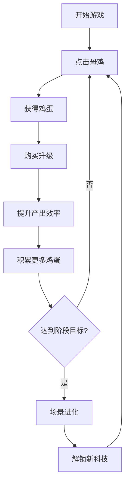

## 1. 产品概述

《星际蛋工厂》是一款放置点击类休闲小游戏，玩家通过点击屏幕养鸡、收集鸡蛋，逐步升级科技树，将养鸡事业从地球农场发展到宇宙规模。游戏上手简单，成长路径清晰，给玩家带来持续的正向反馈和成长爽感。

- 核心目标：让玩家体验从零开始建立养鸡帝国的成就感，通过指数级增长的数值和不断解锁的新内容，保持长期游戏动力
- 目标用户：喜欢放置类、点击类休闲游戏的玩家，年龄层广泛

## 2. 核心功能

### 2.1 功能模块

1. **主游戏区域**：点击养鸡、鸡蛋收集、场景展示
2. **升级科技树**：生产效率升级、自动收集、特殊能力解锁
3. **统计面板**：实时显示鸡蛋数量、每秒产出、总点击数等数据
4. **成就系统**：达成里程碑目标获得奖励和荣誉
5. **场景进化**：农场 → 工厂 → 太空站 → 星际帝国 → 宇宙霸主

### 2.2 页面详情

| 页面名称 | 模块名称 | 功能描述 |
|---------|---------|---------|
| 游戏主界面 | 顶部资源栏 | 显示当前鸡蛋数量、每秒产出、当前阶段 |
| 游戏主界面 | 中央点击区 | 点击母鸡产蛋，动画反馈，可升级外观 |
| 游戏主界面 | 左侧升级面板 | 科技树升级列表，可折叠/展开 |
| 游戏主界面 | 右侧统计面板 | 详细数据统计，成就展示 |
| 游戏主界面 | 底部导航栏 | 商店、成就、设置、重置等功能入口 |

## 3. 核心流程

玩家进入游戏 → 点击中央母鸡获得鸡蛋 → 使用鸡蛋购买升级 → 提升自动产蛋效率 → 积累足够鸡蛋解锁新阶段 → 场景进化获得新能力 → 循环往复直至宇宙规模

## 4. 用户界面设计

### 4.1 设计风格

- **主色调**：温暖的金黄色系（#FFD700、#FFA500）代表鸡蛋和财富，搭配天蓝色（#87CEEB）到深紫色（#1a0033）的渐变背景体现从地球到宇宙的过渡
- **按钮风格**：圆角卡片式设计，带有微妙的阴影和悬浮动效，升级按钮采用渐变色彩
- **字体**：标题使用圆润可爱的显示字体，正文使用清晰易读的无衬线字体
- **布局风格**：三栏式布局（左升级、中游戏、右统计），卡片模块化设计，层次分明
- **图标/emoji**：使用 🐔🥚🌌🚀 等富有童趣的 emoji 增强视觉吸引力

### 4.2 页面设计概述

| 页面名称 | 模块名称 | UI 元素 |
|---------|---------|---------|
| 游戏主界面 | 顶部资源栏 | 大号数字显示鸡蛋数量，带千位分隔符和单位（K/M/B/T），每秒产出小字显示 |
| 游戏主界面 | 中央点击区 | 大尺寸可点击母鸡/生产装置，点击时有鸡蛋飞溅动画和数字弹出效果，背景随阶段变化 |
| 游戏主界面 | 左侧升级面板 | 垂直列表的升级卡片，显示图标、名称、描述、价格、当前等级，可购买时高亮 |
| 游戏主界面 | 右侧统计面板 | 分类展示各项数据，成就图标网格排列，达成时发光 |
| 游戏主界面 | 底部导航栏 | 图标按钮，点击切换功能面板，带有选中状态 |

### 4.3 响应式

- 桌面端优先设计（1280px+），三栏布局
- 平板端（768px-1279px）：升级面板和统计面板可折叠为抽屉
- 移动端（<768px）：单栏布局，通过标签页切换各模块
- 触摸优化：按钮最小尺寸 44x44px，点击区域适当放大

### 4.4 视觉特效指引

- **环境氛围**：每个阶段有独特背景（农场草地、工厂车间、太空站、星空、星云）
- **粒子效果**：点击时产生金色粒子，升级时绽放光效
- **灯光**：随阶段变化光照，地球阶段温暖明亮，宇宙阶段深邃神秘
- **相机/视差**：背景元素随鼠标移动产生微视差效果
- **动画**：数字变化有滚动过渡，新内容解锁有入场动画
- **后处理**：微妙的辉光效果，宇宙阶段增加星星闪烁
