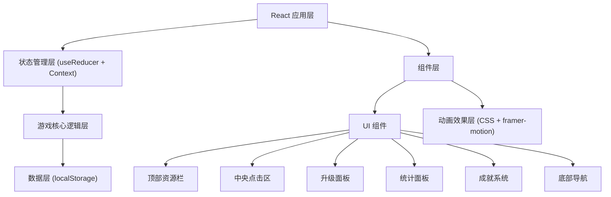

## 1. 架构设计



## 2. 技术描述

- **前端框架**: React@18 + TypeScript
- **构建工具**: Vite@5
- **样式方案**: TailwindCSS@3
- **状态管理**: React useReducer + Context API
- **动画库**: framer-motion
- **图标库**: lucide-react
- **数据持久化**: localStorage（自动保存）
- **后端**: 无（纯前端游戏）
- **数据库**: 无（本地存储）

## 3. 目录结构

```
src/
├── game/
│   ├── types.ts          # 类型定义
│   ├── config.ts         # 游戏配置（升级、成就、阶段）
│   ├── logic.ts          # 核心游戏逻辑
│   ├── reducer.ts        # 状态 reducer
│   └── utils.ts          # 工具函数（数字格式化等）
├── components/
│   ├── TopBar.tsx        # 顶部资源栏
│   ├── ClickArea.tsx     # 中央点击区
│   ├── UpgradePanel.tsx  # 升级面板
│   ├── StatsPanel.tsx    # 统计面板
│   ├── Achievements.tsx  # 成就系统
│   ├── BottomNav.tsx     # 底部导航
│   └── ParticleEffect.tsx # 粒子效果
├── hooks/
│   └── useGameLoop.ts    # 游戏循环 hook
├── context/
│   └── GameContext.tsx   # 游戏状态上下文
├── App.tsx
├── main.tsx
└── index.css
```

## 4. 数据模型

### 4.1 游戏状态

```typescript
interface GameState {
  eggs: number;                    // 当前鸡蛋数
  totalEggs: number;               // 累计鸡蛋数
  eggsPerClick: number;            // 每次点击产出
  eggsPerSecond: number;           // 每秒自动产出
  totalClicks: number;             // 总点击次数
  currentStage: number;            // 当前阶段 (0-4)
  upgrades: Record<string, number>; // 升级等级映射
  achievements: string[];          // 已达成成就ID
  lastSaveTime: number;            // 上次保存时间戳
  playTime: number;                // 总游戏时间(秒)
}
```

### 4.2 升级定义

```typescript
interface Upgrade {
  id: string;
  name: string;
  description: string;
  icon: string;
  baseCost: number;
  costMultiplier: number;
  baseEffect: number;
  effectType: 'click' | 'auto' | 'multiplier';
  unlockStage: number;
}
```

### 4.3 阶段定义

```typescript
interface Stage {
  id: number;
  name: string;
  description: string;
  requiredEggs: number;
  bgGradient: string;
  chickenEmoji: string;
  unlockMessage: string;
}
```

### 4.4 成就定义

```typescript
interface Achievement {
  id: string;
  name: string;
  description: string;
  icon: string;
  condition: (state: GameState) => boolean;
  reward: number;
}
```

## 5. 核心功能模块

### 5.1 游戏循环

- 主循环：每秒调用一次，计算自动产出
- 使用 `requestAnimationFrame` 实现平滑的数字更新
- 离线收益：计算离开时间，按比例给予离线鸡蛋

### 5.2 升级系统

- 每次购买升级，价格按倍率递增
- 升级效果立即生效
- 按阶段解锁新的升级选项

### 5.3 阶段系统

- 累计鸡蛋达到阈值时自动解锁新阶段
- 阶段变化伴随场景动画过渡
- 新阶段解锁更高级的升级和成就

### 5.4 成就系统

- 每一帧检查成就条件
- 达成时弹出通知动画
- 成就奖励一次性发放

## 6. 性能优化

- 使用 `React.memo` 优化不必要的重渲染
- 数字更新使用 CSS transition 而非频繁 setState
- 粒子效果使用 CSS 动画，达到数量上限后自动回收
- localStorage 保存采用防抖机制，避免频繁写入
- 大数字使用 BigInt 或科学计数法处理溢出
