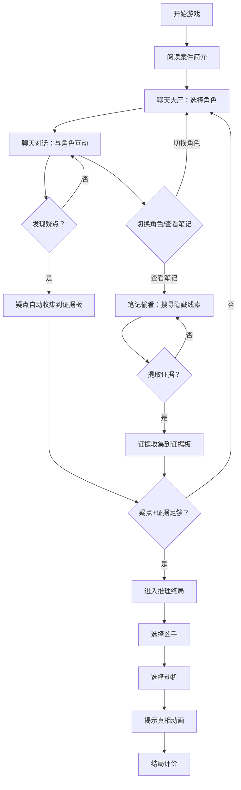

## 1. 产品概述

《深夜告别》是一款仿微信聊天界面的破案推理小游戏。玩家扮演一名匿名调查者，通过即时通讯软件与案件相关者逐一聊天，偷看他们的私人笔记，从中发现疑点、收集证据，最终推理出真相。

- 核心体验：沉浸式聊天推理，角色有血有肉，界面精致不枯燥
- 目标用户：喜爱文字推理、互动叙事、社交模拟类游戏的玩家

## 2. 核心功能

### 2.1 用户角色

| 角色 | 说明 |
|------|------|
| 调查者（玩家） | 通过聊天软件与嫌疑人对话，搜集线索，推理真相 |
| 嫌疑人（NPC） | 由预设剧本驱动的AI角色，各有性格、秘密和矛盾 |

### 2.2 功能模块

1. **聊天大厅页**：角色列表、未读标记、案件简介入口
2. **聊天对话页**：微信风格对话界面，含打字动画、关键疑点高亮、选项回复
3. **笔记偷看页**：各角色私密日记/备忘录，需解锁条件，含隐藏线索
4. **证据板页**：疑点收集、物证展示、线索关联、推理入口
5. **推理终局页**：选择凶手与动机，揭示真相动画

### 2.3 页面详情

| 页面名称 | 模块名称 | 功能描述 |
|----------|----------|----------|
| 聊天大厅 | 角色列表 | 显示所有可聊天角色头像、名字、最后一条消息预览、未读红点 |
| 聊天大厅 | 案件简介 | 顶部卡片展示案件概述：死者、时间、地点、死因 |
| 聊天大厅 | 进度条 | 底部显示疑点/证据/推理三阶段进度 |
| 聊天对话 | 消息流 | 左右气泡布局，NPC消息左侧，玩家消息右侧，打字逐字动画 |
| 聊天对话 | 选项回复 | 玩家从2-3个选项中选择回复，不同选项触发不同分支 |
| 聊天对话 | 疑点标记 | 关键消息出现疑点标记动画，自动收集到证据板 |
| 聊天对话 | 笔记入口 | 顶部按钮进入该角色的笔记偷看模式 |
| 笔记偷看 | 日记列表 | 角色的多页笔记/备忘，按时间排列 |
| 笔记偷看 | 解锁机制 | 部分笔记需与角色聊到特定话题后自动解锁，锁链图标提示 |
| 笔记偷看 | 隐藏线索 | 笔记中高亮文字可点击，提取为证据 |
| 证据板 | 疑点卡片 | 从聊天中收集的疑点，带来源角色标记 |
| 证据板 | 物证卡片 | 从笔记中提取的物证，带详细信息 |
| 证据板 | 线索连线 | 可视化疑点与证据之间的逻辑关联 |
| 证据板 | 推理入口 | 证据足够时解锁"开始推理"按钮 |
| 推理终局 | 凶手选择 | 从角色头像中选择你认为的凶手 |
| 推理终局 | 动机选择 | 选择作案动机 |
| 推理终局 | 真相揭示 | 动画展示完整案件真相，对比玩家推理结果 |

## 3. 核心流程

玩家打开游戏后，首先阅读案件简介，随后进入聊天大厅逐一与嫌疑人对话。聊天过程中发现疑点（疑点自动标记收集），同时可偷看角色笔记获取隐藏线索。疑点和证据足够后进入推理阶段，选择凶手和动机，最终揭示真相。

## 4. 用户界面设计

### 4.1 设计风格

- **主色调**：深夜黑（#0D0D0D）+ 暖琥珀金（#D4A847）作为点缀，营造侦探 noir 氛围
- **辅助色**：暗红（#8B2252）用于疑点标记，冷灰（#3A3A4A）用于笔记纸张
- **聊天气泡**：玩家消息用琥珀金半透明底，NPC消息用深灰底；圆角 16px
- **字体**：标题用 Noto Serif SC 衬线体（侦探气质），正文用 Noto Sans SC
- **布局**：桌面端居中模拟手机屏幕（max-width 420px），移动端全屏适配
- **动画**：消息打字逐字出现（40ms/字）、疑点发现时脉冲高亮、笔记解锁锁链断裂
- **背景**：微妙的噪点纹理 + 雨滴流动效果，增加沉浸感

### 4.2 页面设计概览

| 页面名称 | 模块名称 | UI元素 |
|----------|----------|--------|
| 聊天大厅 | 案件简介卡片 | 暗色卡片、琥珀金边框、衬线标题、案件摘要文字 |
| 聊天大厅 | 角色列表 | 头像圆形（带在线绿点）、名字、最后消息预览、未读红点、右侧箭头 |
| 聊天大厅 | 进度条 | 三段式进度：疑点/证据/推理，琥珀金填充 |
| 聊天对话 | 顶部导航 | 角色头像+名字、返回箭头、笔记偷看按钮（锁图标） |
| 聊天对话 | 消息区 | 气泡消息、时间戳、疑点脉冲动画、头像 |
| 聊天对话 | 选项区 | 底部2-3个选项按钮，琥珀金边框，hover填充 |
| 笔记偷看 | 笔记本背景 | 做旧纸张纹理、手写风格字体、翻页效果 |
| 笔记偷看 | 笔记条目 | 时间戳+内容，锁链图标（未解锁）、高亮可点击文字 |
| 证据板 | 线索卡片 | 深色卡片、疑点用红色标记、物证用金色标记、来源标签 |
| 证据板 | 连线区域 | SVG连线展示线索关联 |
| 推理终局 | 选择面板 | 大头像选择、动机文字选项、确认按钮 |
| 推理终局 | 真相动画 | 全屏暗幕、逐字打字揭示真相、对比玩家答案 |

### 4.3 响应式设计

- 桌面端：居中模拟手机屏幕（420px宽），两侧暗色背景，微妙的雨滴动画
- 平板端：居中模拟手机屏幕（480px宽）
- 移动端：全屏适配，底部安全区域处理

### 4.4 游戏剧本设定

**案件：《深夜告别》**

知名画家林远舟在一个雨夜被发现死于自己的画室中，死因为氰化物中毒。画室门从内侧反锁，窗户半开。案发当晚，有5个人曾与林远舟有过接触。

**角色设定：**

| 角色 | 身份 | 性格特征 | 隐藏秘密 |
|------|------|----------|----------|
| 林小雨 | 死者女儿，大学生 | 表面悲伤温柔，偶尔流露冷漠 | 知道父亲曾想修改遗嘱剥夺她的继承权 |
| 赵明辉 | 死者经纪人，40岁 | 精明世故，话语滴水不漏 | 挪用了林远舟画作的拍卖款，欠下巨债 |
| 苏婉清 | 死者前妻，38岁 | 优雅怨恨，刚从法国回来 | 回国真实目的是争夺一幅价值千万的画 |
| 陈默 | 死者学生/助手，25岁 | 沉默寡言，忠诚但自卑 | 偷偷临摹了林远舟的未完成遗作 |
| 周警官 | 办案刑警，45岁 | 公事公办，偶尔透露案情 | 发现了画室的暗门，但暂时保密 |

**真相：赵明辉是凶手。** 他因挪用拍卖款面临巨额债务，当晚去画室想偷走林远舟未完成的遗作抵债。被林远舟发现后，赵明辉在茶水中下了氰化物。门从内侧反锁是因为林远舟习惯性锁门，赵明辉从窗户翻出。苏婉清的回国、陈默的临摹、林小雨的继承权变更，都是干扰线索。

**疑点列表（7个）：**
1. 赵明辉声称当晚没去过画室 → 笔记中记录了画室窗户的高度
2. 苏婉清回国的时间与林远舟修改遗嘱的时间重合 → 但与凶案无直接关联
3. 陈默能准确描述遗作的画面 → 说明他趁夜进过画室
4. 林小雨对父亲死讯的反应有延迟 → 她早就知道遗嘱变更
5. 赵明辉对拍卖款的细节回避 → 他挪用了拍卖款
6. 画室茶杯有两个人的指纹 → 有人陪林远舟喝茶
7. 赵明辉手机定位在案发时段有1小时空白 → 他关闭了手机

**证据列表（5个）：**
1. 画室窗户下的泥脚印（赵明辉鞋码吻合）
2. 茶杯上的第二组指纹（赵明辉的）
3. 赵明辉笔记本中记录的画室窗户尺寸
4. 拍卖行的转账记录（款项未到林远舟账户）
5. 画室暗门的存在（周警官发现，证明反锁的门不是唯一出口）
