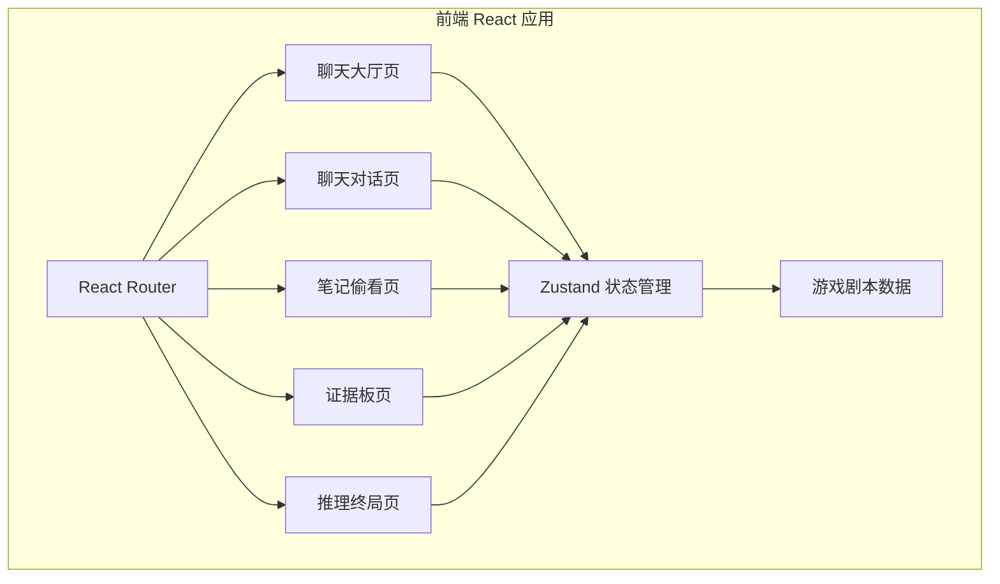
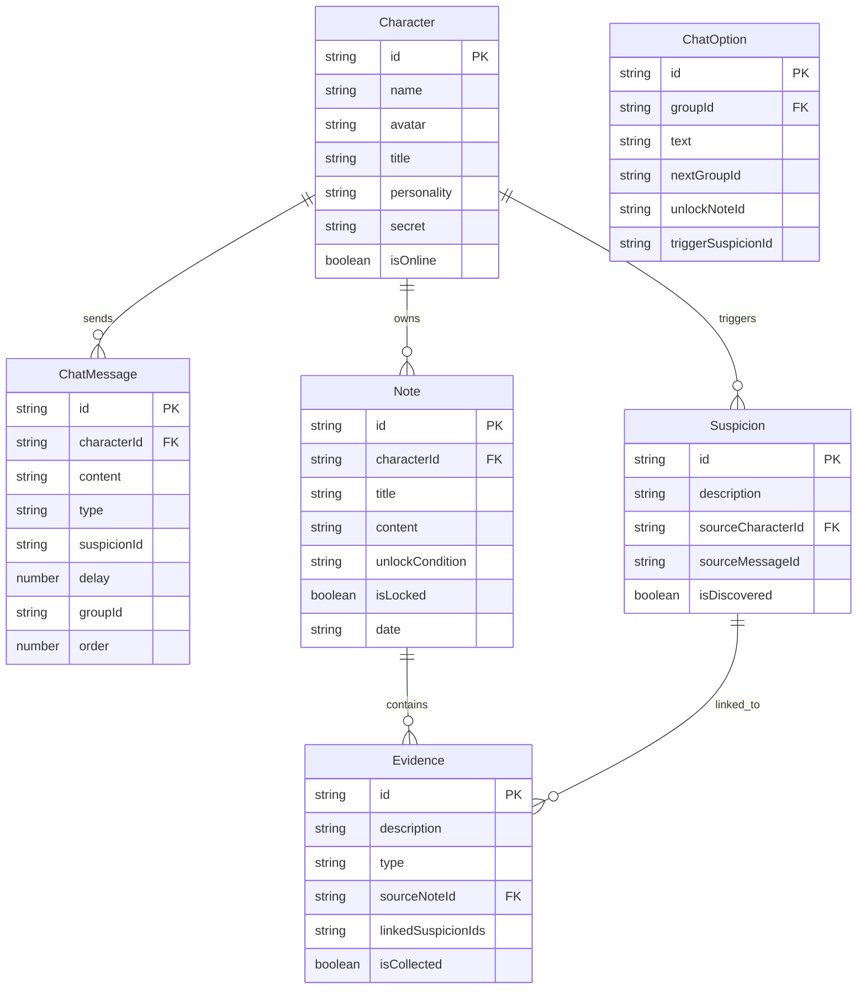

## 1. 架构设计



## 2. 技术说明

- 前端：React@18 + TypeScript + Tailwind CSS@3 + Vite
- 初始化工具：vite-init（react-ts 模板）
- 状态管理：Zustand
- 路由：React Router DOM v6
- 后端：无（纯前端，剧本数据内嵌）
- 数据库：无（使用 JSON 数据文件 + Zustand 内存状态）

## 3. 路由定义

| 路由 | 用途 |
|------|------|
| `/` | 聊天大厅：角色列表、案件简介、进度展示 |
| `/chat/:characterId` | 聊天对话：与指定角色的微信风格对话 |
| `/notes/:characterId` | 笔记偷看：查看角色的私密笔记 |
| `/evidence` | 证据板：疑点与证据的收集与关联 |
| `/deduction` | 推理终局：选择凶手与动机，揭示真相 |

## 4. 数据模型

### 4.1 数据模型定义



### 4.2 核心状态结构（Zustand Store）

```typescript
interface GameState {
  currentPhase: 'suspicion' | 'evidence' | 'deduction'
  suspicions: Record<string, boolean>
  evidences: Record<string, boolean>
  unlockedNotes: Record<string, boolean>
  chatProgress: Record<string, string>
  selectedKiller: string | null
  selectedMotive: string | null
  gameCompleted: boolean

  discoverSuspicion: (id: string) => void
  collectEvidence: (id: string) => void
  unlockNote: (id: string) => void
  advanceChat: (characterId: string, groupId: string) => void
  setDeduction: (killer: string, motive: string) => void
  completeGame: () => void
  resetGame: () => void
}
```

## 5. 项目文件结构

```
src/
  components/
    ChatBubble.tsx          # 消息气泡组件
    ChatOption.tsx          # 选项按钮组件
    CharacterCard.tsx       # 角色卡片组件
    SuspicionMark.tsx       # 疑点标记动画组件
    EvidenceCard.tsx        # 证据卡片组件
    ProgressBar.tsx         # 三段进度条组件
    NoteEntry.tsx           # 笔记条目组件
    RainEffect.tsx          # 雨滴背景特效
    PhoneFrame.tsx          # 手机框架容器
  pages/
    ChatHall.tsx            # 聊天大厅页
    ChatRoom.tsx            # 聊天对话页
    NotePeek.tsx            # 笔记偷看页
    EvidenceBoard.tsx       # 证据板页
    Deduction.tsx           # 推理终局页
  data/
    characters.ts           # 角色数据
    dialogues.ts            # 对话树数据
    notes.ts                # 笔记数据
    suspicions.ts           # 疑点数据
    evidences.ts            # 证据数据
  store/
    gameStore.ts            # Zustand 状态管理
  App.tsx                   # 路由配置
  main.tsx                  # 入口文件
  index.css                 # 全局样式
```
