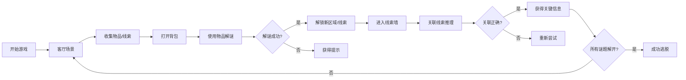

## 1. 产品概述
《残影老宅》是一款微恐风格的密室逃脱解谜游戏。玩家在一座废弃的老宅中醒来，需要通过搜集线索、解开谜题、拼凑逻辑来找到逃离的方法。游戏侧重于氛围感营造和逻辑推理，恐怖程度控制在"微恐"级别，通过环境细节和音效营造紧张感而非血腥画面。

- 核心玩法：探索场景 → 收集线索/物品 → 解开谜题 → 拼凑逻辑 → 逃脱密室
- 目标用户：喜欢解谜和轻度恐怖游戏的玩家
- 产品价值：提供沉浸式的密室逃脱体验，考验玩家的观察力和逻辑推理能力

## 2. 核心功能

### 2.1 用户角色
| 角色 | 注册方式 | 核心权限 |
|------|---------|---------|
| 玩家 | 无需注册，直接进入 | 开始游戏、探索场景、收集物品、解开谜题、查看线索墙 |

### 2.2 功能模块
1. **开始界面**：游戏标题、开始按钮、游戏规则说明
2. **主游戏场景**：包含4个可探索区域（客厅、书房、卧室、地下室）
3. **物品系统**：物品收集、背包管理、物品使用
4. **线索系统**：线索收集、线索墙展示、线索关联推理
5. **谜题系统**：密码锁、机关盒、顺序谜题等多种解谜形式
6. **对话/提示系统**：场景交互反馈、解谜提示
7. **结局界面**：成功逃脱/失败结局展示

### 2.3 页面详情
| 页面名称 | 模块名称 | 功能描述 |
|---------|---------|---------|
| 开始界面 | 标题动画 | 带有呼吸效果的游戏标题，背景为老宅剪影 |
| 开始界面 | 开始按钮 | 点击进入游戏，淡入淡出过渡 |
| 开始界面 | 规则说明 | 简洁的操作说明卡片 |
| 主游戏界面 | 场景切换 | 点击房间图标或门进行区域切换 |
| 主游戏界面 | 场景交互 | 点击场景中高亮的物品进行互动 |
| 主游戏界面 | 背包栏 | 底部展示已收集物品，可点击查看/使用 |
| 主游戏界面 | 线索墙入口 | 右上角按钮进入线索关联界面 |
| 线索墙界面 | 线索展示 | 所有收集到的线索以卡片形式展示 |
| 线索墙界面 | 线索关联 | 拖拽线索进行关联，触发逻辑推理 |
| 线索墙界面 | 推理结果 | 关联正确后解锁关键信息 |
| 解谜弹窗 | 密码输入 | 数字/字母密码键盘 |
| 解谜弹窗 | 机关交互 | 滑块、旋转等互动形式 |
| 结局界面 | 结局展示 | 逃脱成功/失败的动画和文字 |
| 结局界面 | 重新开始 | 重置游戏状态，返回开始界面 |

## 3. 核心流程

玩家从客厅开始，通过点击探索场景中的物品，收集有用的线索和道具。使用收集到的物品解开各个房间的谜题，逐步解锁新的区域。在线索墙中将相关线索进行关联，拼凑出完整的故事线和最终逃脱密码。

## 4. 用户界面设计

### 4.1 设计风格
- **主色调**：深棕灰(#1a1510)为主背景，暗红(#8b2635)为强调色，暗绿(#2d4a3e)为辅助色，米白(#d4c5a9)为文字色
- **按钮风格**：做旧木质纹理，圆角4px，带有微妙的内阴影营造年代感
- **字体**：标题使用"ZCOOL XiaoWei"（古风宋体），正文使用"Noto Serif SC"（思源宋体）
- **布局风格**：场景为主体，顶部状态栏，底部背包栏，右侧快捷操作
- **氛围元素**：噪点纹理叠加、胶片颗粒效果、暗角晕影、摇曳的光影动画

### 4.2 页面设计概览
| 页面名称 | 模块名称 | UI元素 |
|---------|---------|--------|
| 开始界面 | 标题区域 | 渐显动画的游戏标题，老宅剪影背景，摇曳的烛光效果 |
| 开始界面 | 操作区域 | 木质纹理按钮，hover时有轻微上浮和发光效果 |
| 主游戏界面 | 场景区域 | 手绘风格场景图，可交互物品有微弱呼吸光效 |
| 主游戏界面 | 状态栏 | 左上角显示当前房间名称，右上角线索墙按钮和提示按钮 |
| 主游戏界面 | 背包栏 | 底部半透明条，物品图标有做旧质感，选中时放大 |
| 线索墙界面 | 背景 | 软木板纹理，钉住的线索卡片 |
| 线索墙界面 | 连线 | 关联线索时出现暗红色连线，带有动画效果 |
| 解谜弹窗 | 弹窗样式 | 深色木质边框，内部磨砂玻璃质感 |

### 4.3 响应式
- 桌面端优先设计，场景区域居中固定宽度1024px
- 移动端自适应，场景区域等比缩放，背包栏改为底部抽屉式
- 触摸操作优化，增大可点击区域至48x48px

### 4.4 氛围设计
- **环境音效**：老房子的吱呀声、远处的风声、时钟滴答声
- **视觉效果**：画面轻微的呼吸抖动、灯光闪烁效果、物品发现时的聚光动画
- **转场效果**：房间切换时的淡入淡出+模糊过渡
- **恐怖元素**：偶尔的影子闪过、物品轻微移位（微恐级别，避免惊吓）
