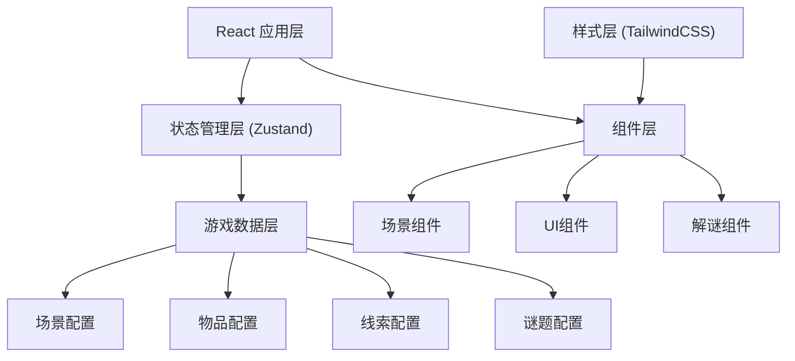

## 1. 架构设计

本项目为纯前端密室逃脱解谜游戏，无需后端服务，所有数据和逻辑均在前端处理。



## 2. 技术描述

- **前端框架**: React@18 + TypeScript + Vite
- **状态管理**: Zustand
- **样式方案**: TailwindCSS@3
- **路由**: react-router-dom
- **图标**: lucide-react
- **动画**: CSS Animations + Framer Motion
- **后端**: 无（纯前端应用）
- **数据存储**: localStorage（用于保存游戏进度）

## 3. 目录结构

```
src/
├── components/          # 组件目录
│   ├── game/           # 游戏核心组件
│   │   ├── GameScene.tsx       # 主游戏场景
│   │   ├── Inventory.tsx       # 背包栏
│   │   ├── ClueBoard.tsx       # 线索墙
│   │   ├── DialogBox.tsx       # 对话框
│   │   └── PuzzleModal.tsx     # 解谜弹窗
│   ├── scenes/         # 场景组件
│   │   ├── LivingRoom.tsx      # 客厅
│   │   ├── StudyRoom.tsx       # 书房
│   │   ├── Bedroom.tsx         # 卧室
│   │   └── Basement.tsx        # 地下室
│   ├── puzzles/        # 谜题组件
│   │   ├── PasswordLock.tsx    # 密码锁
│   │   ├── SequencePuzzle.tsx  # 顺序谜题
│   │   └── MechanismBox.tsx    # 机关盒
│   └── ui/             # 通用UI组件
│       ├── Button.tsx
│       ├── ItemSlot.tsx
│       └── ClueCard.tsx
├── store/              # 状态管理
│   └── useGameStore.ts
├── data/               # 游戏数据配置
│   ├── scenes.ts
│   ├── items.ts
│   ├── clues.ts
│   └── puzzles.ts
├── hooks/              # 自定义Hooks
│   ├── useInventory.ts
│   ├── useClues.ts
│   └── usePuzzle.ts
├── types/              # 类型定义
│   └── game.ts
├── utils/              # 工具函数
│   ├── audio.ts
│   └── storage.ts
├── pages/              # 页面
│   ├── StartPage.tsx
│   ├── GamePage.tsx
│   └── EndingPage.tsx
├── App.tsx
├── main.tsx
└── index.css
```

## 4. 类型定义

```typescript
// 游戏物品
interface Item {
  id: string;
  name: string;
  description: string;
  icon: string;
  canUseOn: string[]; // 可使用的目标ID
  usedToSolve: string[]; // 用于解开的谜题ID
}

// 线索
interface Clue {
  id: string;
  title: string;
  content: string;
  relatedClues: string[]; // 可关联的线索ID
  unlocks?: string; // 关联后解锁的内容
  found: boolean;
}

// 谜题
interface Puzzle {
  id: string;
  type: 'password' | 'sequence' | 'mechanism';
  answer: string | string[];
  requiredItem?: string; // 需要的物品ID
  reward: string; // 解谜奖励（物品/线索/区域）
  hint: string;
  solved: boolean;
}

// 可交互点
interface Interactable {
  id: string;
  name: string;
  position: { x: number; y: number; width: number; height: number };
  type: 'item' | 'puzzle' | 'clue' | 'exit';
  targetId: string;
  requiresItem?: string; // 需要物品才能交互
  description: string;
}

// 场景
interface Scene {
  id: string;
  name: string;
  description: string;
  backgroundImage: string;
  interactables: Interactable[];
  exits: { targetSceneId: string; position: { x: number; y: number } }[];
  unlocked: boolean;
}

// 游戏状态
interface GameState {
  currentScene: string;
  inventory: Item[];
  clues: Clue[];
  puzzles: Puzzle[];
  scenes: Scene[];
  selectedItem: Item | null;
  dialogMessage: string | null;
  showClueBoard: boolean;
  activePuzzle: Puzzle | null;
  gamePhase: 'start' | 'playing' | 'ending';
  endingType: 'success' | 'fail' | null;
}
```

## 5. 核心数据模型

### 5.1 游戏流程数据
```typescript
// 物品定义示例
const items: Item[] = [
  {
    id: 'old-key',
    name: '生锈的钥匙',
    description: '一把老旧的铜钥匙，上面刻着奇怪的符号。',
    icon: 'key',
    canUseOn: ['study-door', 'chest'],
    usedToSolve: ['study-unlock', 'chest-open']
  }
];

// 线索关联示例
const clueConnections: { from: string; to: string; result: string }[] = [
  {
    from: 'diary-page-1',
    to: 'diary-page-3',
    result: '密码线索：记住日期 1987/03/15'
  }
];
```

### 5.2 状态管理设计
使用 Zustand 管理全局游戏状态：

```typescript
import { create } from 'zustand';

interface GameStore extends GameState {
  // 场景操作
  changeScene: (sceneId: string) => void;
  unlockScene: (sceneId: string) => void;
  
  // 物品操作
  collectItem: (itemId: string) => void;
  selectItem: (item: Item | null) => void;
  useItem: (itemId: string, targetId: string) => boolean;
  
  // 线索操作
  collectClue: (clueId: string) => void;
  connectClues: (clueId1: string, clueId2: string) => boolean;
  
  // 谜题操作
  startPuzzle: (puzzleId: string) => void;
  solvePuzzle: (puzzleId: string, answer: any) => boolean;
  
  // 对话操作
  showDialog: (message: string) => void;
  hideDialog: () => void;
  
  // 游戏控制
  startGame: () => void;
  endGame: (type: 'success' | 'fail') => void;
  resetGame: () => void;
}
```

## 6. 核心功能实现要点

### 6.1 场景交互系统
- 使用绝对定位的热区（hotspot）实现点击交互
- 鼠标悬停时显示物品名称和高亮效果
- 带有物品选中状态时，点击可交互点判断是否可使用

### 6.2 线索关联系统
- 拖拽实现线索卡片的关联
- 关联成功时显示连线动画和解锁信息
- 关联错误时轻微抖动反馈

### 6.3 谜题系统
- 可扩展的谜题类型设计
- 支持多种输入方式：数字键盘、滑块、旋转等
- 错误反馈和提示系统

### 6.4 氛围渲染
- CSS 滤镜实现噪点和暗角效果
- CSS 动画实现光影摇曳
- Web Audio API 实现环境音效
- 随机触发的微恐怖视觉元素

## 7. 性能优化
- 场景资源按需加载
- 使用 React.memo 优化组件重渲染
- 状态更新时最小化重渲染范围
- 图片资源使用 WebP 格式并适当压缩
