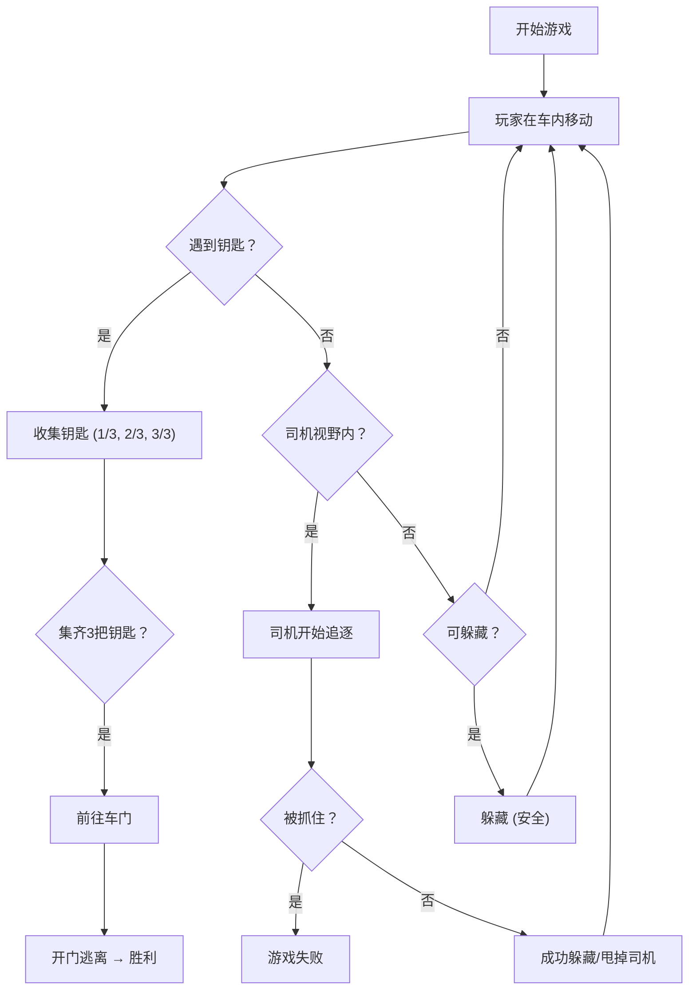

## 1. 产品概述
诡异冰淇淋车躲猫猫游戏，玩家在封闭的冰淇淋车内躲避疯狂司机的追捕，收集钥匙开门逃离。
- 核心玩法：躲猫猫 + 解谜收集，紧张刺激的追逐体验
- 目标用户：喜欢恐怖小游戏、解谜类游戏的玩家

## 2. 核心 Features

### 2.1 Feature List
1. **开始页面**：游戏标题、规则说明、开始按钮
2. **游戏主场景**：2D俯视视角的冰淇淋车内部地图
3. **玩家控制系统**：WASD/方向键移动，空格躲藏
4. **司机AI系统**：巡逻、发现、追逐玩家的智能行为
5. **钥匙收集系统**：3把钥匙散落在车内各处
6. **躲藏点系统**：冰箱、箱子、桌子下等可躲藏位置
7. **游戏结束页面**：胜利/失败结果展示、重新开始

### 2.2 页面详情
| 页面名称 | 模块名称 | Feature description |
|---------|---------|---------------------|
| 开始页 | 标题区域 | 动态扭曲的游戏标题动画 |
| 开始页 | 规则说明 | 一句话规则 + 操作说明 |
| 开始页 | 开始按钮 | 闪烁的霓虹风格按钮 |
| 游戏页 | 游戏地图 | 冰淇淋车内部俯视图，含多个房间/区域 |
| 游戏页 | 玩家角色 | 可移动的玩家，带视野范围 |
| 游戏页 | 司机角色 | 红色警示视野，巡逻/追逐状态切换 |
| 游戏页 | 状态UI | 钥匙收集进度、司机状态提示、时间/心跳 |
| 游戏页 | 交互提示 | 靠近躲藏点/钥匙时显示操作提示 |
| 结束页 | 结果展示 | 胜利/失败动画，统计信息 |
| 结束页 | 重新开始 | 返回开始或重玩按钮 |

## 3. 核心流程
玩家在冰淇淋车内移动，躲避司机的视野，找到3把钥匙，打开车门逃离。如果被司机发现并抓住则游戏失败。

## 4. 用户界面设计

### 4.1 设计风格
- **主色调**：鲜艳的冰淇淋粉 (#FF69B4)、薄荷绿 (#98FB98) 与深黑/暗红形成扭曲对比
- **辅色调**：霓虹紫 (#9400D3)、警告红 (#FF0000)、诡异黄 (#FFFF00)
- **按钮风格**：霓虹发光效果，圆角矩形，hover时有脉动动画
- **字体**：Creepster (显示字体) + VT323 (像素风格等宽字体)
- **布局风格**：规整的网格布局，游戏区域居中，UI信息固定在角落
- **视觉效果**：CRT扫描线滤镜、色彩偏移、轻微晃动营造诡异感

### 4.2 页面设计
| 页面名称 | 模块名称 | UI Elements |
|---------|---------|-------------|
| 开始页 | 标题 | 大号Creepster字体，粉紫渐变，扭曲动画 |
| 开始页 | 规则卡片 | 黑色半透明背景，霓虹边框，一句话规则 |
| 开始页 | 操作说明 | 小图标配文字，WASD移动，空格躲藏 |
| 开始页 | 开始按钮 | 粉色霓虹发光，脉动效果 |
| 游戏页 | 地图 | 暗色调车厢，粉色/绿色区域标记，网格感 |
| 游戏页 | 玩家 | 白色小人，带淡蓝色视野扇形 |
| 游戏页 | 司机 | 红色小人，带红色视野扇形，追逐时闪烁 |
| 游戏页 | 钥匙 | 金色旋转钥匙图标 |
| 游戏页 | 躲藏点 | 深蓝色半透明区域标识 |
| 游戏页 | 状态HUD | 左上：钥匙进度；右上：司机状态；底部：心跳/警告 |
| 结束页 | 结果文字 | 大号动画字体，胜利绿色/失败红色 |
| 结束页 | 统计 | 用时、躲藏次数、惊险次数 |
| 结束页 | 按钮组 | 重玩、返回主菜单 |

### 4.3 响应性
- 桌面端优先，固定1280x720游戏区域
- 移动端适配：缩放游戏区域，添加虚拟摇杆控制
- 触控优化：按钮最小48x48px

### 4.4 视觉特效
- **环境**：CRT扫描线叠加，轻微色彩偏移，角落暗角
- **司机接近**：屏幕边缘红色渐变，心跳加速效果
- **躲藏时**：画面变暗，呼吸效果
- **收集钥匙**：金色粒子爆炸效果
- **被发现**：屏幕闪红，音效警告
