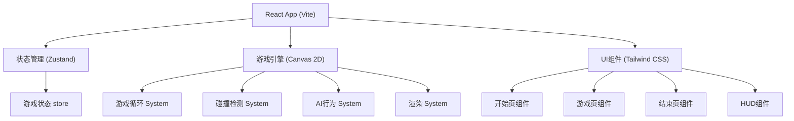

## 1. 架构设计



## 2. 技术描述
- **前端框架**: React@18 + TypeScript + Vite
- **状态管理**: Zustand
- **样式**: Tailwind CSS@3
- **游戏渲染**: HTML5 Canvas 2D API
- **路由**: React Router DOM
- **字体**: Google Fonts (Creepster, VT323)
- **音效**: Web Audio API (程序化生成)

## 3. 目录结构
```
src/
├── components/
│   ├── StartScreen.tsx      # 开始页面
│   ├── GameScreen.tsx       # 游戏主页面
│   ├── EndScreen.tsx        # 结束页面
│   ├── GameCanvas.tsx       # Canvas游戏渲染
│   └── HUD.tsx              # 游戏HUD界面
├── game/
│   ├── types.ts             # 游戏类型定义
│   ├── constants.ts         # 游戏常量配置
│   ├── store.ts             # Zustand状态管理
│   ├── engine/
│   │   ├── GameLoop.ts      # 游戏循环
│   │   ├── Player.ts        # 玩家逻辑
│   │   ├── Enemy.ts         # 敌人AI
│   │   ├── Collision.ts     # 碰撞检测
│   │   └── Renderer.ts      # Canvas渲染
│   └── utils/
│       ├── math.ts          # 数学工具
│       └── audio.ts         # 音效工具
├── pages/
│   └── App.tsx              # 主应用
├── App.tsx
├── main.tsx
└── index.css
```

## 4. 核心数据模型

### 4.1 游戏状态
```typescript
type GamePhase = 'start' | 'playing' | 'won' | 'lost';

interface GameState {
  phase: GamePhase;
  player: Player;
  enemy: Enemy;
  keys: Key[];
  hidingSpots: HidingSpot[];
  walls: Wall[];
  door: Door;
  collectedKeys: number;
  isHiding: boolean;
  currentHidingSpot: HidingSpot | null;
  isChasing: boolean;
  gameTime: number;
  stats: GameStats;
}
```

### 4.2 实体类型
```typescript
interface Entity {
  x: number;
  y: number;
  width: number;
  height: number;
  rotation: number;
}

interface Player extends Entity {
  speed: number;
  viewDistance: number;
  viewAngle: number;
}

interface Enemy extends Entity {
  speed: number;
  viewDistance: number;
  viewAngle: number;
  state: 'patrol' | 'chase' | 'search';
  patrolPath: Point[];
  currentPathIndex: number;
  lastSeenPlayerPos: Point | null;
}

interface Key extends Entity {
  collected: boolean;
  id: number;
}

interface HidingSpot extends Entity {
  occupied: boolean;
  type: 'fridge' | 'box' | 'table';
}
```

## 5. 游戏常量
```typescript
// 地图尺寸
const MAP_WIDTH = 1280;
const MAP_HEIGHT = 720;

// 玩家属性
const PLAYER_SPEED = 180;
const PLAYER_VIEW_DISTANCE = 200;
const PLAYER_VIEW_ANGLE = Math.PI / 3;

// 敌人属性
const ENEMY_SPEED_PATROL = 80;
const ENEMY_SPEED_CHASE = 160;
const ENEMY_VIEW_DISTANCE = 220;
const ENEMY_VIEW_ANGLE = Math.PI / 2.5;

// 游戏规则
const TOTAL_KEYS = 3;
const HIDE_COOLDOWN = 500;
const CHASE_DURATION_AFTER_LOST = 3000;
```

## 6. 核心系统

### 6.1 游戏循环
- 使用 `requestAnimationFrame` 实现60fps游戏循环
- 固定时间步长更新逻辑，可变渲染帧率
- 系统顺序：输入处理 → 玩家更新 → 敌人AI更新 → 碰撞检测 → 游戏状态检查 → 渲染

### 6.2 碰撞检测
- AABB碰撞检测用于墙体和实体
- 扇形视野检测用于敌人发现玩家
- 距离检测用于收集钥匙和进入躲藏点

### 6.3 敌人AI状态机
- **Patrol**: 沿预设路径巡逻，随机停留
- **Chase**: 发现玩家后直接追逐，更新最后已知位置
- **Search**: 丢失视野后前往最后已知位置搜索，一段时间后返回巡逻

### 6.4 输入处理
- 键盘事件监听：WASD/方向键移动，空格躲藏/出来
- 移动使用向量归一化处理斜向移动速度一致
