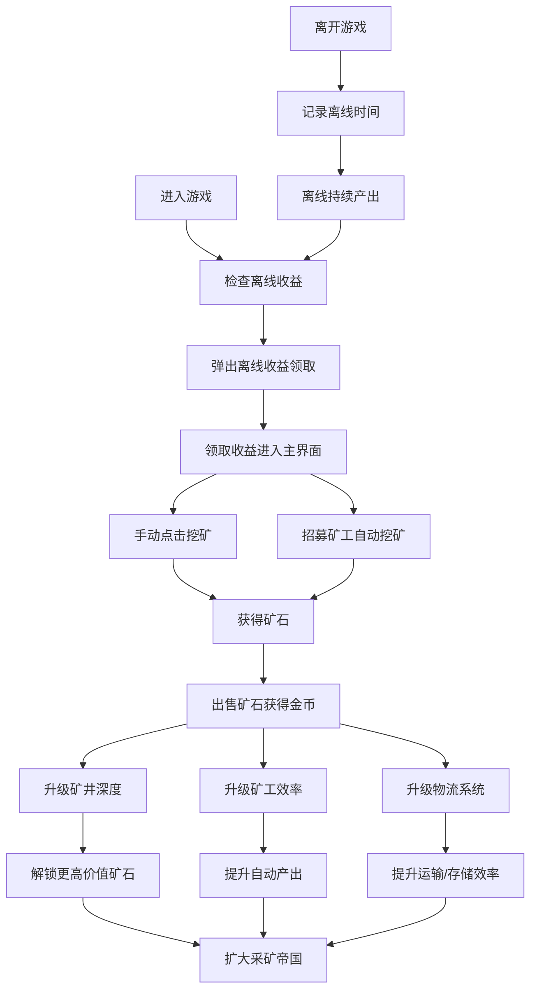

## 1. 产品概述

《采矿大亨》是一款放置点击类休闲游戏，玩家通过招募矿工开采矿石获取收益，逐步升级矿井深度和物流系统，实现自动化生产和离线挂机增收。游戏目标是建立一个庞大的采矿帝国。

- 核心玩法：点击挖矿 → 招募矿工 → 升级矿井/物流 → 离线收益 → 扩大生产
- 目标用户：喜欢放置类、模拟经营类游戏的休闲玩家
- 市场价值：碎片化时间娱乐，简单易上手，数值成长带来成就感

## 2. 核心 Features

### 2.1 用户角色

| 角色 | 注册方式 | 核心权限 |
|------|----------|----------|
| 玩家 | 无需注册，本地存储 | 完整游戏体验，数据本地保存 |

### 2.2 Feature 模块

1. **主游戏界面**：资源显示、矿井视图、操作区域
2. **矿井系统**：矿石开采、矿井升级、深度解锁
3. **矿工系统**：矿工招募、等级升级、效率提升
4. **物流系统**：运输速度、仓库容量、自动售卖
5. **离线收益**：离线时间计算、收益领取、挂机奖励

### 2.3 页面详情

| 页面名称 | 模块名称 | Feature 描述 |
|----------|----------|--------------|
| 主界面 | 资源面板 | 实时显示金币、矿石数量、每秒收益 |
| 主界面 | 矿井区域 | 可视化矿井深度，点击挖矿，显示矿石产出动画 |
| 主界面 | 矿工面板 | 显示已招募矿工列表，招募新矿工，升级矿工等级 |
| 主界面 | 物流面板 | 升级运输速度、仓库容量、自动售卖效率 |
| 主界面 | 离线收益弹窗 | 玩家重新进入游戏时显示离线期间收益 |

## 3. 核心流程

## 4. 用户界面设计

### 4.1 设计风格

- **主色调**：深棕色(#3E2723)代表土地、金色(#FFD700)代表财富、铜色(#B87333)代表矿石
- **辅助色**：深灰色(#2D2D2D)背景、青绿色(#4CAF50)代表升级、红色(#F44336)代表警告
- **按钮风格**：圆角矩形，带有微妙的3D阴影效果，悬停时有上浮动画
- **字体**：标题使用"Press Start 2P"像素风格字体，正文使用"VT323"等宽像素字体
- **布局风格**：卡片式布局，清晰的模块分区，左侧矿井区、右侧控制面板
- **图标风格**：像素风emoji和Lucide图标结合，统一的8-bit风格

### 4.2 页面设计概述

| 页面名称 | 模块名称 | UI 元素 |
|----------|----------|----------|
| 主界面 | 资源面板 | 顶部横幅，大数字显示金币、矿石、DPS，像素字体，金色闪光效果 |
| 主界面 | 矿井区域 | 左侧60%区域，分层显示矿井深度，每层有矿石和矿工动画，点击区域放大效果 |
| 主界面 | 控制面板 | 右侧40%区域，三个选项卡：矿工、物流、升级，卡片式按钮 |
| 主界面 | 底部状态栏 | 显示离线计时、游戏速度、音效开关 |
| 弹窗 | 离线收益 | 居中弹窗，金色边框，显示离线时长和收益，大号领取按钮 |

### 4.3 响应式

- 桌面端优先设计(1280px+)
- 平板端(768px-1279px)：左右布局调整为上下布局
- 移动端(<768px)：单列布局，选项卡改为底部导航
- 触摸优化：增大点击区域到48x48px

### 4.4 动画效果

- 矿石飞出：点击矿井时矿石粒子向上飞散动画
- 数字跳动：收益增加时数字滚动效果
- 进度条填充：升级时平滑的进度条动画
- 矿工工作：循环的挖掘动画
- 按钮悬停：轻微上浮+阴影加深
- 页面加载：元素渐入+轻微位移
