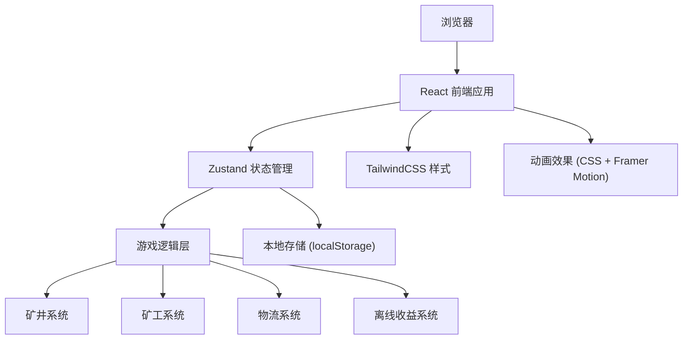

## 1. 架构设计



## 2. 技术描述

- **前端框架**: React@18 + TypeScript
- **构建工具**: Vite@5
- **状态管理**: Zustand@4
- **样式方案**: TailwindCSS@3
- **图标库**: Lucide React
- **动画库**: framer-motion
- **数据持久化**: localStorage
- **无后端服务**: 纯前端游戏，数据本地存储

## 3. 目录结构

```
src/
├── components/
│   ├── game/
│   │   ├── MineShaft.tsx          # 矿井区域组件
│   │   ├── MinerPanel.tsx         # 矿工管理面板
│   │   ├── LogisticsPanel.tsx     # 物流系统面板
│   │   ├── ResourceBar.tsx        # 资源显示栏
│   │   ├── OfflineModal.tsx       # 离线收益弹窗
│   │   └── OreParticle.tsx        # 矿石粒子动画
│   └── ui/
│       ├── Button.tsx             # 通用按钮组件
│       ├── Card.tsx               # 通用卡片组件
│       ├── ProgressBar.tsx        # 进度条组件
│       └── TabPanel.tsx           # 选项卡组件
├── store/
│   └── useGameStore.ts            # 游戏状态管理
├── hooks/
│   ├── useGameLoop.ts             # 游戏主循环Hook
│   ├── useOfflineEarnings.ts      # 离线收益Hook
│   └── useClickEffect.ts          # 点击效果Hook
├── utils/
│   ├── formatters.ts              # 数字格式化工具
│   ├── calculations.ts            # 游戏数值计算
│   └── storage.ts                 # 本地存储工具
├── types/
│   └── game.ts                    # 类型定义
├── data/
│   ├── miners.ts                  # 矿工配置数据
│   ├── ores.ts                    # 矿石配置数据
│   └── upgrades.ts                # 升级配置数据
├── App.tsx                        # 主应用组件
├── main.tsx                       # 入口文件
└── index.css                      # 全局样式
```

## 4. 数据模型

### 4.1 类型定义

```typescript
// 矿石类型
interface OreType {
  id: string;
  name: string;
  emoji: string;
  baseValue: number;
  unlockDepth: number;
  color: string;
}

// 矿工类型
interface MinerType {
  id: string;
  name: string;
  emoji: string;
  baseCost: number;
  baseEfficiency: number;
  description: string;
}

// 矿工实例
interface Miner {
  id: string;
  typeId: string;
  level: number;
  count: number;
}

// 物流升级
interface LogisticsUpgrade {
  id: string;
  name: string;
  description: string;
  emoji: string;
  baseCost: number;
  effect: number;
  maxLevel: number;
}

// 游戏状态
interface GameState {
  gold: number;
  ores: Record<string, number>;
  mineDepth: number;
  miners: Miner[];
  logistics: Record<string, number>;
  totalEarnings: number;
  lastOnlineTime: number;
  gameSpeed: number;
  soundEnabled: boolean;
}
```

## 5. 核心算法

### 5.1 挖矿产出计算
```
手动点击产出 = 基础产出 * (1 + 矿井深度加成)
矿工自动产出 = Σ(矿工数量 * 矿工基础效率 * 矿工等级加成) * 物流速度加成
每秒总产出 = 手动点击积累 + 矿工自动产出
```

### 5.2 升级成本计算
```
升级成本 = 基础成本 * (成本增长系数 ^ 当前等级)
成本增长系数 = 1.15 (矿工) / 1.2 (物流) / 1.5 (矿井深度)
```

### 5.3 离线收益计算
```
离线时长 = 当前时间 - 上次在线时间
最大离线时长 = 8小时
离线效率 = 在线效率 * 0.5 (离线惩罚)
离线收益 = 每秒产出 * 离线时长 * 离线效率
```

## 6. 状态管理设计

```typescript
// Zustand Store 核心方法
interface GameStore {
  // 状态
  gold: number;
  ores: Record<string, number>;
  mineDepth: number;
  miners: Miner[];
  logistics: Record<string, number>;
  
  // 操作
  clickMine: () => void;
  hireMiner: (typeId: string) => void;
  upgradeMiner: (minerId: string) => void;
  upgradeLogistics: (upgradeId: string) => void;
  upgradeMineDepth: () => void;
  collectOfflineEarnings: (earnings: number) => void;
  
  // 计算属性
  getOrePerSecond: () => number;
  getGoldPerSecond: () => number;
  getTotalMinerEfficiency: () => number;
  getLogisticsSpeed: () => number;
  
  // 持久化
  saveGame: () => void;
  loadGame: () => void;
}
```

## 7. 性能优化

1. **游戏循环**: 使用 requestAnimationFrame 实现60fps更新，状态变更节流到100ms
2. **状态更新**: 批量更新状态，避免频繁重渲染
3. **组件优化**: 使用 React.memo 包裹纯展示组件
4. **动画优化**: 使用 CSS transform 和 opacity 实现硬件加速动画
5. **存储优化**: 仅在关键状态变更时持久化，防抖处理
