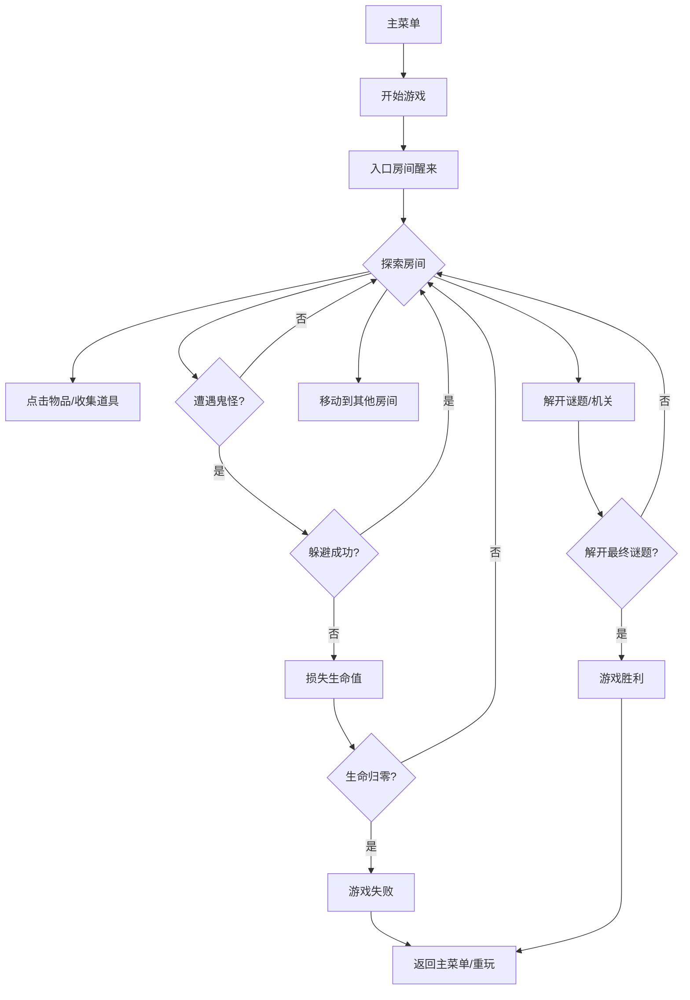

## 1. 产品概述

《微缩恐怖屋》是一款以微缩模型美学呈现的点击解谜+潜行恐怖游戏。玩家扮演被困在诡异微缩屋中的小人，需要通过点击互动解开谜题、收集道具，同时躲避游荡的鬼怪，最终找到逃离的方法。游戏融合了《爷爷的城市》的精致微缩视觉与《逃出恐怖屋》的经典解谜潜行玩法，规则简单直观，上手即玩。

- 目标用户：喜欢解谜、恐怖题材的休闲玩家
- 核心价值：独特的微缩美学 + 紧张刺激的潜行解谜体验

## 2. 核心功能

### 2.1 游戏模块

1. **主菜单**：开始游戏、继续游戏、游戏说明、关于
2. **游戏主场景**：微缩屋多房间探索、点击互动、潜行躲避
3. **物品栏系统**：道具收集、组合、使用
4. **谜题系统**：环境解谜、密码锁、机关触发
5. **鬼怪AI**：巡逻、感知、追逐
6. **UI界面**：生命值、提示系统、暂停菜单

### 2.2 页面详情

| 页面名称 | 模块名称 | 功能描述 |
|---------|---------|----------|
| 主菜单 | 标题与按钮 | 游戏标题、开始/继续/说明/关于按钮，微缩屋背景 |
| 游戏场景 | 房间视图 | 俯视微缩房间、可点击物品、玩家角色、鬼怪 |
| 游戏场景 | 物品栏 | 底部道具栏，点击选中，拖动物品使用 |
| 游戏场景 | 状态UI | 心跳/生命值指示器、当前房间名、提示按钮 |
| 游戏场景 | 对话/提示 | 物品描述、谜题线索、剧情文本 |
| 暂停菜单 | 暂停面板 | 继续、重新开始、返回主菜单 |
| 结束画面 | 结算画面 | 胜利/失败文本、重玩按钮 |

## 3. 核心流程

玩家从主菜单进入游戏，在微缩屋的入口房间醒来。通过点击场景中的物品收集道具、解开机关，在房间之间移动探索。过程中需要躲避游荡的鬼怪，被发现会损失生命值，生命归零则游戏失败。收集齐关键道具并解开最终谜题后，成功逃离微缩屋，游戏胜利。

## 4. 用户界面设计

### 4.1 设计风格

- **整体风格**：微缩模型/立体书风格，俯视等距视角，类似《爷爷的城市》
- **色彩基调**：暖黄底色 + 深阴影，营造温馨又诡异的反差感；鬼怪出现时色调变冷
- **材质感**：纸张、木材、黏土的手工质感，轻微的颗粒噪点
- **光影**：倾斜移位（tilt-shift）效果，中心清晰边缘虚化，模拟微距摄影
- **动画**：物品悬停轻微放大、点击按压反馈、鬼怪漂浮感、场景切换淡入淡出

### 4.2 视觉元素

- **房间**：以微缩模型屋的形式呈现，墙面有纸张纹理，家具有木材质感
- **玩家**：小纸人形象，带微光效果，可通过点击地面移动
- **鬼怪**：半透明的幽灵形象，缓慢漂浮，有巡逻路径
- **可交互物品**：轻微发光描边，悬停时更明显
- **物品栏**：木质抽屉风格，道具以微缩模型形式展示

### 4.3 页面设计概述

| 页面名称 | 模块名称 | UI元素 |
|---------|---------|-------|
| 主菜单 | 标题区 | 大号艺术字标题，微缩屋剪影背景，缓慢呼吸动画 |
| 主菜单 | 按钮区 | 竖向排列的木质按钮，悬停时亮起，点击有凹陷效果 |
| 游戏场景 | 场景区 | 居中的微缩房间，倾斜移位效果，点击地面移动角色 |
| 游戏场景 | 物品栏 | 底部横向木质栏，格子状布局，选中道具高亮 |
| 游戏场景 | 状态栏 | 左上角心跳指示器（生命值），右上角房间名称与提示按钮 |
| 游戏场景 | 对话框 | 底部半透明白色面板，衬线字体显示文本 |
| 暂停菜单 | 遮罩+面板 | 暗色半透明遮罩，居中木质面板，三个按钮竖向排列 |

### 4.4 响应式

- 桌面端优先，场景按比例缩放
- 移动端适配：物品栏移至底部，按钮放大便于触控
- 最小支持宽度：375px

### 4.5 音效氛围建议

- 背景音：轻微的噼啪声（类似老房子）、远处的脚步声
- 交互音：点击物品的清脆声、拾取道具的叮咚声
- 恐怖音：鬼怪靠近时心跳加速、呼吸声、低沉嗡鸣
