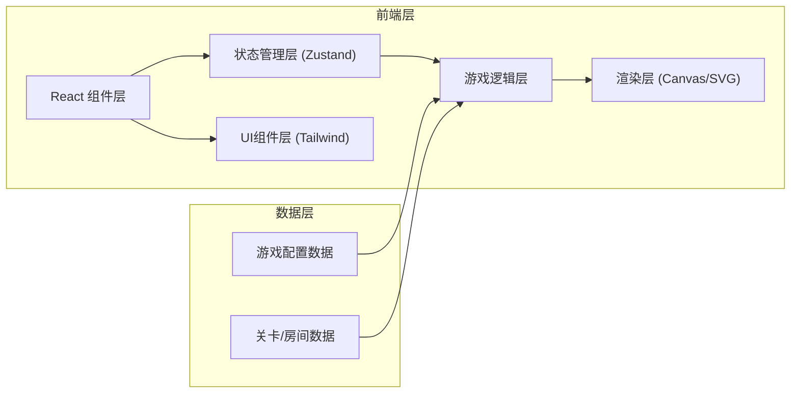

## 1. 架构设计

这是一个纯前端的网页游戏，使用 React + TypeScript + Vite 构建。游戏采用 2D Canvas/SVG 渲染微缩模型风格的场景，结合 CSS 动画实现交互效果。状态管理使用 Zustand。



## 2. 技术描述

- **前端框架**：React@18 + TypeScript + Vite
- **样式方案**：Tailwind CSS@3
- **状态管理**：Zustand
- **渲染方式**：HTML5 Canvas 用于场景渲染，React DOM 用于 UI
- **动画**：CSS 动画 + requestAnimationFrame 游戏循环
- **图标**：Lucide React
- **无需后端**，游戏数据全部内置

## 3. 目录结构

```
src/
├── components/          # React 组件
│   ├── game/           # 游戏相关组件
│   │   ├── GameCanvas.tsx    # 游戏主画布
│   │   ├── GameHUD.tsx       # 游戏HUD（生命、房间名）
│   │   ├── Inventory.tsx     # 物品栏
│   │   └── DialogBox.tsx     # 对话框
│   ├── ui/             # 通用UI组件
│   │   ├── Button.tsx
│   │   └── Modal.tsx
│   └── menus/          # 菜单组件
│       ├── MainMenu.tsx
│       ├── PauseMenu.tsx
│       └── EndScreen.tsx
├── store/             # Zustand 状态
│   └── useGameStore.ts
├── game/              # 游戏核心逻辑
│   ├── engine.ts      # 游戏引擎/主循环
│   ├── player.ts      # 玩家逻辑
│   ├── ghost.ts       # 鬼怪AI
│   ├── items.ts       # 物品系统
│   ├── puzzles.ts     # 谜题系统
│   └── rooms.ts       # 房间/场景数据
├── types/             # TypeScript 类型定义
│   └── game.ts
├── utils/             # 工具函数
│   ├── math.ts
│   └── collision.ts
├── pages/             # 页面
│   └── GamePage.tsx
├── App.tsx
├── main.tsx
└── index.css
```

## 4. 核心类型定义

```typescript
// 位置
interface Position {
  x: number;
  y: number;
}

// 物品
interface Item {
  id: string;
  name: string;
  description: string;
  icon: string;
  canCombine?: string[]; // 可组合的物品ID
}

// 可交互对象
interface Interactable {
  id: string;
  type: 'item' | 'door' | 'puzzle' | 'furniture';
  position: Position;
  size: { width: number; height: number };
  name: string;
  description: string;
  requiresItem?: string; // 需要的物品才能交互
  givesItem?: string;    // 交互后给予的物品
  leadsTo?: string;      // 通往的房间ID
  puzzleId?: string;     // 关联的谜题ID
  solved?: boolean;
  visible?: boolean;
}

// 房间
interface Room {
  id: string;
  name: string;
  description: string;
  background: string; // 背景色/纹理
  interactables: Interactable[];
  ghostPatrolPath?: Position[]; // 鬼怪巡逻路径
  exits: { direction: string; roomId: string; position: Position }[];
}

// 鬼怪
interface Ghost {
  id: string;
  position: Position;
  targetPosition: Position;
  speed: number;
  patrolPath: Position[];
  patrolIndex: number;
  state: 'patrol' | 'chase' | 'search';
  detectionRadius: number;
  alertLevel: number;
}

// 玩家
interface Player {
  position: Position;
  targetPosition: Position;
  speed: number;
  health: number;
  maxHealth: number;
  inventory: string[]; // 物品ID列表
  currentRoom: string;
  isHidden: boolean;
}

// 游戏状态
type GameState = 'menu' | 'playing' | 'paused' | 'dialog' | 'puzzle' | 'victory' | 'gameover';

// 谜题
interface Puzzle {
  id: string;
  type: 'code' | 'sequence' | 'combination';
  description: string;
  solution: string | number[];
  hint: string;
  reward?: string;
}
```

## 5. 游戏状态管理

使用 Zustand 管理全局游戏状态：

```typescript
const useGameStore = create((set, get) => ({
  gameState: 'menu',
  player: { ... },
  ghost: { ... },
  currentRoom: 'entrance',
  rooms: { ... },
  puzzles: { ... },
  dialog: { visible: false, text: '', speaker: '' },
  
  // Actions
  startGame: () => { ... },
  pauseGame: () => { ... },
  resumeGame: () => { ... },
  movePlayer: (target) => { ... },
  interactWith: (id) => { ... },
  collectItem: (itemId) => { ... },
  useItem: (itemId, targetId) => { ... },
  changeRoom: (roomId) => { ... },
  showDialog: (text, speaker) => { ... },
  hideDialog: () => { ... },
  damagePlayer: (amount) => { ... },
  solvePuzzle: (puzzleId) => { ... },
}));
```

## 6. 游戏循环

使用 `requestAnimationFrame` 实现游戏主循环：

```
每帧执行:
1. 更新玩家位置（向目标移动）
2. 更新鬼怪位置（巡逻/追逐）
3. 检测碰撞与可见性
4. 检测鬼怪是否发现玩家
5. 渲染场景
```

## 7. 渲染方案

- **场景**：使用 Canvas 2D 绘制微缩房间、家具、物品、玩家、鬼怪
- **UI**：使用 React + Tailwind 绘制物品栏、对话框、菜单等
- **微缩效果**：通过 CSS `filter: blur()` 实现倾斜移位，Canvas 内绘制阴影和纹理
- **动画**：
  - 玩家移动：插值动画
  - 鬼怪：漂浮上下浮动效果
  - 可交互物品：呼吸式发光
  - 场景切换：淡入淡出过渡
