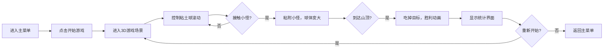

## 1. 产品概述

《粘土大冒险》是一款粘土风格的3D创意沙盒游戏。玩家控制一个粘土球在粘土世界中滚动，通过粘附沿途的小怪来让球不断变大，最终爬上山顶吃掉目标完成游戏。游戏以轻松治愈的粘土美术风格和简单有趣的核心玩法为特色。

- 核心玩法：滚粘土球 → 粘小怪 → 球变大 → 吃山顶目标
- 目标用户：所有年龄段玩家，喜欢轻松治愈风格游戏的用户
- 产品价值：提供简单纯粹的游戏乐趣，精美的粘土视觉体验

## 2. 核心功能

### 2.1 用户角色
| 角色 | 注册方式 | 核心权限 |
|------|----------|----------|
| 玩家 | 无需注册 | 完整游戏体验 |

### 2.2 功能模块
1. **主菜单页面**：游戏标题、开始按钮、操作说明
2. **游戏场景**：3D粘土世界、玩家控制、小怪系统、地形系统
3. **HUD界面**：球体大小显示、粘附小怪计数、进度指示
4. **胜利界面**：通关动画、得分展示、重新开始

### 2.3 页面详情
| 页面名称 | 模块名称 | 功能描述 |
|----------|----------|----------|
| 主菜单 | 标题区域 | 粘土风格游戏标题，带弹跳动画 |
| 主菜单 | 操作说明 | WASD/方向键控制，空格跳跃 |
| 游戏场景 | 玩家控制 | 粘土球滚动控制，物理碰撞 |
| 游戏场景 | 小怪系统 | 可爱粘土小怪随机生成，可被粘附 |
| 游戏场景 | 地形系统 | 粘土山丘、平台、山顶目标 |
| 游戏场景 | 粘附机制 | 接触小怪后自动粘附，球体增大 |
| HUD界面 | 状态显示 | 显示当前球体大小、已粘附小怪数量 |
| HUD界面 | 进度指示 | 显示到山顶目标的距离进度 |
| 胜利界面 | 通关动画 | 粘土球吃掉目标的庆祝动画 |
| 胜利界面 | 统计展示 | 显示游戏用时、粘附小怪总数 |

## 3. 核心流程

玩家进入游戏主菜单，点击开始后进入3D粘土世界。使用WASD控制粘土球滚动，在滚动过程中接触到小怪会将其粘附到球体上，球体随之变大。随着球体变大，可以爬上更陡峭的山坡。最终到达山顶吃掉目标，触发胜利动画和统计界面，可选择重新开始。

## 4. 界面设计

### 4.1 设计风格
- **主色调**：温暖的粘土色系 - 陶土橙(#E07A5F)、奶油白(#F4F1DE)、天空蓝(#81B29A)、草地绿(#3D405B)
- **按钮风格**：圆润3D粘土按钮，带有柔和阴影和按压效果
- **字体**：圆润可爱的卡通字体，标题使用大号粗体
- **布局风格**：简洁居中布局，大量留白，元素圆润可爱
- **视觉风格**：软阴影、圆角、粘土质感、轻微膨胀感

### 4.2 页面设计概览
| 页面名称 | 模块名称 | UI元素 |
|----------|----------|--------|
| 主菜单 | 标题 | 粘土质感3D文字，弹跳动画，渐变色 |
| 主菜单 | 开始按钮 | 大号圆形粘土按钮，悬停放大效果 |
| 主菜单 | 操作说明 | 卡片式布局，图标+文字说明 |
| 游戏场景 | 3D世界 | 粘土材质地形，柔和光照，卡通渲染 |
| 游戏场景 | 粘土球 | 带有捏痕纹理的粘土球体，滚动时表面变形 |
| 游戏场景 | 小怪 | 多种颜色的可爱粘土小怪，带有简单表情 |
| HUD界面 | 状态条 | 左上角半透明卡片，显示球体大小进度条 |
| HUD界面 | 计数 | 小怪图标+数字，带有粘附时的弹跳动画 |
| 胜利界面 | 弹窗 | 居中粘土风格弹窗，彩带粒子特效 |
| 胜利界面 | 统计 | 大号数字展示，带有递增动画 |

### 4.3 响应式设计
- 桌面端优先，全屏3D游戏体验
- 支持窗口大小自适应
- 移动端可使用虚拟摇杆控制（可选扩展）

### 4.4 3D场景指导
- **环境与氛围**：温暖明亮的粘土世界，柔和的全局光照，轻微的环境光遮蔽
- **光照设置**：主方向光+柔和环境光，暖色基调，阴影柔和
- **相机设置**：第三人称跟随相机，平滑跟随，可轻微旋转
- **构图与焦点**：玩家粘土球始终在视野中心，山顶目标在远处可见
- **交互与动画**：球体滚动时的表面变形，小怪被粘附时的压扁动画，山顶目标的发光脉冲
- **后处理效果**：轻微的泛光效果，色彩增强，卡通渲染轮廓
- **性能预算**：使用实例化渲染处理小怪，控制多边形数量在合理范围
