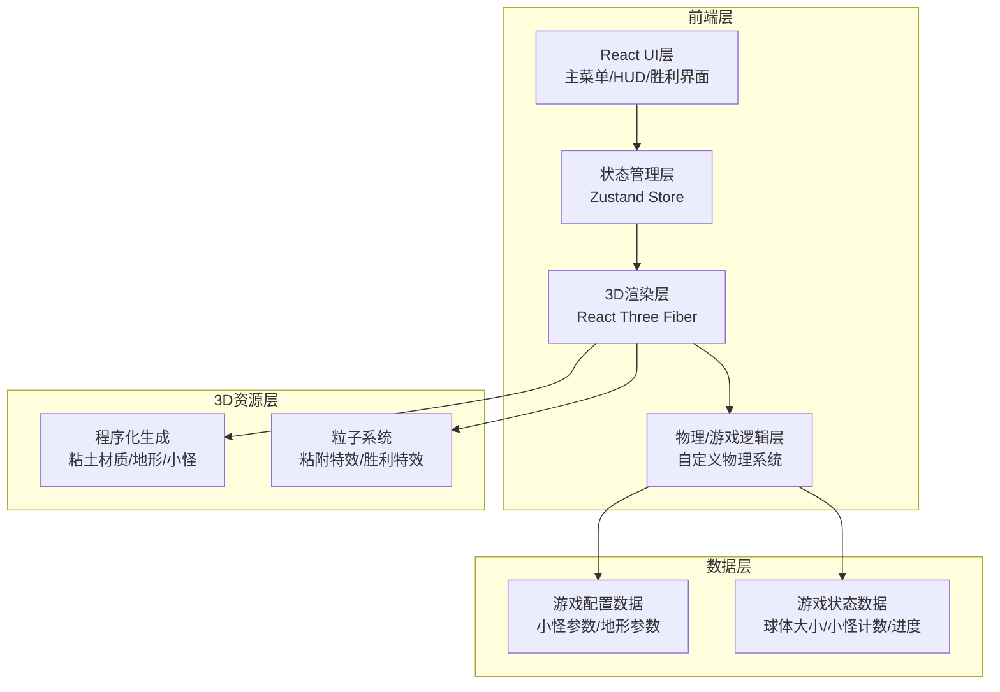

## 1. 架构设计



## 2. 技术选型

| 层级 | 技术栈 | 版本 | 说明 |
|------|--------|------|------|
| 前端框架 | React | ^18.2.0 | 组件化开发 |
| 开发构建 | Vite | ^5.0.0 | 快速构建与热更新 |
| 类型系统 | TypeScript | ^5.0.0 | 类型安全 |
| 样式框架 | TailwindCSS | ^3.4.0 | 原子化CSS |
| 状态管理 | Zustand | ^4.5.0 | 轻量状态管理 |
| 3D渲染 | Three.js | ^0.160.0 | WebGL 3D引擎 |
| 3D React绑定 | @react-three/fiber | ^8.15.0 | React声明式Three.js |
| 3D工具库 | @react-three/drei | ^9.92.0 | 常用3D组件 |
| 后处理 | @react-three/postprocessing | ^2.15.0 | 后期特效 |

## 3. 目录结构

```
src/
├── components/           # React UI组件
│   ├── MainMenu.tsx      # 主菜单
│   ├── HUD.tsx           # 游戏HUD
│   └── VictoryScreen.tsx # 胜利界面
├── game/                 # 3D游戏组件
│   ├── GameScene.tsx     # 游戏主场景
│   ├── ClayBall.tsx      # 粘土球玩家
│   ├── Critter.tsx       # 小怪组件
│   ├── Terrain.tsx       # 地形系统
│   └── Goal.tsx          # 山顶目标
├── store/                # 状态管理
│   └── useGameStore.ts   # 游戏状态
├── hooks/                # 自定义Hooks
│   ├── useControls.ts    # 输入控制
│   └── usePhysics.ts     # 物理系统
├── types/                # 类型定义
│   └── game.ts           # 游戏相关类型
├── utils/                # 工具函数
│   ├── clayMaterial.ts   # 粘土材质
│   └── noise.ts          # 噪声函数
├── pages/                # 页面
│   └── Game.tsx          # 游戏主页面
├── App.tsx               # 应用入口
├── main.tsx              # React入口
└── index.css             # 全局样式
```

## 4. 路由定义

| 路由 | 页面 | 说明 |
|------|------|------|
| / | Game.tsx | 游戏主页面（包含菜单和游戏场景） |

## 5. 状态管理设计

### 5.1 游戏状态 Store

```typescript
interface GameState {
  // 游戏阶段: 'menu' | 'playing' | 'victory'
  gamePhase: 'menu' | 'playing' | 'victory'
  
  // 玩家状态
  ballSize: number
  ballPosition: [number, number, number]
  
  // 小怪系统
  critters: Critter[]
  attachedCritters: AttachedCritter[]
  critterCount: number
  
  // 游戏进度
  distanceToGoal: number
  progress: number
  startTime: number
  elapsedTime: number
  
  // Actions
  startGame: () => void
  restartGame: () => void
  attachCritter: (critterId: string) => void
  updateBallSize: (delta: number) => void
  updatePosition: (pos: [number, number, number]) => void
  reachGoal: () => void
}
```

### 5.2 小怪类型定义

```typescript
interface Critter {
  id: string
  position: [number, number, number]
  color: string
  size: number
  type: 'basic' | 'big' | 'shiny'
  value: number
  isAttached: boolean
}

interface AttachedCritter {
  critter: Critter
  attachOffset: [number, number, number]
  attachTime: number
}
```

## 6. 核心模块设计

### 6.1 控制模块 (useControls)
- 键盘输入监听 (WASD + 方向键 + 空格)
- 输入归一化处理
- 移动向量计算

### 6.2 物理模块 (usePhysics)
- 球体滚动物理模拟
- 重力与摩擦力
- 碰撞检测 (球体-地形, 球体-小怪)
- 粘附物理计算

### 6.3 渲染模块
- 粘土材质：程序化生成带凹凸纹理的粘土质感
- 卡通渲染：轮廓线 + 平着色
- 粒子系统：粘附特效、胜利庆祝特效
- 后处理：Bloom泛光、色彩调整

### 6.4 地形生成
- 使用 Simplex 噪声生成起伏地形
- 中心山丘设计，山顶放置目标
- 多层粘土材质纹理

## 7. 性能优化

1. **实例化渲染**：小怪使用 InstancedMesh 批量渲染
2. **视锥剔除**：只渲染视野内的对象
3. **LOD**：地形使用多细节层次
4. **状态更新优化**：使用 Zustand 选择器避免不必要重渲染
5. **物理帧率**：固定60Hz物理更新，与渲染帧率分离
