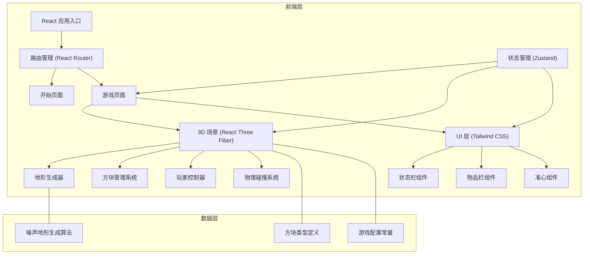

## 1. 架构设计



## 2. 技术描述

**前端技术栈：**
- 框架：React 18 + TypeScript
- 构建工具：Vite
- 样式：Tailwind CSS 3
- 3D 渲染：Three.js + @react-three/fiber + @react-three/drei
- 状态管理：Zustand
- 路由：React Router DOM

**核心库说明：**
- `three`: WebGL 3D 渲染引擎基础
- `@react-three/fiber`: Three.js 的 React 声明式封装
- `@react-three/drei`: R3F 常用组件库（相机、控制、环境等）
- `zustand`: 轻量级状态管理，管理游戏全局状态

**无后端设计：**
- 纯前端游戏，所有逻辑在浏览器运行
- 无需数据库，游戏状态存储在内存中
- 地形随机生成，每次游戏体验不同

## 3. 路由定义

| 路径 | 页面 | 用途 |
|------|------|------|
| `/` | 开始页面 | 游戏标题、操作说明、开始按钮 |
| `/game` | 游戏页面 | 3D 游戏主场景、状态栏、物品栏 |

## 4. 数据模型

### 4.1 方块类型定义

```typescript
enum BlockType {
  AIR = 'air',
  GRASS = 'grass',
  DIRT = 'dirt',
  STONE = 'stone',
  WOOD = 'wood',
  LEAVES = 'leaves',
  SAND = 'sand',
  WATER = 'water',
  PLANKS = 'planks',
  COBBLESTONE = 'cobblestone',
}

interface BlockProperties {
  id: BlockType;
  name: string;
  color: string;
  hardness: number;
  transparent: boolean;
}
```

### 4.2 世界数据模型

```typescript
// 世界使用 Map 存储，key 为坐标字符串，value 为方块类型
type WorldMap = Map<string, BlockType>;

interface WorldState {
  blocks: WorldMap;
  size: { width: number; height: number; depth: number };
  seed: number;
}
```

### 4.3 玩家状态模型

```typescript
interface PlayerState {
  position: { x: number; y: number; z: number };
  velocity: { x: number; y: number; z: number };
  yaw: number;    // 水平旋转角度
  pitch: number;  // 垂直旋转角度
  onGround: boolean;
  health: number;     // 生命值 0-20
  hunger: number;     // 饥饿值 0-20
  selectedSlot: number;  // 当前选中的物品栏槽位 0-4
  inventory: InventorySlot[];
}

interface InventorySlot {
  blockType: BlockType | null;
  count: number;
}
```

### 4.4 游戏全局状态

```typescript
interface GameState {
  phase: 'menu' | 'playing' | 'paused';
  world: WorldState;
  player: PlayerState;
  settings: GameSettings;
}

interface GameSettings {
  renderDistance: number;
  mouseSensitivity: number;
  volume: number;
}
```

### 4.5 方块配置

```typescript
const BLOCK_CONFIG: Record<BlockType, BlockProperties> = {
  [BlockType.AIR]: { id: BlockType.AIR, name: '空气', color: '#000000', hardness: 0, transparent: true },
  [BlockType.GRASS]: { id: BlockType.GRASS, name: '草地', color: '#4CAF50', hardness: 0.6, transparent: false },
  [BlockType.DIRT]: { id: BlockType.DIRT, name: '泥土', color: '#8B4513', hardness: 0.5, transparent: false },
  [BlockType.STONE]: { id: BlockType.STONE, name: '石头', color: '#808080', hardness: 1.5, transparent: false },
  [BlockType.WOOD]: { id: BlockType.WOOD, name: '木头', color: '#A0522D', hardness: 1.2, transparent: false },
  [BlockType.LEAVES]: { id: BlockType.LEAVES, name: '树叶', color: '#228B22', hardness: 0.2, transparent: true },
  [BlockType.SAND]: { id: BlockType.SAND, name: '沙子', color: '#F4D03F', hardness: 0.5, transparent: false },
  [BlockType.WATER]: { id: BlockType.WATER, name: '水', color: '#4169E1', hardness: Infinity, transparent: true },
  [BlockType.PLANKS]: { id: BlockType.PLANKS, name: '木板', color: '#DEB887', hardness: 1.0, transparent: false },
  [BlockType.COBBLESTONE]: { id: BlockType.COBBLESTONE, name: '鹅卵石', color: '#696969', hardness: 1.5, transparent: false },
};
```

## 5. 核心模块设计

### 5.1 地形生成模块

使用 Simplex 噪声算法生成自然地形：
- 高度图生成：2D 噪声决定地表高度
- 地层分布：草地 -> 泥土 -> 石头的垂直分布
- 树木生成：随机位置放置树干和树叶
- 水体生成：低海拔区域填充水

### 5.2 方块交互模块

- **射线检测**：从相机发射射线，检测瞄准的方块
- **破坏逻辑**：左键长按破坏，根据硬度决定破坏时间
- **放置逻辑**：右键在目标方块相邻位置放置
- **相邻检测**：确保放置位置合法且不与玩家重叠

### 5.3 玩家控制模块

- **视角控制**：鼠标移动控制 yaw 和 pitch
- **移动系统**：WASD 相对视角方向移动
- **物理系统**：重力、跳跃、碰撞检测
- **状态更新**：生命值、饥饿值随时间变化

### 5.4 渲染优化

- **可见性剔除**：只渲染玩家可见的方块面
- **实例化渲染**：相同方块使用 InstancedMesh
- **区块管理**：按区块加载和卸载地形
- **LOD**：远处方块降低渲染精度
