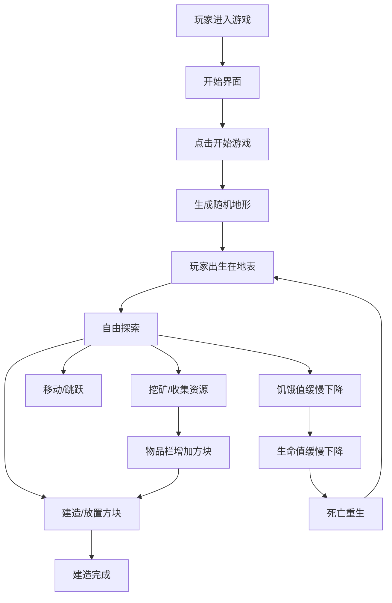

## 1. 产品概述

极简沙盒建造生存游戏，灵感源自《我的世界》。玩家在 3D 方块世界中自由探索、挖矿收集资源、建造房屋，体验轻松愉悦的创造乐趣。

- 核心价值：低门槛、零压力的沙盒创造体验
- 目标用户：喜欢建造和探索的休闲玩家
- 产品定位：免费网页小游戏，即开即玩

## 2. 核心功能

### 2.1 用户角色

| 角色 | 注册方式 | 核心权限 |
|------|----------|----------|
| 玩家 | 无需注册 | 完整游戏体验 |

### 2.2 功能模块

1. **游戏主界面**：3D 游戏场景、玩家视角控制
2. **建造系统**：方块放置、方块破坏、多种方块类型
3. **探索系统**：玩家移动、跳跃、地形生成
4. **生存系统**：生命值、饥饿值（极简设计，压力小）
5. **物品系统**：物品栏、方块选择切换

### 2.3 页面详情

| 页面名称 | 模块名称 | 功能描述 |
|----------|----------|----------|
| 开始界面 | 游戏标题 | 显示游戏名称、开始按钮、操作说明 |
| 游戏界面 | 3D 场景 | 渲染方块世界、天空、光照效果 |
| 游戏界面 | 状态显示 | 生命值、饥饿值、坐标信息 |
| 游戏界面 | 物品栏 | 底部快捷栏，显示可用方块类型 |
| 游戏界面 | 准心 | 屏幕中心十字准心，指示操作目标 |

## 3. 核心流程

**操作流程说明：**
1. 玩家进入游戏后看到简洁的开始界面，点击"开始游戏"进入世界
2. 世界随机生成：草地、泥土、石头、树木等自然元素
3. 使用 WASD 移动，空格跳跃，鼠标控制视角
4. 左键破坏方块收集资源，右键在面前放置方块
5. 数字键 1-5 快速切换方块类型
6. 生存压力极小：饥饿值下降极慢，生命值充足，鼓励创造

## 4. 用户界面设计

### 4.1 设计风格

**极简主义美学：**
- 主色调：天空蓝 (#87CEEB)、草地绿 (#4CAF50)、泥土棕 (#8B4513)、石头灰 (#808080)
- 背景：纯净的渐变色天空，无多余装饰
- 字体：现代无衬线字体，清晰易读
- 按钮：圆角矩形，半透明背景，悬停有轻微放大效果
- 图标：简洁的 emoji 或几何图形表示方块类型
- 整体风格：干净、通透、模块边界清晰，信息一目了然

### 4.2 页面设计概览

| 页面名称 | 模块名称 | UI 元素 |
|----------|----------|----------|
| 开始界面 | 标题区域 | 大号字体游戏名称，居中显示，简洁有力 |
| 开始界面 | 操作说明 | 卡片式布局，清晰列出 WASD、鼠标、数字键操作 |
| 开始界面 | 开始按钮 | 大尺寸圆角按钮，绿色主题，居中 |
| 游戏界面 | 状态栏 | 顶部半透明条，显示生命值（红心）、饥饿值（鸡腿） |
| 游戏界面 | 物品栏 | 底部半透明条，5个方块槽位，当前选中高亮 |
| 游戏界面 | 准心 | 屏幕中心白色十字，细线 |

### 4.3 响应式

- 桌面端优先，全屏体验
- 自适应窗口大小，保持正确的画面比例
- 键盘鼠标操作，不考虑移动端触屏

### 4.4 3D 场景指引

**环境与氛围：**
- 明亮的日间光照，柔和的环境光
- 天空：从地平线的浅蓝到头顶的深蓝渐变
- 雾效：轻微的距离雾，增加空间感
- 阴影：柔和的方向光阴影

**光照设置：**
- 主光源：暖白色方向光，模拟太阳，角度约 45 度
- 环境光：淡蓝色，补充暗部细节
- 半球光：天空蓝和地面绿的混合，提升整体氛围

**相机设置：**
- 第一人称视角
- 视野角度：75 度
- 灵敏度适中，平滑跟随

**构图与焦点：**
- 玩家位于中心，前方是可操作的世界
- 地平线位于画面约 1/3 处
- UI 元素靠边，不遮挡主要视野

**交互与动画：**
- 方块破坏：逐帧消失效果
- 方块放置：轻微放大的出现动画
- 移动：平滑插值，无卡顿
- 选中方块：白色线框高亮

**后期效果：**
- 轻微的色调映射
- 抗锯齿处理
- 无过度滤镜，保持清晰干净

**资源与性能：**
- 所有方块使用简单几何体 + 纯色材质
- 程序化生成地形，无外部模型资源
- 控制方块数量，保持 60 FPS 流畅体验
