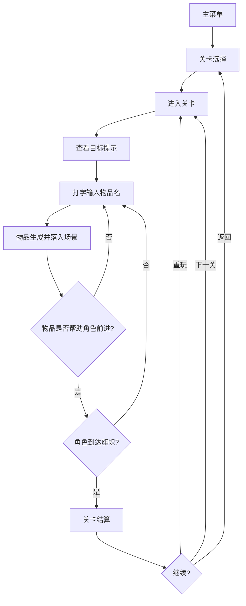

## 1. 产品概述
「字造万物」是一款灵感来自《小小大星球》的沙盒闯关小游戏，核心玩法是"打字出东西，东西帮过关"。玩家通过输入文字召唤物体，利用物体的物理特性解决关卡谜题，抵达终点。画面风格采用手绘童话纸艺风，温暖柔和，模块清晰，规则简单直白。

- 目标用户：喜欢创意解谜、休闲沙盒的玩家，年龄不限
- 核心价值：用文字创造世界，用想象力通关，每次通关方式都不一样

## 2. 核心功能

### 2.1 用户角色
无需用户角色系统，单机游玩即可。

### 2.2 功能模块
1. **主菜单页**：游戏标题、开始游戏、关卡选择、操作说明
2. **游戏关卡页**：游戏场景、打字输入框、物品栏、HUD信息
3. **关卡结算页**：星级评价、通关时间、使用物品数、下一关

### 2.3 页面详情
| 页面名称 | 模块名称 | 功能描述 |
|----------|----------|----------|
| 主菜单页 | 标题动画区 | 手绘风标题，带有轻微浮动动画 |
| 主菜单页 | 按钮区 | 开始游戏、关卡选择、操作说明三个入口 |
| 主菜单页 | 背景装饰 | 纸艺风格漂浮物、渐变背景 |
| 游戏关卡页 | 游戏画布 | Canvas 渲染的 2D 物理场景 |
| 游戏关卡页 | 打字输入框 | 底部居中输入框，输入物品名召唤物品 |
| 游戏关卡页 | 物品栏 | 已召唤物品的缩略列表，可拖拽放置 |
| 游戏关卡页 | HUD | 关卡名称、计时器、目标提示、重置按钮 |
| 游戏关卡页 | 目标指引 | 关卡目标文字提示（如"到达右边的旗帜"） |
| 关卡结算页 | 星级评价 | 根据物品使用数评1-3星 |
| 关卡结算页 | 统计数据 | 通关时间、使用物品数 |
| 关卡结算页 | 操作按钮 | 重玩、下一关、返回关卡选择 |

## 3. 核心流程

玩家从主菜单进入，选择关卡后进入游戏场景。场景中有一个角色（小纸人），玩家需要在输入框中打字召唤物品（如输入"箱子"生成一个箱子），物品会从天而降到场景中。玩家利用物品的物理特性（箱子可以垫脚、气球可以上升、桥可以跨越）帮助角色到达目标旗帜。角色到达旗帜即通关，进入结算页面。

## 4. 用户界面设计

### 4.1 设计风格
- 主色调：暖橙色 `#FF8C42`、天蓝色 `#5CC8FF`、草地绿 `#7BC67E`
- 辅助色：奶白色 `#FFF8F0`、深棕色 `#3D2B1F`
- 按钮风格：圆角纸片感按钮，带轻微阴影，hover时上浮
- 字体：标题用手绘风展示字体，正文用圆润清晰字体
- 布局风格：场景居中全屏，输入框底部悬浮，HUD顶栏
- 图标风格：手绘线条风，搭配小动画

### 4.2 页面设计概览
| 页面名称 | 模块名称 | UI元素 |
|----------|----------|--------|
| 主菜单页 | 标题动画区 | 手写风大标题，轻微摇摆动画，暖色渐变背景 |
| 主菜单页 | 按钮区 | 圆角纸片按钮，暖橙色主按钮，hover上浮+阴影 |
| 游戏关卡页 | 游戏画布 | Canvas全屏渲染，纸艺风场景，手绘纹理 |
| 游戏关卡页 | 打字输入框 | 底部居中圆角输入框，发光边框，打字时脉冲动画 |
| 游戏关卡页 | 物品栏 | 左侧竖排物品缩略图，可拖拽，选中高亮 |
| 游戏关卡页 | HUD | 顶部半透明条，关卡名+计时+重置图标 |
| 关卡结算页 | 星级评价 | 大号星星图标，逐个点亮动画 |
| 关卡结算页 | 统计数据 | 卡片式展示，数字跳动动画 |

### 4.3 响应式
- 桌面端优先，游戏画布自适应窗口大小
- 最小支持 1024x768 分辨率
- 输入框在移动端自动弹出虚拟键盘

### 4.4 可召唤物品列表
| 物品名 | 英文关键词 | 物理属性 | 用途 |
|--------|-----------|----------|------|
| 箱子 | box | 重力、可站立、可堆叠 | 垫脚、搭桥 |
| 气球 | balloon | 上升力、可拴绳 | 浮起角色或物体 |
| 弹簧 | spring | 弹力反弹 | 弹跳跨越 |
| 桥 | bridge | 水平安放、承重 | 跨越缝隙 |
| 墙 | wall | 固定不动、挡路 | 挡住危险或引导方向 |
| 风扇 | fan | 向右吹风 | 推动角色或物体 |
| 冰块 | ice | 滑动摩擦低 | 滑行通过 |

## 5. 关卡设计

### 关卡1：垫脚过关
- 场景：角色在左侧低台，旗帜在右侧高台，中间有缝隙
- 提示："试试输入'箱子'来垫脚吧！"
- 解法：输入"箱子"生成箱子，拖到缝隙旁垫脚，角色跳上高台

### 关卡2：飞天之路
- 场景：旗帜在高空中，地面有固定平台
- 提示："有些东西可以飞起来哦"
- 解法：输入"气球"，角色抓住气球飞到高处

### 关卡3：弹跳峡谷
- 场景：两面高墙中间有深谷，旗帜在对面墙上
- 提示："弹一弹，跳更高"
- 解法：输入"弹簧"放在地上，角色踩弹簧弹跳到对面

### 关卡4：风之引导
- 场景：角色在左侧，旗帜在右侧远处，地面有尖刺
- 提示："风可以推着你走"
- 解法：输入"风扇"放在角色身后，风推动角色滑过尖刺区域

### 关卡5：终极挑战
- 场景：综合障碍，需要组合使用多种物品
- 提示："发挥你的想象力吧！"
- 解法：自由组合箱子、弹簧、气球等物品通关
