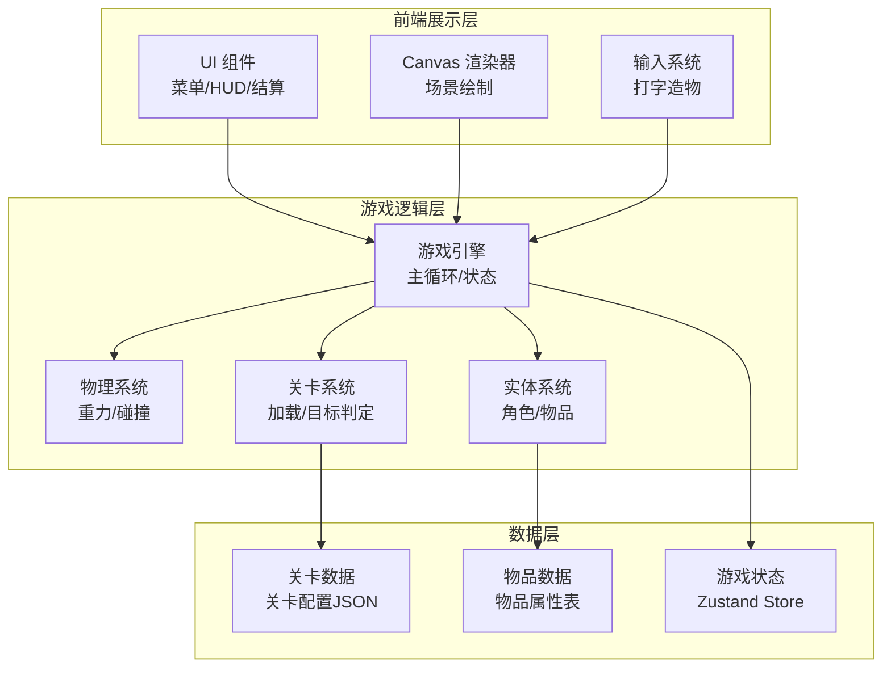

## 1. 架构设计



## 2. 技术说明
- 前端：React@18 + TypeScript + Tailwind CSS@3 + Vite
- 物理引擎：Matter.js（轻量2D物理引擎，支持重力、碰撞、约束）
- 渲染方式：Canvas 2D（Matter.js 自带 Render 或自定义渲染器）
- 状态管理：Zustand
- 初始化工具：vite-init
- 后端：无（纯前端游戏）
- 数据库：无（关卡数据内嵌JSON）

## 3. 路由定义
| 路由 | 用途 |
|------|------|
| `/` | 主菜单页面 |
| `/game/:levelId` | 游戏关卡页面 |
| `/result/:levelId` | 关卡结算页面 |
| `/levels` | 关卡选择页面 |
| `/help` | 操作说明页面 |

## 4. 项目目录结构

```
src/
├── components/           # UI组件
│   ├── Menu/            # 主菜单相关
│   ├── HUD/             # 游戏内HUD
│   ├── InputBox/        # 打字输入框
│   ├── ItemBar/         # 物品栏
│   └── Result/          # 结算页面组件
├── engine/              # 游戏引擎核心
│   ├── GameEngine.ts    # 主引擎类
│   ├── PhysicsWorld.ts  # 物理世界封装
│   ├── Renderer.ts      # Canvas渲染器
│   └── Camera.ts        # 摄像机/视口
├── entities/            # 游戏实体
│   ├── Player.ts        # 玩家角色
│   ├── Item.ts          # 可召唤物品基类
│   ├── Goal.ts          # 目标旗帜
│   └── Obstacle.ts      # 障碍物
├── levels/              # 关卡系统
│   ├── LevelManager.ts  # 关卡管理器
│   ├── levelData.ts     # 关卡配置数据
│   └── types.ts         # 关卡类型定义
├── data/                # 静态数据
│   └── items.ts         # 物品属性数据
├── hooks/               # 自定义Hooks
│   ├── useGameLoop.ts   # 游戏主循环
│   ├── useInput.ts      # 输入处理
│   └── usePhysics.ts    # 物理更新
├── store/               # 状态管理
│   └── gameStore.ts     # 游戏全局状态
├── pages/               # 页面组件
│   ├── HomePage.tsx     # 主菜单页
│   ├── GamePage.tsx     # 游戏关卡页
│   ├── ResultPage.tsx   # 结算页
│   ├── LevelSelect.tsx  # 关卡选择页
│   └── HelpPage.tsx     # 操作说明页
├── utils/               # 工具函数
│   └── drawUtils.ts     # Canvas绘制工具
├── App.tsx              # 根组件
└── main.tsx             # 入口文件
```

## 5. 核心模块说明

### 5.1 游戏引擎（GameEngine）
- 主循环：requestAnimationFrame 驱动
- 更新顺序：物理更新 → 实体更新 → 碰撞检测 → 渲染
- 时间步长：固定步长 16.67ms (60fps)

### 5.2 物理系统（PhysicsWorld）
- 基于 Matter.js 封装
- 提供重力、碰撞、摩擦、弹力等物理属性
- 碰撞回调：检测玩家与目标、玩家与障碍物

### 5.3 打字造物系统
- 输入框监听回车键提交
- 匹配物品关键词，生成对应实体
- 物品从顶部掉落到指定位置（或鼠标点击位置）
- 每关限制可召唤物品数量

### 5.4 关卡系统
- JSON配置定义关卡结构
- 包含：平台位置、障碍物、目标位置、提示文字、物品限制
- 关卡加载时解析配置，创建物理世界

### 5.5 渲染系统
- 自定义Canvas 2D渲染器（不用Matter.js自带Render）
- 手绘风格绘制：圆角、描边、渐变填充
- 粒子效果：物品生成时的闪光、通关时的彩纸
- 视差背景：远山、云朵慢速移动

## 6. 游戏状态管理（Zustand Store）

```typescript
interface GameState {
  currentLevel: number
  gamePhase: 'menu' | 'playing' | 'paused' | 'won' | 'lost'
  spawnedItems: SpawnedItem[]
  timeElapsed: number
  playerPosition: { x: number; y: number }
  completedLevels: { [levelId: number]: { stars: number; time: number } }
  availableItems: string[]

  spawnItem: (name: string, x: number, y: number) => void
  removeItem: (id: string) => void
  setPhase: (phase: GameState['gamePhase']) => void
  completeLevel: (stars: number) => void
  resetLevel: () => void
}
```

## 7. 物品数据模型

```typescript
interface ItemDefinition {
  id: string
  name: string
  keywords: string[]
  width: number
  height: number
  color: string
  physics: {
    isStatic: boolean
    density: number
    friction: number
    restitution: number
    buoyancy?: number
    windForce?: number
  }
  drawStyle: 'rect' | 'circle' | 'triangle' | 'custom'
  description: string
}
```

## 8. 关卡数据模型

```typescript
interface LevelDefinition {
  id: number
  name: string
  hint: string
  platforms: PlatformDef[]
  obstacles: ObstacleDef[]
  goal: { x: number; y: number }
  playerStart: { x: number; y: number }
  allowedItems: string[]
  maxItems: number
  starThresholds: { three: number; two: number }
  background: string
}
```
