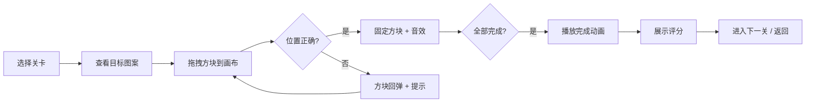

## 1. 产品概述

像素拼图小游戏，玩家通过拖拽彩色像素方块到正确位置，拼出可爱的像素图案。操作极简，治愈解压，适合所有年龄段玩家。

- **主要用途**：休闲娱乐、锻炼观察力和耐心
- **目标用户**：所有喜欢像素风格和益智休闲游戏的玩家
- **产品价值**：提供简单有趣的像素艺术创作体验，在碎片化时间获得成就感

## 2. 核心功能

### 2.1 功能模块

1. **游戏主页面**：关卡选择、游戏设置
2. **游戏界面**：目标图案预览、拼图画布、方块托盘
3. **结果展示**：完成动画、星级评价、下一关引导

### 2.2 页面详情

| 页面名称 | 模块名称 | 功能描述 |
|----------|----------|----------|
| 游戏主页面 | 关卡选择 | 展示已解锁关卡，显示完成星级，点击进入游戏 |
| 游戏主页面 | 设置面板 | 音效开关、重置进度、关于信息 |
| 游戏界面 | 目标图案区 | 显示完整的目标像素图案作为参考 |
| 游戏界面 | 拼图画布区 | 带网格的空白画布，玩家拖入方块进行填充 |
| 游戏界面 | 方块托盘区 | 打乱顺序的彩色像素方块，支持拖拽操作 |
| 游戏界面 | 状态栏 | 显示当前关卡、用时、错误次数、提示按钮 |
| 结果展示 | 完成弹窗 | 展示完成动画、用时统计、星级评价、操作按钮 |

## 3. 核心流程

玩家选择关卡 → 查看目标图案 → 从托盘拖拽彩色方块到画布对应位置 → 正确放置则固定，错误则提示 → 完成所有方块放置 → 展示完成效果和评分 → 进入下一关

## 4. 用户界面设计

### 4.1 设计风格

- **主色调**：糖果色系，以柔和的马卡龙色为主
  - 背景色：`#FFF5E6`（温暖奶油色）
  - 主色：`#FF6B9D`（活力粉）、`#4ECDC4`（清新青）、`#FFE66D`（明亮黄）
  - 辅助色：`#95E1D3`、`#F38181`、`#AA96DA`、`#FCBAD3`
- **按钮风格**：圆润像素风，带有微妙的像素边框和柔和阴影
- **字体**：
  - 标题：`Press Start 2P`（经典像素字体）
  - 正文：`ZCOOL KuaiLe`（可爱圆润中文字体）
- **布局风格**：卡片式分区，模块间有清晰的像素边框分隔
- **图标风格**：纯像素风格emoji，手绘可爱风格

### 4.2 页面设计概述

| 页面名称 | 模块名称 | UI 元素 |
|----------|----------|----------|
| 游戏主页面 | 关卡选择 | 像素风格卡片网格，显示关卡图案缩略图、完成星级，悬停有弹跳动画 |
| 游戏主页面 | 标题区域 | 大号像素字体标题，带有渐变霓虹效果，副标题说明游戏规则 |
| 游戏界面 | 目标图案区 | 左上角卡片，展示缩小版完整图案，带有"目标"标签 |
| 游戏界面 | 拼图画布区 | 中央区域，带淡色网格线，空位有半透明底色提示 |
| 游戏界面 | 方块托盘区 | 底部横向滚动区域，方块随机排列，可拖拽，悬停放大 |
| 游戏界面 | 状态栏 | 顶部信息栏，显示关卡、计时、错误次数，按钮像素风格 |
| 结果展示 | 完成弹窗 | 居中弹出，像素边框，有撒花动画，星级评分闪烁效果 |

### 4.3 响应式设计

- **桌面端优先**：采用 1280px 宽度基准设计
- **平板适配**：使用相对单位，各区域按比例缩放
- **移动端**：布局调整为纵向排列，目标图案在上方，画布居中，托盘在下方
- **触摸优化**：方块最小触摸尺寸 44x44px，拖拽有明显的视觉反馈

### 4.4 动效设计

- **页面加载**：元素从四周飞入，错落有致的延迟动画
- **方块拖拽**：跟随鼠标/手指，带有轻微旋转和放大效果
- **放置成功**：方块"咔哒"一声嵌入网格，有像素爆裂粒子效果
- **放置错误**：方块左右抖动后弹回原位
- **完成动画**：图案逐行点亮，伴随彩虹色流光效果，像素礼花从中心迸发
- **按钮交互**：悬停时轻微放大 + 像素边框高亮，点击时有按压凹陷效果
