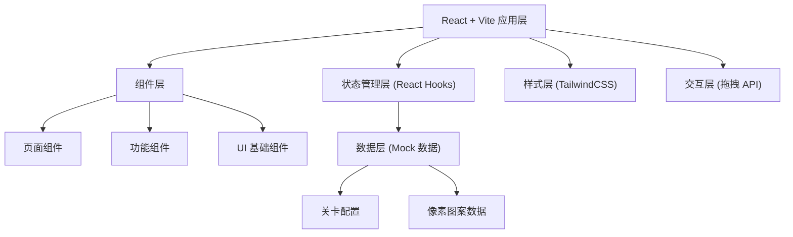

## 1. 架构设计



## 2. 技术描述

- **前端框架**：React@18 + TypeScript
- **构建工具**：Vite@5
- **样式方案**：TailwindCSS@3 + 自定义 CSS 变量
- **拖拽实现**：原生 HTML5 Drag and Drop API + 触摸事件适配
- **动画方案**：CSS Keyframes + React Transition Group
- **状态管理**：React Hooks (useState, useReducer, useEffect)
- **图标方案**：纯 CSS 像素图标 + emoji
- **字体方案**：Google Fonts (Press Start 2P, ZCOOL KuaiLe)
- **数据持久化**：localStorage 存储游戏进度

## 3. 路由定义

| 路由 | 页面 | 说明 |
|------|------|------|
| `/` | 首页 | 游戏主页面，关卡选择 |
| `/game/:levelId` | 游戏页 | 像素拼图游戏界面 |
| `*` | 404 | 页面不存在时跳转首页 |

## 4. 数据模型

### 4.1 颜色映射表

```typescript
const COLORS = {
  empty: 'transparent',
  red: '#FF6B6B',
  pink: '#FF6B9D',
  orange: '#FFA502',
  yellow: '#FFE66D',
  green: '#7BED9F',
  teal: '#4ECDC4',
  blue: '#74B9FF',
  purple: '#AA96DA',
  brown: '#A0522D',
  black: '#2D3436',
  white: '#FFFFFF',
  gray: '#B2BEC3',
} as const;
```

### 4.2 关卡数据结构

```typescript
interface Level {
  id: number;
  name: string;
  difficulty: 'easy' | 'medium' | 'hard';
  gridSize: number; // 8x8, 10x10, 12x12
  pattern: (keyof typeof COLORS)[][]; // 二维数组表示图案
  timeLimit?: number; // 可选时间限制
  maxMistakes?: number; // 可选最大错误次数
}

interface GameState {
  currentLevel: number;
  completedLevels: { [levelId: number]: { stars: number; time: number } };
  soundEnabled: boolean;
}

interface PixelBlock {
  id: string;
  color: keyof typeof COLORS;
  targetRow: number;
  targetCol: number;
  isPlaced: boolean;
}
```

### 4.3 预设关卡数据

- **Level 1 - 小爱心**：8x8，简单难度，适合新手
- **Level 2 - 小蘑菇**：8x8，简单难度
- **Level 3 - 小猫咪**：10x10，中等难度
- **Level 4 - 小太阳**：10x10，中等难度
- **Level 5 - 小房子**：12x12，困难难度
- **Level 6 - 像素花朵**：12x12，困难难度

## 5. 组件架构

```
src/
├── components/
│   ├── layout/
│   │   └── GameLayout.tsx      # 游戏布局容器
│   ├── game/
│   │   ├── PixelGrid.tsx       # 拼图画布网格
│   │   ├── BlockTray.tsx       # 方块托盘
│   │   ├── PixelBlock.tsx      # 可拖拽像素方块
│   │   ├── TargetPreview.tsx   # 目标图案预览
│   │   └── GameStatus.tsx      # 游戏状态栏
│   ├── ui/
│   │   ├── PixelButton.tsx     # 像素风格按钮
│   │   ├── PixelCard.tsx       # 像素风格卡片
│   │   └── StarRating.tsx      # 星级评分组件
│   ├── LevelCard.tsx           # 关卡选择卡片
│   └── CompletionModal.tsx     # 完成弹窗
├── pages/
│   ├── HomePage.tsx            # 首页
│   └── GamePage.tsx            # 游戏页
├── data/
│   └── levels.ts               # 关卡数据
├── hooks/
│   ├── useGameLogic.ts         # 游戏核心逻辑
│   ├── useDragAndDrop.ts       # 拖拽逻辑
│   └── useTimer.ts             # 计时器
├── types/
│   └── index.ts                # 类型定义
├── utils/
│   ├── sound.ts                # 音效工具
│   └── storage.ts              # 本地存储
├── App.tsx
├── main.tsx
└── index.css
```

## 6. 核心逻辑实现要点

### 6.1 拖拽交互

```typescript
// 拖拽开始 - 设置传输数据
const handleDragStart = (e: React.DragEvent, block: PixelBlock) => {
  e.dataTransfer.setData('blockId', block.id);
  e.dataTransfer.effectAllowed = 'move';
};

// 拖拽悬停 - 允许放置
const handleDragOver = (e: React.DragEvent) => {
  e.preventDefault();
  e.dataTransfer.dropEffect = 'move';
};

// 放置 - 验证位置正确性
const handleDrop = (e: React.DragEvent, row: number, col: number) => {
  e.preventDefault();
  const blockId = e.dataTransfer.getData('blockId');
  validateAndPlaceBlock(blockId, row, col);
};
```

### 6.2 位置验证逻辑

```typescript
const validateAndPlaceBlock = (blockId: string, row: number, col: number) => {
  const block = blocks.find(b => b.id === blockId);
  if (!block || block.isPlaced) return;

  if (block.targetRow === row && block.targetCol === col) {
    // 正确位置
    placeBlock(block, row, col);
    playSuccessSound();
    checkCompletion();
  } else {
    // 错误位置
    handleWrongPlacement(block);
    playErrorSound();
  }
};
```

### 6.3 评分计算

```typescript
const calculateStars = (time: number, mistakes: number, maxMistakes: number): number => {
  if (mistakes === 0 && time < 60) return 3;
  if (mistakes <= 2 && time < 120) return 2;
  return 1;
};
```

## 7. 性能优化

- **虚拟渲染**：对于 12x12 以上的大网格，只渲染可视区域
- **防抖处理**：拖拽悬停效果使用防抖，避免频繁重渲染
- **CSS 硬件加速**：使用 `transform` 和 `opacity` 实现动画
- **内存管理**：拖拽结束后清理事件监听器和数据传输
