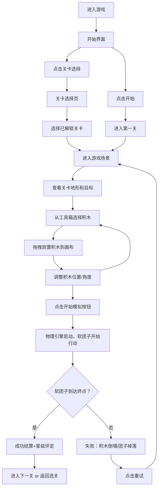

## 1. 产品概述

「软团子大冒险」是一款轻松治愈系物理沙盒解谜游戏，参考《造桥小能手》的自由搭建+物理脑洞玩法。玩家操控一只软趴趴的可爱团子小人，通过拖拽、拉伸、堆叠各种神奇积木块，帮助团子到达关卡终点。游戏画面柔和养眼，功能模块清晰直白，让玩家专注于创意解谜的乐趣。

- 核心目标：用有限的积木资源搭建通路，让软团子安全到达金色终点
- 目标用户：喜欢轻松脑洞游戏、追求治愈视觉体验的休闲玩家群体
- 市场价值：填补国内轻量级物理沙盒游戏空白，低门槛高乐趣，适合碎片时间游玩

## 2. 核心功能

### 2.1 功能模块

1. **游戏主场景**：物理模拟画布、积木工具箱、软团子角色、终点目标
2. **关卡选择界面**：关卡缩略图、星级评价、进度保存
3. **积木工具箱**：木板、弹簧、气球、胶水、支点等功能积木
4. **游戏控制面板**：开始/暂停/重置、积木数量显示、提示按钮
5. **结算界面**：成功/失败动画、星级评分、下一关指引

### 2.2 页面详情

| 页面名称 | 模块名称 | 功能描述 |
|-----------|-------------|---------------------|
| 开始界面 | 主标题区 | 游戏logo动效、开始按钮、关卡选择入口、设置按钮 |
| 关卡选择页 | 关卡卡片网格 | 展示全部关卡、已解锁关卡显示星级、锁定关卡显示锁图标 |
| 游戏主场景 | 物理画布区 | 渲染关卡地形、积木、软团子、终点，支持鼠标拖拽放置积木 |
| 游戏主场景 | 积木工具箱 | 横向滚动展示可用积木，点击选中后在画布拖拽放置，显示剩余数量 |
| 游戏主场景 | 控制面板 | 顶部栏：返回、重置、开始模拟、暂停、提示；底部栏：积木数量、进度条 |
| 结算弹窗 | 结果展示 | 成功：星级评价+庆祝动效+下一关；失败：失败动效+重试按钮 |

## 3. 核心流程

## 4. 用户界面设计

### 4.1 设计风格
- **主色调**：奶油桃粉 `#FFD6C8` 为主色，天空蓝 `#A8D8EA` 为辅助色，薄荷绿 `#B8E0C4` 为强调色，整体低饱和度柔和配色不刺眼
- **按钮风格**：圆角胶囊形，3D微浮雕效果，悬停时轻微放大+渐变变色
- **字体**：标题用圆润可爱的 "ZCOOL KuaiLe" 中文圆体，正文用 "Noto Sans SC" 思源黑体
- **布局风格**：卡片式悬浮布局，大圆角、软阴影、奶油色系背景
- **图标/emoji**：手绘风格卡通图标，积木用圆润立体造型，团子用Q弹果冻质感

### 4.2 页面设计概述

| 页面名称 | 模块名称 | UI元素描述 |
|-----------|-------------|-------------|
| 开始界面 | 主标题区 | 半透明玻璃拟态卡片居中，标题文字带渐变发光，软团子角色在标题旁做弹跳动画，背景是渐变天空+漂浮云朵 |
| 关卡选择页 | 关卡卡片网格 | 每行3个圆角卡片，已解锁显示缩略图+星级，锁定为灰色半透明+锁图标，卡片悬停上浮+发光 |
| 游戏主场景 | 物理画布区 | 带网格纸纹理的奶油色背景，地形用手绘风色块，积木带描边+软阴影，团子带高光果冻质感 |
| 游戏主场景 | 积木工具箱 | 底部悬浮半透明长条容器，积木图标横向排列，选中的积木外发光，右上角显示剩余数量小圆徽章 |
| 游戏主场景 | 控制面板 | 顶部左右两侧悬浮圆形按钮组，按钮带图标+悬停tooltip，中心显示关卡标题 |
| 结算弹窗 | 结果展示 | 居中大圆角卡片，成功：金色彩带粒子+3颗星星弹出动画；失败：软团子哭泣动画+鼓励文案 |

### 4.3 响应式
- 桌面端优先（1280px+）：横向工具箱+大尺寸画布
- 平板自适应（768-1280px）：缩小元素尺寸，保持横向布局
- 移动端适配（<768px）：工具箱改为底部横向滚动，画布全屏显示，按钮放大便于触控

### 4.4 动效设计指引
- 团子 idle 状态：持续轻微Q弹形变（缩放0.95-1.05循环）
- 积木放置：从鼠标位置缩放落地+弹性回弹
- 模拟开始：按钮变绿色脉动，团子眨眼+准备姿势
- 成功：星星依次弹出（延迟100ms），彩带粒子从中心喷发
- 转场：页面间使用圆形缩放过渡（页面路由切换）
- 背景：缓慢漂浮的云朵+轻微视差滚动
