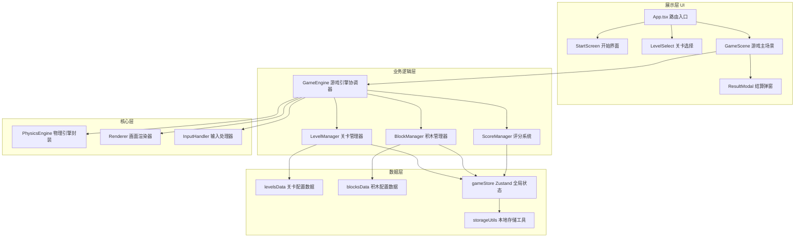

## 1. 架构设计



## 2. 技术选型说明

- **前端框架**：React@18 + TypeScript@5
  - 使用函数式组件+Hooks，类型安全，组件化管理复杂游戏UI
- **构建工具**：Vite@5
  - 极速冷启动和HMR，适合游戏开发的快速迭代
- **样式方案**：TailwindCSS@3 + CSS变量
  - 原子化CSS快速搭建治愈系UI，CSS变量统一管理主题配色
- **物理引擎**：Matter.js@0.19
  - 轻量级2D物理引擎，支持刚体、约束、碰撞检测，完美适配积木搭建类游戏
- **状态管理**：Zustand@4
  - 轻量无模板代码，管理游戏全局状态（当前关卡、积木库存、模拟状态等）
- **路由管理**：React Router@6
  - SPA多页面切换，支持开始页→选关页→游戏场景的流程跳转
- **动画库**：Framer Motion@11
  - 实现页面转场、按钮微交互、结算庆祝动效等流畅动画
- **本地存储**：localStorage 封装
  - 持久化关卡进度、星级评分、解锁状态

## 3. 路由定义

| 路由路径 | 页面组件 | 用途说明 |
|-----------|-----------|----------|
| `/` | `StartScreen` | 游戏开始界面，展示logo和主入口按钮 |
| `/levels` | `LevelSelect` | 关卡选择页，显示所有关卡缩略图和解锁状态 |
| `/game/:levelId` | `GameScene` | 游戏主场景，包含物理画布、工具箱、控制面板 |

## 4. 核心数据模型

### 4.1 类型定义

```typescript
// 积木类型枚举
enum BlockType {
  WOOD_PLANK = 'wood_plank',    // 木板
  SPRING = 'spring',            // 弹簧
  BALLOON = 'balloon',          // 气球
  GLUE = 'glue',                // 胶水点
  PIVOT = 'pivot',              // 支点
  SOFT_BLOCK = 'soft_block',    // 软海绵块
}

// 积木实例接口
interface PlacedBlock {
  id: string;
  type: BlockType;
  x: number;          // 画布坐标x
  y: number;          // 画布坐标y
  width: number;
  height: number;
  rotation: number;   // 旋转角度（弧度）
  bodyId?: number;    // Matter.js刚体ID
}

// 关卡地形元素
interface TerrainElement {
  id: string;
  type: 'ground' | 'platform' | 'wall' | 'obstacle' | 'goal';
  x: number;
  y: number;
  width: number;
  height: number;
  color?: string;
}

// 关卡配置
interface LevelConfig {
  id: number;
  name: string;
  description: string;
  terrain: TerrainElement[];
  playerStart: { x: number; y: number };
  goalPosition: { x: number; y: number };
  availableBlocks: Record<BlockType, number>;  // 每种积木可用数量
  threeStarBlocks: number;   // 3星条件：使用积木数≤此值
  twoStarBlocks: number;     // 2星条件
  oneStarBlocks: number;     // 1星条件
  timeLimit?: number;        // 可选时间限制
}

// 游戏全局状态
interface GameState {
  currentLevelId: number | null;
  unlockedLevels: number[];
  levelStars: Record<number, 0 | 1 | 2 | 3>;
  isSimulating: boolean;
  isPaused: boolean;
  placedBlocks: PlacedBlock[];
  selectedBlockType: BlockType | null;
  gameResult: 'success' | 'fail' | null;
  earnedStars: 0 | 1 | 2 | 3;
}
```

### 4.2 关卡初始数据

| 关卡ID | 名称 | 特点说明 | 积木资源 |
|--------|------|---------|---------|
| 1 | 初学乍练 | 简单平地缺口，学习放置木板 | 木板×5 |
| 2 | 小小台阶 | 高低差地形，引入弹簧 | 木板×3、弹簧×2 |
| 3 | 飞天梦想 | 深渊地形，气球飞升 | 木板×2、气球×3、胶水×2 |
| 4 | 支点妙用 | 大跨度沟壑，杠杆原理 | 木板×4、支点×2 |
| 5 | 组合挑战 | 综合地形，多积木组合 | 木板×4、弹簧×2、气球×2、软块×3 |

## 5. 物理引擎封装设计

**文件位置**：`src/physics/PhysicsEngine.ts`

核心方法：
- `init(canvas: HTMLCanvasElement)`：初始化Matter.js引擎、渲染器
- `createTerrain(terrain: TerrainElement[])`：根据关卡配置创建静态地形刚体
- `createPlayer(x: number, y: number)`：创建软团子玩家刚体（使用圆形+柔软约束模拟）
- `addBlock(block: PlacedBlock)`：添加积木刚体
- `removeBlock(id: string)`：移除积木
- `startSimulation()`：启动引擎运行
- `pauseSimulation()`：暂停引擎
- `reset()`：重置所有刚体到初始状态
- `onCollision(callback)`：监听碰撞事件（检测到达终点）
- `onPlayerFall(callback)`：检测玩家掉出屏幕

软团子实现：用多个小圆形刚体通过`Constraint`弹性约束连接，模拟软体Q弹效果，外层套一个渐变圆形精灵。

## 6. 项目目录结构

```
src/
├── assets/                 # 静态资源
│   └── fonts/              # 自定义字体文件
├── components/             # UI组件
│   ├── StartScreen.tsx     # 开始界面
│   ├── LevelSelect.tsx     # 关卡选择
│   ├── GameScene.tsx       # 游戏主场景
│   ├── GameCanvas.tsx      # 物理画布
│   ├── BlockToolbox.tsx    # 积木工具箱
│   ├── ControlPanel.tsx    # 控制面板
│   ├── ResultModal.tsx     # 结算弹窗
│   └── StarRating.tsx      # 星级展示组件
├── data/                   # 配置数据
│   ├── levels.ts           # 关卡配置
│   └── blocks.ts           # 积木类型配置
├── hooks/                  # 自定义Hooks
│   ├── useGameStore.ts     # Zustand状态Hook
│   └── usePhysics.ts       # 物理引擎Hook
├── physics/                # 物理模块
│   ├── PhysicsEngine.ts    # 物理引擎封装
│   └── PlayerBody.ts       # 软团子构建器
├── store/                  # 状态管理
│   └── gameStore.ts        # Zustand Store定义
├── types/                  # TypeScript类型
│   └── index.ts            # 全局类型定义
├── utils/                  # 工具函数
│   ├── storage.ts          # 本地存储封装
│   └── animations.ts       # 动画常量
├── App.tsx                 # 路由入口
├── main.tsx                # 应用挂载
└── index.css               # 全局样式+Tailwind
```
