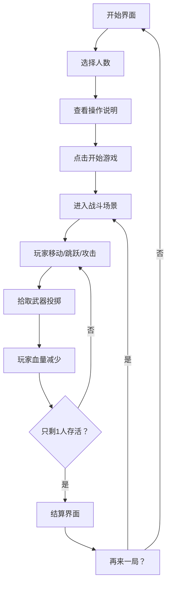

## 1. 产品概述

《火柴人乱斗派对》是一款欢乐互殴的本地多人派对游戏，支持2-4人同屏对战。玩家操控简笔风格的火柴人角色，通过简单的拳脚攻击和拾取场景中的武器道具进行战斗，最后存活的玩家获胜。游戏主打简单粗暴的战斗体验、明快的视觉风格和零门槛的上手难度。

- **核心玩法**：同屏多人对战，普通攻击 + 武器投掷
- **目标用户**：朋友聚会、家庭娱乐的休闲玩家
- **产品价值**：提供轻松欢乐的多人互动体验，两把就能上手

## 2. 核心功能

### 2.1 功能模块

1. **开始界面**：玩家人数选择、操作说明、开始游戏
2. **战斗场景**：角色移动、跳跃、攻击、武器系统、物理碰撞
3. **结算界面**：胜负展示、再来一局、返回主菜单

### 2.2 页面详情

| 页面名称 | 模块名称 | 功能描述 |
|---------|---------|---------|
| 开始界面 | 标题区 | 游戏Logo、动感动画效果 |
| 开始界面 | 人数选择 | 2人/3人/4人模式切换按钮 |
| 开始界面 | 操作说明 | 各玩家键位示意图 |
| 开始界面 | 开始按钮 | 开始游戏，进入战斗场景 |
| 战斗场景 | 战斗区域 | 平台、地形、边界 |
| 战斗场景 | 角色系统 | 移动、跳跃、普通攻击、受击反馈 |
| 战斗场景 | 武器系统 | 武器生成、拾取、投掷、伤害计算 |
| 战斗场景 | UI层 | 血量条、玩家编号、道具提示 |
| 战斗场景 | 游戏状态 | 倒计时、胜负判定、暂停 |
| 结算界面 | 结果展示 | 获胜者展示、排名 |
| 结算界面 | 操作按钮 | 再来一局、返回主菜单 |

## 3. 核心流程

玩家进入游戏后，首先在开始界面选择对战人数（2-4人），查看操作说明后点击开始。进入战斗场景后，玩家各自操控火柴人角色进行移动、跳跃和攻击，场景中会随机生成武器道具供玩家拾取投掷。当只剩一名玩家存活时，游戏结束并显示结算界面，玩家可选择再来一局或返回主菜单。

## 4. 用户界面设计

### 4.1 设计风格

**视觉风格**：高对比度扁平化 + 霓虹质感
- **主色调**：深紫蓝背景 (#0F0A1F)，营造夜晚格斗场氛围
- **玩家色**：
  - P1：霓虹青 (#00F5FF)
  - P2：霓虹粉 (#FF2E93)
  - P3：霓虹黄 (#FFE600)
  - P4：霓虹绿 (#39FF14)
- **武器色**：橙红渐变，带发光效果
- **UI元素**：玻璃拟态风格面板，带模糊背景和边框光效

**字体选择**：
- 标题：Press Start 2P（像素风格）或 Orbitron（未来感）
- 正文：Rajdhani 或 Roboto Condensed

**动效风格**：
- 角色攻击有残影效果
- 受击有屏幕震动和闪白
- 武器拾取有弹跳动画
- 血条变化有平滑过渡

### 4.2 页面设计概览

| 页面名称 | 模块名称 | UI元素 |
|---------|---------|-------|
| 开始界面 | 标题区 | 大字号游戏名，霓虹发光效果，逐字显现动画 |
| 开始界面 | 人数选择 | 三个圆形按钮，选中状态有脉冲光效 |
| 开始界面 | 操作说明 | 键位布局图，不同玩家用对应颜色标识 |
| 开始界面 | 开始按钮 | 大号按钮，hover有放大和发光效果 |
| 战斗场景 | 背景 | 渐变背景 + 网格线 + 远景装饰 |
| 战斗场景 | 平台 | 深色平台带顶部高光，边缘有轮廓光 |
| 战斗场景 | 角色 | 简笔火柴人，身体发光，不同玩家不同颜色 |
| 战斗场景 | 武器 | 发光道具，悬浮上下浮动动画 |
| 战斗场景 | 血条 | 顶部玩家栏，头像+血条+编号，血条有渐变 |
| 战斗场景 | 倒计时 | 开局3秒倒计时，大号数字居中 |
| 结算界面 | 结果 | 获胜者角色放大展示，配庆祝动效 |
| 结算界面 | 按钮 | 两个主操作按钮，清晰明确 |

### 4.3 响应式

- 桌面端优先，固定画布尺寸（1280x720）
- 支持键盘操作，每个玩家一组键位
- 画面自适应窗口大小，保持比例居中

### 4.4 游戏体验要点

- **战斗区标识**：深色平台 + 发光边缘，明确可活动区域
- **血量标识**：顶部固定玩家血条，颜色对应玩家，数值清晰
- **道具位置**：武器发光 + 悬浮动画，远处也能一眼看到
- **受击反馈**：角色变色、击退、屏幕震动，打击感强烈
- **规则简洁**：无复杂技能树，攻击+捡武器，存活到最后即赢
