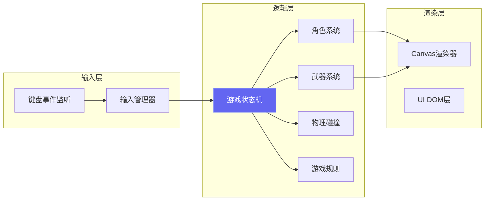

## 1. 架构设计

本游戏为纯前端Canvas游戏，无需后端服务。采用HTML5 Canvas 2D进行游戏渲染，JavaScript处理游戏逻辑，CSS负责UI样式。整体架构分为三层：渲染层、逻辑层和输入层。



## 2. 技术描述

- **前端框架**：原生 HTML5 + CSS3 + JavaScript (ES6+)
- **渲染技术**：HTML5 Canvas 2D API
- **构建工具**：无构建步骤，纯静态页面直接运行
- **字体方案**：Google Fonts (Orbitron + Rajdhani)
- **物理系统**：自研简易2D物理（重力、碰撞检测、速度）
- **后端**：无后端，纯本地游戏

**为什么选择原生方案？**
- 游戏逻辑相对简单，无需引入重框架
- 加载速度快，开箱即玩
- Canvas 2D足够满足2D火柴人游戏的渲染需求
- 便于理解和维护

## 3. 文件结构

```
project27/
├── index.html              # 入口页面
├── css/
│   └── style.css           # 全局样式、UI样式
├── js/
│   ├── main.js             # 入口文件，初始化游戏
│   ├── game/
│   │   ├── Game.js         # 游戏主循环、状态管理
│   │   ├── Player.js       # 玩家角色类
│   │   ├── Weapon.js       # 武器类
│   │   ├── Platform.js     # 平台类
│   │   ├── Physics.js      # 物理系统
│   │   └── Input.js        # 输入管理
│   └── ui/
│       ├── MenuScreen.js   # 开始菜单
│       ├── GameUI.js       # 游戏内UI
│       └── ResultScreen.js # 结算界面
└── assets/
    └── (如需图片资源可放此处)
```

## 4. 核心数据结构

### 4.1 玩家 (Player)

```javascript
{
  id: number,           // 玩家编号 1-4
  x: number,            // X坐标
  y: number,            // Y坐标
  vx: number,           // X速度
  vy: number,           // Y速度
  width: number,        // 宽度
  height: number,       // 高度
  hp: number,           // 血量 (默认100)
  maxHp: number,        // 最大血量
  color: string,        // 玩家颜色
  facing: number,       // 朝向 1右 -1左
  isGrounded: boolean,  // 是否在地面
  isAttacking: boolean, // 是否在攻击
  attackCooldown: number, // 攻击冷却
  hitCooldown: number,  // 受击无敌时间
  weapon: Weapon|null,  // 持有的武器
  isAlive: boolean      // 是否存活
}
```

### 4.2 武器 (Weapon)

```javascript
{
  type: string,         // 武器类型 'stick'|'box'|'bomb'
  x: number,
  y: number,
  vx: number,
  vy: number,
  width: number,
  height: number,
  damage: number,       // 伤害值
  isThrown: boolean,    // 是否被投掷
  isPicked: boolean,    // 是否被拾取
  ownerId: number|null, // 持有者ID
  floatOffset: number   // 悬浮动画偏移
}
```

### 4.3 游戏状态

```javascript
{
  state: 'menu'|'countdown'|'playing'|'result',
  playerCount: number,  // 玩家数量 2/3/4
  players: Player[],
  weapons: Weapon[],
  platforms: Platform[],
  countdown: number,    // 倒计时秒数
  winnerId: number|null,
  screenShake: number   // 屏幕震动强度
}
```

## 5. 操作键位定义

| 玩家 | 左移 | 右移 | 跳跃 | 攻击 | 拾取/投掷 |
|-----|-----|-----|-----|-----|----------|
| P1 (青) | A | D | W | F | G |
| P2 (粉) | ← | → | ↑ | . | / |
| P3 (黄) | J | L | I | K | L |
| P4 (绿) | 4 | 6 | 8 | 5 | 7 |

(注：P3/P4使用小键盘，需确认NumLock开启)

## 6. 游戏规则

1. **目标**：成为最后存活的玩家
2. **血量**：每位玩家初始100点血量，归零时淘汰
3. **普通攻击**：近距离出拳，造成10点伤害，有冷却
4. **武器系统**：
   - 场景中随机生成武器
   - 靠近按拾取键捡起
   - 按投掷键扔出，造成更高伤害
   - 武器有重力，会落地
5. **物理规则**：
   - 有重力，角色会下落
   - 平台可站立
   - 攻击有击退效果
6. **胜负判定**：当场上只剩1名玩家存活时，该玩家获胜
