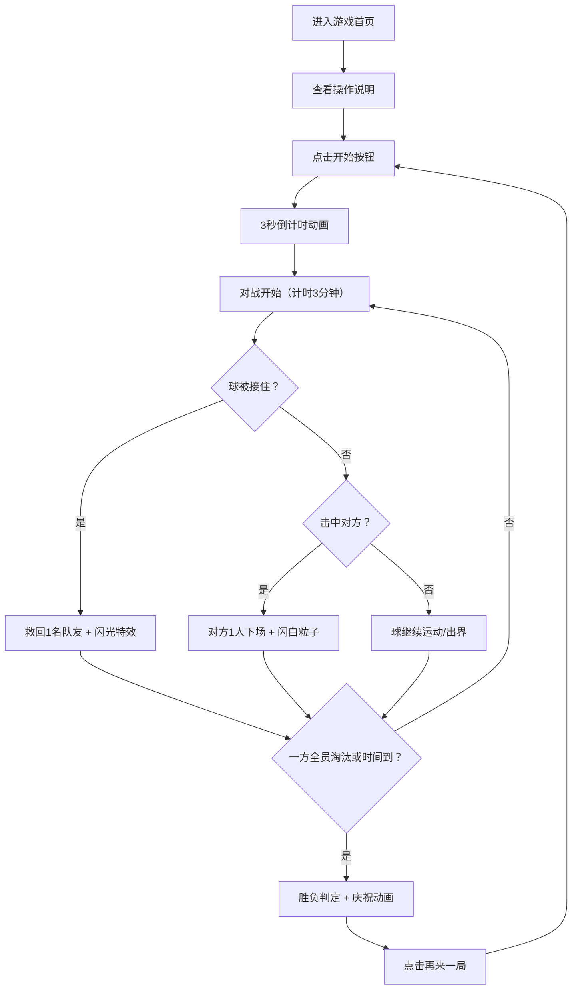

## 1. 产品概述
躲避球派对对战游戏 - 一款节奏明快、画面鲜艳的双人本地对战小游戏。两队玩家在场地两侧互相投掷躲避球，被击中者暂时下场，接住球可救回队友，先淘汰对方全员的队伍获胜。

- 核心玩法：本地双人对战，键盘分屏操控，3分钟快节奏对局
- 目标用户：派对聚会玩家、情侣好友、休闲游戏爱好者
- 产品价值：零学习成本的即时欢乐，5分钟一局，人人上手就能玩

## 2. 核心功能

### 2.1 用户角色
| 角色 | 操作方式 | 核心能力 |
|------|----------|----------|
| 玩家1（蓝队） | W/A/S/D 移动，空格投球/接球 | 移动、投球、接球、救队友 |
| 玩家2（红队） | ↑/←/↓/→ 移动，Enter投球/接球 | 移动、投球、接球、救队友 |

### 2.2 功能模块
1. **开始界面**：游戏标题、角色预览、操作说明、开始按钮
2. **对战场地**：Canvas渲染的躲避球场地，含中线、两队区域、边界
3. **实时HUD**：双方存活人数、计时、控球提示
4. **结束画面**：胜负判定、胜利动画、再来一局按钮

### 2.3 页面详情
| 页面名称 | 模块名称 | 功能描述 |
|----------|----------|----------|
| 开始界面 | 标题与动画 | 闪烁霓虹标题、弹跳角色预览、脉冲式开始按钮 |
| 开始界面 | 操作说明卡片 | 左右两侧分别展示蓝队/红队按键，带图标与高亮 |
| 对战场地 | 场地渲染 | 木质地板纹理、中线分区、鲜明边界警戒线、替补席区域 |
| 对战场地 | 角色系统 | 圆形Q版角色、朝向指示、队伍色、被击中闪白、下场后灰化移至替补席 |
| 对战场地 | 球体物理 | 多球同时存在、速度衰减、边界反弹、抛物线运动轨迹 |
| 对战场地 | 投球接球 | 蓄力投球（按键时长决定力度）、接球判定窗口、接球闪光特效 |
| 实时HUD | 状态面板 | 顶部居中倒计时、左右两侧存活人数头像阵列、当前控球方提示 |
| 结束画面 | 结果展示 | 大字胜利宣言、彩带粒子雨、失败方沮丧动画、再来一局按钮 |

## 3. 核心流程
玩家进入游戏 → 查看操作说明 → 点击开始 → 3秒倒计时 → 对战开始 → 投球/接球循环 → 一方全员淘汰或时间耗尽 → 胜负判定 → 再来一局/返回首页

## 4. 用户界面设计

### 4.1 设计风格
- **主色调**：霓虹蓝 (#00D4FF) vs 烈火红 (#FF3D68) 双队配色，碰撞紫 (#A855F7) 强调色
- **背景色**：深夜蓝渐变 (#0F172A → #1E293B) 打底，叠加轻微噪点纹理
- **按钮风格**：3D凸起圆角按钮，悬停上浮+发光阴影，按下凹陷
- **字体**：展示字体使用 Press Start 2P（像素复古风）或 Bruno Ace SC（运动感），正文字体使用 JetBrains Mono
- **布局风格**：卡片式悬浮面板，半透明毛玻璃背景 + 彩色描边发光
- **图标风格**：纯几何 emoji（🏐 ⚡ 🎯 🏆）+ Lucide 线条图标
- **整体氛围**：街机厅霓虹感 + 体育竞技热血感

### 4.2 页面设计概览
| 页面名称 | 模块名称 | UI元素描述 |
|----------|----------|------------|
| 开始界面 | 标题区 | "超级躲避球"大字居中，霓虹蓝红双色描边+发光，字间有弹跳小🏐 |
| 开始界面 | 角色预览 | 左右两个放大角色做投球姿势动画，中间VS徽章闪光 |
| 开始界面 | 操作卡片 | 蓝红两色卡片分列，内有按键图标+文字说明，按下有反馈色 |
| 开始界面 | 开始按钮 | 巨型紫色渐变按钮，悬停缩放+光晕，"开始对战"大字 |
| 对战场地 | 场地 | 俯视视角，暖棕色木地板纹理，中线白虚线+发光，边界红黄警戒条 |
| 对战场地 | 角色 | 圆形身体+眼睛朝向，脚下队伍色阴影光圈，移动时有拖尾 |
| 对战场地 | 球体 | 橙白相间躲避球，快速运动带残影，被接住时金色光环 |
| HUD | 顶部栏 | 居中倒计时（最后30秒红色闪烁），左右存活人数圆形头像阵列 |
| HUD | 提示条 | 底部半透明条，显示"按住蓄力！""接球时机！"等动态文字 |
| 结束画面 | 结果卡 | 全屏渐变遮罩，中间超大"🏆 蓝队胜利！"，彩带粒子从顶飘落 |
| 结束画面 | 按钮 | 两个按钮："再来一局"（绿色脉冲）和"返回首页"（灰色） |

### 4.3 响应式
- Desktop-first 设计，固定 1280x720 画布比例
- 全屏自适应缩放（contain 模式），保持比例不变形
- 移动端不支持（双人键盘对战场景）

### 4.4 动画与特效指引
- 角色移动：位置插值平滑过渡，眼睛朝向跟随移动方向
- 投球：蓄力时角色压缩，投出瞬间拉伸，球带速度线残影
- 被击中：角色闪白3帧→缩小旋转飞出→灰化平移至替补席
- 接球：金色冲击波扩散，接球队友闪光0.5秒
- 胜利：全屏彩带粒子（100+个随机颜色旋转飘落），胜利方角色跳跃欢呼
