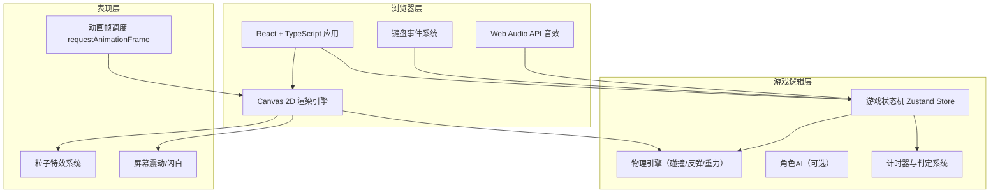

## 1. 架构设计



## 2. 技术描述
- **前端框架**：React@18 + TypeScript + Vite
- **样式方案**：Tailwind CSS 3
- **状态管理**：Zustand（游戏全局状态机）
- **渲染方式**：HTML5 Canvas 2D（游戏场景）+ React DOM（UI层）
- **音效**：Web Audio API 合成音（无需外部资源）
- **构建工具**：Vite 5
- **后端**：无（纯前端本地游戏）

## 3. 路由定义
| 路由 | 页面 | 用途 |
|------|------|------|
| / | Home 首页 | 开始界面、操作说明 |
| /game | Game 对战页 | 躲避球游戏主画面 |
| /result | Result 结果页 | 胜负展示、再来一局 |

> 实际实现使用单页状态切换而非路由，保证游戏体验流畅不中断。

## 4. 目录结构

```
src/
├── components/
│   ├── StartScreen.tsx      # 开始界面组件
│   ├── GameCanvas.tsx       # Canvas 游戏渲染组件
│   ├── HUD.tsx              # 顶部计分/计时 HUD
│   └── ResultScreen.tsx     # 结束画面组件
├── game/
│   ├── types.ts             # 游戏类型定义
│   ├── constants.ts         # 游戏常量（场地尺寸、速度、颜色）
│   ├── physics.ts           # 物理计算（碰撞、反弹、运动）
│   ├── engine.ts            # 游戏引擎主循环、状态更新
│   ├── renderer.ts          # Canvas 绘制函数
│   └── audio.ts             # Web Audio 音效生成
├── store/
│   └── useGameStore.ts      # Zustand 全局状态
├── pages/
│   └── App.tsx              # 根组件，状态机切换界面
├── utils/
│   └── particles.ts         # 粒子系统工具
├── main.tsx
└── index.css
```

## 5. 核心类型定义

```typescript
// 游戏阶段
type GamePhase = 'menu' | 'countdown' | 'playing' | 'paused' | 'result'

// 队伍
type Team = 'blue' | 'red'

// 角色状态
type PlayerStatus = 'active' | 'out' | 'bench'

// 角色
interface Player {
  id: string
  team: Team
  x: number
  y: number
  vx: number
  vy: number
  radius: number
  status: PlayerStatus
  facingAngle: number
  hasBall: string | null   // 持有球的ID
  chargeTime: number       // 蓄力时间 ms
  isCharging: boolean
  catchWindow: number      // 接球判定剩余窗口 ms
  flashTime: number        // 被击中闪白剩余时间
}

// 躲避球
interface Ball {
  id: string
  x: number
  y: number
  vx: number
  vy: number
  radius: number
  ownerTeam: Team | null   // 最近投出的队伍
  isActive: boolean        // 是否在场地内
  spin: number             // 旋转角度（视觉）
}

// 粒子
interface Particle {
  id: string
  x: number
  y: number
  vx: number
  vy: number
  life: number
  maxLife: number
  color: string
  size: number
}

// 游戏全局状态
interface GameState {
  phase: GamePhase
  countdown: number        // 倒计时秒数
  timeLeft: number         // 对战剩余时间 ms
  players: Player[]
  balls: Ball[]
  particles: Particle[]
  screenShake: number
  winner: Team | null
  scores: Record<Team, number>
  actions: {
    startGame: () => void
    resetGame: () => void
    goToMenu: () => void
    update: (dt: number) => void
    playerMove: (team: Team, dir: {x:number; y:number}) => void
    playerStartCharge: (team: Team) => void
    playerReleaseCharge: (team: Team) => void
  }
}
```

## 6. 游戏常量配置

```typescript
// 场地
const COURT = {
  WIDTH: 900,
  HEIGHT: 540,
  MIDLINE_X: 450,
  WALL_MARGIN: 20,
  BENCH_WIDTH: 100
}

// 角色
const PLAYER = {
  RADIUS: 22,
  MOVE_SPEED: 220,      // px/s
  MAX_CHARGE: 1000,     // ms
  CATCH_WINDOW: 250,    // ms
  FLASH_DURATION: 150,  // ms
  PER_TEAM: 4           // 每队人数
}

// 球
const BALL = {
  RADIUS: 14,
  MIN_SPEED: 300,
  MAX_SPEED: 750,
  FRICTION: 0.985,
  MAX_ACTIVE: 5,        // 场地最多球数
  RESPAWN_DELAY: 1500   // ms
}

// 游戏规则
const RULES = {
  MATCH_DURATION: 180000,  // 3分钟
  COUNTDOWN: 3
}

// 颜色
const COLORS = {
  BLUE_TEAM: '#00D4FF',
  BLUE_DARK: '#0066FF',
  RED_TEAM: '#FF3D68',
  RED_DARK: '#CC1133',
  BALL: '#FF8C00',
  BALL_DARK: '#CC5500',
  COURT_FLOOR: '#8B4513',
  COURT_LINE: '#FFFFFF',
  MIDLINE: '#FFFF00'
}
```

## 7. 核心算法说明

### 7.1 碰撞检测
- 圆-圆碰撞：两角色/球/角色-球之间 `distance² < (r1+r2)²`
- 圆-矩形碰撞：角色/球与场地边界
- 中线限制：蓝队 x ≤ MIDLINE，红队 x ≥ MIDLINE

### 7.2 投球蓄力
- 按键按下开始计时 `chargeTime = 0 → MAX_CHARGE`
- 释放时 `speed = lerp(MIN_SPEED, MAX_SPEED, chargeTime/MAX_CHARGE)`
- 方向 = 角色朝向（最近移动方向的对侧，即朝对方半场）

### 7.3 接球判定
- 按键按下瞬间，若己方半场有球且 `distance < CATCH_RADIUS` 且球速方向朝向角色 → 接球成功
- 接球后救回替补席上最先下场的队友
- 接球后球归该角色持有

### 7.4 胜负判定
- 任一队伍 `active` 状态玩家数为 0 → 对方胜
- 时间耗尽 → `active` 人数多者胜，平则比较历史累计淘汰数
