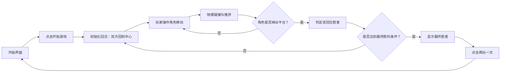

## 1. 产品概述

一款本地双人对战的休闲竞技游戏，灵感来源于《双人旋转球》。两名玩家各控制一个圆形角色，在圆形平台上进行对抗，目标是通过撞击将对手推出平台边缘。游戏规则简单直观，操作易上手，适合朋友聚会或快速休闲娱乐。

- **主要用途**：提供轻松有趣的双人本地对战体验
- **目标用户**：所有年龄段的休闲游戏玩家，尤其适合朋友、情侣、家人共同游戏
- **产品价值**：低门槛、高趣味的社交游戏，无需复杂学习即可获得对战乐趣

## 2. 核心功能

### 2.1 用户角色

| 角色 | 说明 |
|------|------|
| 玩家1（P1） | 使用键盘 W/A/S/D 键控制蓝色角色 |
| 玩家2（P2） | 使用方向键 ↑/←/↓/→ 控制橙色角色 |

### 2.2 功能模块

1. **开始界面**：游戏标题、开始按钮、玩法说明区域
2. **游戏主界面**：圆形平台、两个角色、计分板、倒计时/回合计数
3. **胜负判定**：角色掉落检测、回合重置、胜负结算
4. **游戏结束界面**：显示最终胜者、重新开始按钮

### 2.3 页面详情

| 页面名称 | 模块名称 | 功能描述 |
|-----------|-------------|---------------------|
| 开始界面 | 游戏标题 | 大号字体展示游戏名称，带有渐变和动画效果 |
| 开始界面 | 开始按钮 | 醒目的"开始游戏"按钮，悬停有动画反馈 |
| 开始界面 | 玩法说明 | 简洁的图标+文字说明，3条以内核心规则 |
| 开始界面 | 操作提示 | 分别展示P1和P2的按键说明 |
| 游戏主界面 | 圆形平台 | 带纹理和边缘警示的圆盘场地 |
| 游戏主界面 | 玩家角色 | 两个带颜色区分的圆形角色，有朝向指示 |
| 游戏主界面 | 计分板 | 顶部显示双方回合胜场数 |
| 游戏主界面 | 回合计数 | 当前回合编号显示 |
| 游戏主界面 | 暂停/重置 | 可随时重置当前回合 |
| 胜负结算 | 胜利提示 | 角色掉出平台后显示获胜方 |
| 胜负结算 | 最终结算 | 先获得指定胜场数的玩家赢得游戏 |

## 3. 核心流程

**主要用户流程说明**：
1. 进入游戏后，玩家在开始界面查看简单的玩法和操作说明
2. 点击"开始游戏"进入对战，双方角色从平台中心两侧开始
3. 玩家通过按键控制角色移动和加速，利用碰撞将对手推向边缘
4. 当任意角色完全掉出圆形平台时，该回合结束，存活方获得1分
5. 先获得3分（可配置）的玩家赢得整场游戏
6. 游戏结束后可返回开始界面或直接重新开始

## 4. 用户界面设计

### 4.1 设计风格

- **主色调**：深蓝底色 (#0f172a) + 霓虹蓝 (#3b82f6) + 霓虹橙 (#f97316) 的双色对抗配色
- **辅助色**：青绿色 (#10b981) 用于强调，浅灰 (#64748b) 用于次要信息
- **按钮风格**：大圆角胶囊形按钮，带发光阴影，悬停时有缩放和亮度提升
- **字体**：展示字体使用 "Orbitron"（未来科技感），正文字体使用 "Space Grotesk"
- **布局风格**：居中对称布局，游戏区域为绝对居中的正方形画布
- **视觉元素**：发光描边、渐变填充、微妙的噪点纹理、粒子特效

### 4.2 页面设计概览

| 页面名称 | 模块名称 | UI 元素 |
|-----------|-------------|-------------|
| 开始界面 | 标题区 | 渐变文字 + 发光效果，副标题显示"双人本地对战" |
| 开始界面 | 玩法说明卡片 | 半透明玻璃质感卡片，3条核心规则配图标 |
| 开始界面 | 操作说明 | 左右分栏，P1蓝色/P2橙色，键盘按键可视化 |
| 开始界面 | 开始按钮 | 大号胶囊按钮，渐变填充，悬停动画 |
| 游戏主界面 | 顶部计分板 | 左右对称显示双方名字、颜色标识、分数 |
| 游戏主界面 | 游戏画布 | 深色背景，圆形平台带发光边缘，微妙旋转动画 |
| 游戏主界面 | 玩家角色 | 带尾迹效果的圆球，有朝向箭头和颜色光晕 |
| 游戏主界面 | 回合提示 | 新回合开始时短暂显示"ROUND X"的过场动画 |
| 游戏主界面 | 重置按钮 | 右上角小型圆形按钮 |
| 胜负结算 | 胜利弹窗 | 居中半透明弹窗，显示胜者名称和烟花/粒子效果 |
| 胜负结算 | 操作按钮 | "再来一局" + "返回主菜单" 两个按钮 |

### 4.3 响应式

- **桌面优先**：游戏画布在桌面上固定为 700x700 像素
- **平板适配**：画布等比缩放到 550x550，字体略缩小
- **触摸优化**：在触摸设备上显示虚拟摇杆（两个，左右各一个）
- **最小支持**：宽度不小于 375px

### 4.4 视觉特效建议

- **平台**：边缘有呼吸发光效果，平台表面有微妙的同心圆纹理
- **角色移动**：拖尾粒子效果，移动速度越快尾迹越长
- **碰撞瞬间**：碰撞点产生光环扩散特效，角色轻微缩放弹性
- **掉落边缘**：靠近边缘时，该侧平台边缘闪烁红色警告
- **胜利回合**：全屏闪光 + 胜者颜色的粒子爆发
- **按钮交互**：悬停有微缩放 + 亮度提升，点击有按压反馈
