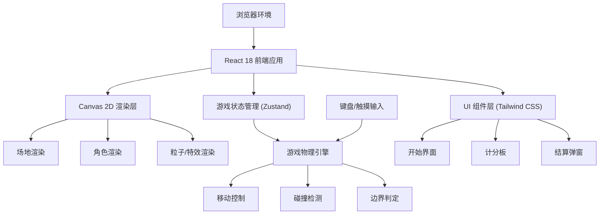

## 1. 架构设计



## 2. 技术描述

- **前端框架**：React@18 + TypeScript@5 + Vite@5
- **样式方案**：Tailwind CSS@3 + CSS 变量（主题色管理）
- **状态管理**：Zustand@4（游戏全局状态）
- **游戏渲染**：HTML5 Canvas 2D API（高性能动画渲染）
- **动画循环**：requestAnimationFrame + 固定时间步长
- **图标库**：lucide-react
- **字体方案**：Google Fonts (Orbitron + Space Grotesk)
- **后端服务**：无（纯前端本地游戏）
- **数据库**：无
- **初始化工具**：vite-init (react-ts 模板)

## 3. 路由定义

| 路由 | 用途 |
|-------|---------|
| / | 主页面，包含开始界面 + 游戏画布（通过状态切换显示） |

**说明**：由于是单页游戏应用，不使用多路由切换。游戏的不同阶段（开始、对战、结算）通过 Zustand 状态管理进行视图切换。

## 4. 核心数据类型定义

```typescript
// 游戏阶段
type GamePhase = 'menu' | 'countdown' | 'playing' | 'roundEnd' | 'gameEnd';

// 玩家标识
type PlayerId = 'P1' | 'P2';

// 2D 向量
interface Vector2 {
  x: number;
  y: number;
}

// 玩家状态
interface Player {
  id: PlayerId;
  position: Vector2;
  velocity: Vector2;
  radius: number;
  color: string;
  glowColor: string;
  score: number;
  isAlive: boolean;
}

// 粒子
interface Particle {
  id: number;
  position: Vector2;
  velocity: Vector2;
  color: string;
  size: number;
  life: number;      // 剩余生命值 (0-1)
  decay: number;     // 每帧衰减率
}

// 碰撞光环特效
interface Shockwave {
  id: number;
  position: Vector2;
  radius: number;
  maxRadius: number;
  color: string;
  life: number;
}

// 游戏全局状态
interface GameState {
  phase: GamePhase;
  currentRound: number;
  roundsToWin: number;
  countdown: number;
  roundWinner: PlayerId | null;
  gameWinner: PlayerId | null;
  
  players: Record<PlayerId, Player>;
  particles: Particle[];
  shockwaves: Shockwave[];
  
  arenaRadius: number;
  arenaCenter: Vector2;
  
  actions: {
    startGame: () => void;
    resetRound: () => void;
    backToMenu: () => void;
    setPlayerInput: (player: PlayerId, direction: Vector2) => void;
    update: (deltaTime: number) => void;
  };
}
```

## 5. 物理引擎核心算法

### 5.1 移动控制
```
输入方向向量 normalized → 乘以加速度 → 叠加到速度
速度 → 乘以摩擦系数 (0.92~0.95) → 限制最大速度
位置 → 加上速度 × 时间步长
```

### 5.2 圆形碰撞检测与响应
```
两球距离 = |P1.pos - P2.pos|
最小距离 = P1.radius + P2.radius

若 两球距离 < 最小距离:
  重叠量 = 最小距离 - 两球距离
  碰撞法线 = (P2.pos - P1.pos).normalized
  
  // 位置修正（各推开一半）
  P1.pos -= 碰撞法线 × 重叠量 × 0.5
  P2.pos += 碰撞法线 × 重叠量 × 0.5
  
  // 速度沿法线方向交换（弹性碰撞）
  v1n = dot(P1.velocity, 碰撞法线)
  v2n = dot(P2.velocity, 碰撞法线)
  P1.velocity += (v2n - v1n) × 碰撞法线 × 恢复系数
  P2.velocity += (v1n - v2n) × 碰撞法线 × 恢复系数
```

### 5.3 边界判定
```
玩家到中心距离 = |player.pos - arenaCenter|

若 玩家到中心距离 > (arenaRadius - player.radius + 掉落阈值):
  player.isAlive = false
  判定对方获胜
```

## 6. 项目文件结构

```
src/
├── components/
│   ├── GameCanvas.tsx       # Canvas 游戏渲染组件
│   ├── StartScreen.tsx      # 开始界面
│   ├── Scoreboard.tsx       # 顶部计分板
│   ├── RoundOverlay.tsx     # 回合开始/结束遮罩
│   ├── GameEndModal.tsx     # 游戏结束弹窗
│   └── Controls.tsx         # 操作说明组件
├── hooks/
│   ├── useGameLoop.ts       # 游戏主循环 Hook
│   └── useKeyboard.ts       # 键盘输入 Hook
├── store/
│   └── useGameStore.ts      # Zustand 游戏状态管理
├── utils/
│   ├── physics.ts           # 物理计算函数
│   ├── vector2.ts           # 2D 向量工具
│   └── particles.ts         # 粒子系统工具
├── types/
│   └── game.ts              # TypeScript 类型定义
├── App.tsx                  # 根组件
├── main.tsx                 # 入口文件
└── index.css                # 全局样式 + Tailwind 配置
```

## 7. 性能优化策略

1. **Canvas 脏矩形渲染**：每帧仅重绘变化区域（简单起见可先全屏重绘，700x700 量级性能足够）
2. **对象池**：粒子和特效对象复用，避免频繁 GC
3. **固定时间步长**：物理更新与帧率解耦，保证不同设备游戏体验一致
4. **输入节流**：键盘事件防抖，避免高频状态更新
5. **Zustand 选择器**：组件仅订阅必要状态切片，减少不必要重渲染
