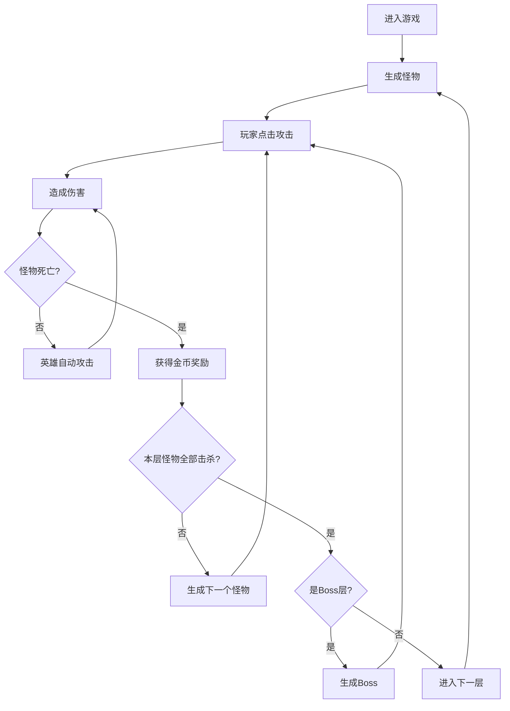
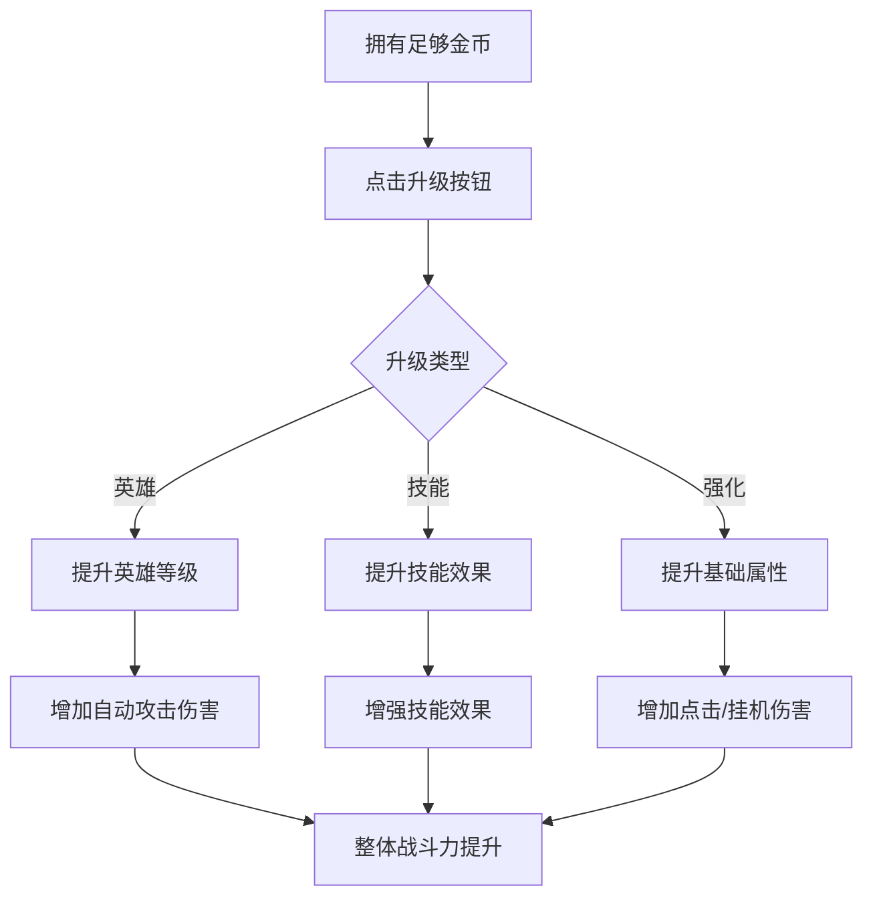

## 1. 产品概述

《点击泰坦》放置类点击游戏，玩家通过点击攻击怪物、收集金币、升级英雄和技能，不断推进关卡层数。支持离线挂机收益，让玩家在不在线时也能获得成长。

- 核心玩法：点击攻击 + 英雄养成 + 技能释放 + 挂机收益 + 层数推进
- 目标用户：喜欢放置类、轻度休闲游戏的玩家
- 产品价值：提供碎片化时间的爽感体验，满足收集和成长的成就感

## 2. 核心 Features

### 2.1 Feature Module

1. **主战斗界面**：怪物展示、点击攻击、伤害数字、金币收集、血量条
2. **英雄系统**：英雄列表、等级升级、自动攻击、伤害加成
3. **技能系统**：主动技能、冷却时间、增益效果、暴击加成
4. **强化系统**：角色属性强化、点击伤害强化、挂机伤害强化
5. **层数系统**：关卡推进、Boss战、难度递增、奖励提升
6. **挂机系统**：离线收益计算、自动攻击、DPS显示

### 2.2 Page Details

| 页面名称 | 模块名称 | Feature description |
|-----------|-------------|---------------------|
| 主游戏页 | 顶部状态栏 | 显示当前层数、金币数量、DPS、每秒伤害 |
| 主游戏页 | 战斗区域 | 怪物展示、点击攻击、伤害数字飘字、血条、击杀动画 |
| 主游戏页 | 英雄面板 | 英雄卡片列表、升级按钮、等级显示、伤害贡献 |
| 主游戏页 | 技能面板 | 技能图标、冷却倒计时、激活状态、技能描述 |
| 主游戏页 | 强化面板 | 属性强化选项、升级消耗、属性预览 |
| 主游戏页 | 侧边导航 | 英雄/技能/强化三个标签页切换 |

## 3. Core Process

### 3.1 主战斗流程

### 3.2 升级流程

## 4. User Interface Design

### 4.1 Design Style
- **主色调**：深紫色 `#1a0a2e` 作为背景，营造神秘魔幻氛围
- **强调色**：金色 `#ffd700` 用于重要按钮和数值，凸显价值感
- **辅助色**：魔法蓝 `#4fc3f7` 用于技能，能量红 `#ef5350` 用于伤害
- **字体**：使用 `Cinzel` 作为标题字体（游戏感），`Roboto` 作为正文字体
- **布局**：左侧战斗区域（70%），右侧功能面板（30%）
- **风格**：暗黑魔幻风，带有光效、粒子特效、渐变色边框

### 4.2 Page Design Overview

| 页面名称 | 模块名称 | UI Elements |
|-----------|-------------|-------------|
| 主游戏页 | 顶部状态栏 | 卡片式设计，金色边框，数值动态变化动画 |
| 主游戏页 | 战斗区域 | 居中怪物，血条带渐变，点击波纹特效，伤害飘字动画 |
| 主游戏页 | 英雄面板 | 纵向卡片列表，头像+等级+伤害，升级按钮带光效 |
| 主游戏页 | 技能面板 | 4个技能图标2x2排列，冷却时灰色遮罩+倒计时 |
| 主游戏页 | 强化面板 | 横向属性卡片，图标+名称+数值+升级按钮 |
| 主游戏页 | 侧边导航 | 底部标签栏，选中状态金色高亮 |

### 4.3 动画效果
- 怪物受击：缩放+抖动+红色闪白
- 伤害数字：向上飘移+渐隐+随机偏移
- 点击特效：波纹扩散+粒子爆炸
- 升级动画：金光闪烁+数值跳动
- 技能释放：全屏光效+屏幕震动
- 怪物死亡：碎裂+金币飞散+渐隐
- Boss出场：镜头拉近+阴影扩散+音效提示

### 4.4 Responsiveness
- Desktop-first 设计，主战斗区自适应宽度
- 平板端：右侧面板可折叠收起
- 移动端：改为上下布局，战斗区在上，功能区在下
- 触摸优化：按钮最小尺寸 48x48px，点击区域放大

## 5. 数值设计

### 5.1 基础数值
- 初始点击伤害：1
- 初始金币：0
- 第一层怪物血量：10
- 每层怪物数量：10个
- 每10层出现Boss

### 5.2 成长曲线
- 怪物血量：每层递增 15%
- Boss血量：普通怪物的 10 倍
- 金币奖励：怪物血量的 20%
- 英雄升级消耗：等级^1.5 * 基础消耗
- 属性强化消耗：等级^2 * 基础消耗

### 5.3 技能设计
| 技能名称 | 效果 | 冷却时间 | 持续时间 |
|---------|------|---------|---------|
| 狂暴打击 | 点击伤害x10 | 60秒 | 10秒 |
| 暗影之雨 | 每秒造成1000%点击伤害 | 90秒 | 5秒 |
| 金币加成 | 金币获取x2 | 120秒 | 30秒 |
| 时间加速 | 英雄攻速x2 | 180秒 | 20秒 |
