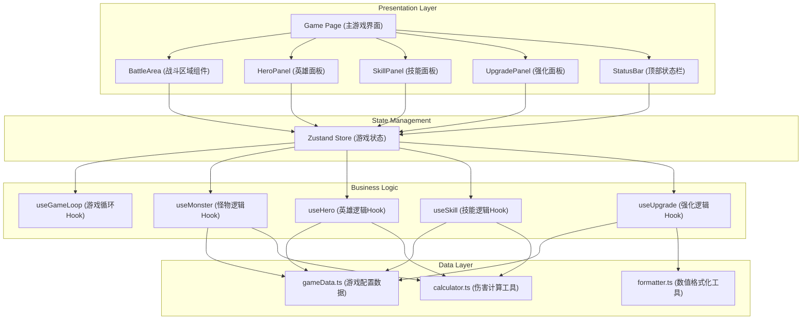

## 1. Architecture Design



## 2. Technology Description

- **Frontend**: React@18 + TypeScript + Vite
- **State Management**: zustand@4
- **Styling**: tailwindcss@3
- **Icons**: lucide-react
- **Routing**: react-router-dom（单页面应用，仅首页）
- **Animations**: CSS Keyframes + React State
- **Storage**: localStorage（本地存档）

## 3. Project Structure

```
src/
├── components/
│   ├── game/
│   │   ├── BattleArea.tsx      # 战斗区域组件
│   │   ├── Monster.tsx         # 怪物组件
│   │   ├── DamageNumber.tsx    # 伤害数字组件
│   │   ├── ClickEffect.tsx     # 点击特效组件
│   │   └── HealthBar.tsx       # 血条组件
│   ├── heroes/
│   │   ├── HeroPanel.tsx       # 英雄面板
│   │   └── HeroCard.tsx        # 英雄卡片
│   ├── skills/
│   │   ├── SkillPanel.tsx      # 技能面板
│   │   └── SkillButton.tsx     # 技能按钮
│   ├── upgrades/
│   │   ├── UpgradePanel.tsx    # 强化面板
│   │   └── UpgradeCard.tsx     # 强化卡片
│   └── ui/
│       ├── StatusBar.tsx       # 顶部状态栏
│       ├── TabNavigation.tsx   # 标签导航
│       └── NumberDisplay.tsx   # 数值显示组件
├── store/
│   └── useGameStore.ts         # Zustand 游戏状态
├── hooks/
│   ├── useGameLoop.ts          # 游戏主循环
│   ├── useMonster.ts           # 怪物逻辑
│   ├── useHero.ts              # 英雄逻辑
│   ├── useSkill.ts             # 技能逻辑
│   ├── useUpgrade.ts           # 强化逻辑
│   └── useAutoSave.ts          # 自动存档
├── data/
│   ├── gameData.ts             # 游戏配置数据
│   └── monsters.ts             # 怪物数据
├── utils/
│   ├── formatter.ts            # 数值格式化
│   ├── calculator.ts           # 伤害计算
│   └── storage.ts              # 本地存储
├── types/
│   └── game.ts                 # 类型定义
├── pages/
│   └── GamePage.tsx            # 主游戏页面
├── App.tsx
├── main.tsx
└── index.css
```

## 4. Route Definitions

| Route | Purpose |
|-------|---------|
| / | 主游戏页面 |

## 5. Data Model

### 5.1 Core Types

```typescript
// 游戏状态
interface GameState {
  gold: number;
  totalGold: number;
  stage: number;
  monsterIndex: number;
  clickDamage: number;
  dps: number;
  heroes: Hero[];
  skills: Skill[];
  upgrades: Upgrade[];
  monster: Monster | null;
  lastSaveTime: number;
}

// 英雄
interface Hero {
  id: string;
  name: string;
  description: string;
  level: number;
  baseDamage: number;
  attackSpeed: number;
  baseCost: number;
  unlocked: boolean;
  unlockStage: number;
  icon: string;
}

// 技能
interface Skill {
  id: string;
  name: string;
  description: string;
  level: number;
  cooldown: number;
  duration: number;
  effect: SkillEffect;
  baseCost: number;
  lastUsed: number;
  icon: string;
}

// 强化
interface Upgrade {
  id: string;
  name: string;
  description: string;
  level: number;
  effectType: 'click' | 'dps' | 'gold' | 'crit';
  effectValue: number;
  baseCost: number;
  icon: string;
}

// 怪物
interface Monster {
  id: string;
  name: string;
  maxHp: number;
  currentHp: number;
  damage: number;
  goldReward: number;
  isBoss: boolean;
  icon: string;
}

// 技能效果
interface SkillEffect {
  type: 'damage_multiplier' | 'gold_multiplier' | 'attack_speed' | 'damage_over_time';
  value: number;
}
```

### 5.2 数据持久化

使用 localStorage 存储游戏进度，存档结构：

```typescript
interface SaveData {
  version: string;
  timestamp: number;
  state: Partial<GameState>;
}

// 存储键名
const SAVE_KEY = 'tap_titans_save';
const AUTO_SAVE_INTERVAL = 10000; // 10秒自动存档
```

## 6. 核心算法

### 6.1 伤害计算

```typescript
// 点击伤害
function calculateClickDamage(state: GameState): number {
  let damage = state.clickDamage;
  
  // 技能加成
  const damageSkill = state.skills.find(s => s.id === 'berserk' && isSkillActive(s));
  if (damageSkill) {
    damage *= Math.pow(2, damageSkill.level);
  }
  
  // 强化加成
  const clickUpgrade = state.upgrades.find(u => u.id === 'click_power');
  if (clickUpgrade) {
    damage *= (1 + clickUpgrade.effectValue * clickUpgrade.level);
  }
  
  // 暴击
  const critChance = 0.05; // 5%暴击率
  const critMultiplier = 2;
  if (Math.random() < critChance) {
    damage *= critMultiplier;
  }
  
  return Math.floor(damage);
}

// 英雄DPS计算
function calculateHeroDPS(hero: Hero, state: GameState): number {
  let damage = hero.baseDamage * hero.level;
  let attackSpeed = hero.attackSpeed;
  
  // 技能加成
  const speedSkill = state.skills.find(s => s.id === 'haste' && isSkillActive(s));
  if (speedSkill) {
    attackSpeed *= Math.pow(1.5, speedSkill.level);
  }
  
  return Math.floor(damage * attackSpeed);
}
```

### 6.2 怪物生成

```typescript
function generateMonster(stage: number, index: number): Monster {
  const isBoss = index === 9 && stage % 10 === 0;
  const baseHp = 10 * Math.pow(1.15, stage - 1);
  const hpMultiplier = isBoss ? 10 : 1;
  const maxHp = Math.floor(baseHp * hpMultiplier);
  
  const monsterTypes = ['slime', 'goblin', 'orc', 'skeleton', 'demon', 'dragon'];
  const typeIndex = Math.floor(Math.random() * monsterTypes.length);
  
  return {
    id: `monster_${Date.now()}`,
    name: isBoss ? `Boss ${monsterTypes[typeIndex]}` : monsterTypes[typeIndex],
    maxHp,
    currentHp: maxHp,
    damage: Math.floor(maxHp * 0.1),
    goldReward: Math.floor(maxHp * 0.2),
    isBoss,
    icon: monsterTypes[typeIndex],
  };
}
```

### 6.3 升级消耗计算

```typescript
function calculateHeroCost(hero: Hero): number {
  return Math.floor(hero.baseCost * Math.pow(hero.level + 1, 1.5));
}

function calculateUpgradeCost(upgrade: Upgrade): number {
  return Math.floor(upgrade.baseCost * Math.pow(upgrade.level + 1, 2));
}

function calculateSkillCost(skill: Skill): number {
  return Math.floor(skill.baseCost * Math.pow(skill.level + 1, 1.8));
}
```

## 7. 游戏循环

```typescript
// 游戏主循环 (每秒执行)
function gameLoop(state: GameState): GameState {
  const newState = { ...state };
  
  // 英雄自动攻击
  let totalDPS = 0;
  newState.heroes.forEach(hero => {
    if (hero.unlocked && hero.level > 0) {
      const heroDPS = calculateHeroDPS(hero, newState);
      totalDPS += heroDPS;
    }
  });
  
  // 应用伤害
  if (newState.monster && newState.monster.currentHp > 0) {
    newState.monster.currentHp -= totalDPS;
    
    // 检查怪物死亡
    if (newState.monster.currentHp <= 0) {
      // 获得金币
      let goldReward = newState.monster.goldReward;
      
      // 金币加成技能
      const goldSkill = newState.skills.find(s => s.id === 'gold_rush' && isSkillActive(s));
      if (goldSkill) {
        goldReward *= Math.pow(2, goldSkill.level);
      }
      
      newState.gold += goldReward;
      newState.totalGold += goldReward;
      
      // 生成下一个怪物或推进关卡
      newState.monsterIndex++;
      if (newState.monsterIndex >= 10) {
        newState.stage++;
        newState.monsterIndex = 0;
      }
      
      // 检查英雄解锁
      newState.heroes.forEach(hero => {
        if (!hero.unlocked && newState.stage >= hero.unlockStage) {
          hero.unlocked = true;
        }
      });
      
      // 生成新怪物
      newState.monster = generateMonster(newState.stage, newState.monsterIndex);
    }
  }
  
  newState.dps = totalDPS;
  return newState;
}
```
