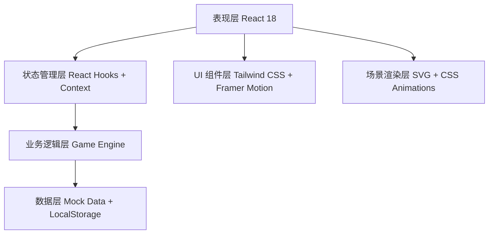

## 1. 架构设计



## 2. 技术说明

- **前端框架**: React@18 + TypeScript
- **构建工具**: Vite@5
- **样式方案**: TailwindCSS@3
- **动画方案**: Framer Motion（流畅动画）
- **状态管理**: React Context + useReducer（轻量游戏状态）
- **数据持久化**: LocalStorage（保存游戏进度）
- **后端**: 无后端，纯前端实现，所有数据为 mock 数据

## 3. 路由定义

| 路由 | 用途 |
|------|------|
| / | 游戏主界面（单页面应用，无需多路由 |

## 4. 数据模型

### 4.1 数据模型定义

```mermaid
erDiagram
    GAME_STATE ||--o ERA : 包含
    GAME_STATE {
        number knowledgePoints 知识点数
        string currentEraId 当前时代ID
        number civilizationLevel 文明等级
        boolean gameCompleted 游戏是否完成
    }
    ERA ||--o LANDMARK : 包含
    ERA {
        string id 时代ID
        string name 时代名称
        string emoji 时代图标
        object theme 主题配色
        string description 时代描述
        boolean unlocked 是否已解锁
    }
    LANDMARK {
        string id 地标ID
        string name 地标名称
        string description 地标描述
        number cost 建造消耗知识点
        boolean built 是否已建造
        string svgIcon SVG图标
    }
    QUIZ {
        string id 题目ID
        string eraId 所属时代ID
        string question 题目
        string[] options 选项
        number correctIndex 正确答案索引
        string explanation 解析
    }
```

### 4.2 游戏状态结构

```typescript
interface GameState {
  knowledgePoints: number;
  currentEraId: string;
  eras: Record<string, Era>;
  quizzes: Quiz[];
  completedLandmarks: string[];
  unlockedEras: string[];
  totalAnswered: number;
  totalCorrect: number;
}

interface Era {
  id: string;
  name: string;
  emoji: string;
  description: string;
  theme: {
    primary: string;
    secondary: string;
    background: string;
    accent: string;
  };
  landmarks: Landmark[];
  unlockCondition: string;
}

interface Landmark {
  id: string;
  name: string;
  description: string;
  cost: number;
  eraId: string;
  built: boolean;
}

interface Quiz {
  id: string;
  eraId: string;
  question: string;
  options: string[];
  correctIndex: number;
  explanation: string;
}
```

## 5. 核心组件结构

```
src/
├── App.tsx                 # 主应用组件
├── main.tsx               # 入口文件
├── index.css              # 全局样式 + Tailwind
├── types/
│   └── game.ts           # 类型定义
├── data/
│   ├── eras.ts           # 时代数据
│   ├── landmarks.ts      # 地标数据
│   └── quizzes.ts        # 题库数据
├── context/
│   └── GameContext.tsx   # 游戏状态管理
├── components/
│   ├── EraTimeline.tsx   # 时代时间轴
│   ├── CivilizationScene.tsx  # 文明场景展示
│   ├── QuizModal.tsx     # 答题弹窗
│   ├── BuildPanel.tsx    # 建造面板
│   ├── ResourceBar.tsx   # 资源状态栏
│   ├── Landmark.tsx      # 地标建筑组件
│   └── Notification.tsx  # 通知组件
└── hooks/
    └── useGameEngine.ts  # 游戏逻辑 Hook
```
