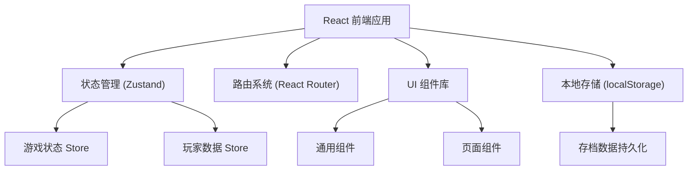

## 1. 架构设计



## 2. 技术描述

- **前端框架**：React 18 + TypeScript
- **构建工具**：Vite
- **状态管理**：Zustand
- **路由**：React Router DOM
- **样式方案**：TailwindCSS 3
- **图标库**：Lucide React
- **数据持久化**：localStorage（本地存档）
- **后端**：无（纯前端单机游戏）

## 3. 路由定义

| 路由 | 页面 | 说明 |
|-----|------|------|
| `/` | 主菜单页面 | 游戏入口，开始游戏 |
| `/map` | 冒险地图页面 | 关卡选择，进度展示 |
| `/quiz/:levelId` | 答题页面 | 关卡答题挑战 |
| `/shop` | 商店页面 | 购买装备 |
| `/inventory` | 背包页面 | 查看和穿戴装备 |
| `/result/:levelId` | 结算页面 | 关卡通关/失败结果 |

## 4. 数据模型

### 4.1 数据类型定义

```typescript
// 装备类型
type EquipmentType = 'weapon' | 'armor' | 'accessory';

// 稀有度
type Rarity = 'common' | 'rare' | 'epic' | 'legendary';

// 装备
interface Equipment {
  id: string;
  name: string;
  type: EquipmentType;
  rarity: Rarity;
  price: number;
  description: string;
  emoji: string;
  stats: {
    attack?: number;
    defense?: number;
    luck?: number;
  };
}

// 玩家数据
interface PlayerData {
  name: string;
  level: number;
  exp: number;
  gold: number;
  maxHp: number;
  attack: number;
  defense: number;
  luck: number;
  equipment: {
    weapon: string | null;
    armor: string | null;
    accessory: string | null;
  };
  inventory: string[]; // 拥有的装备ID列表
  unlockedLevels: string[]; // 已解锁关卡
  completedLevels: string[]; // 已通关关卡
}

// 题目
interface Question {
  id: string;
  category: string;
  question: string;
  options: string[];
  correctIndex: number;
  explanation: string;
  difficulty: number; // 1-5
}

// 关卡
interface Level {
  id: string;
  name: string;
  description: string;
  emoji: string;
  questionIds: string[];
  rewardGold: number;
  rewardExp: number;
  position: { x: number; y: number };
  requiredLevel?: number;
}

// 游戏状态
interface GameState {
  currentScreen: 'menu' | 'map' | 'quiz' | 'shop' | 'inventory' | 'result';
  currentLevelId: string | null;
  currentQuestionIndex: number;
  score: number;
  isAnswering: boolean;
  selectedAnswer: number | null;
  showExplanation: boolean;
}
```

### 4.2 状态管理 Store

使用 Zustand 管理游戏状态，分为两个 store：

1. **playerStore**：玩家数据（金币、装备、等级等）
2. **gameStore**：游戏流程状态（当前页面、答题进度等）

### 4.3 本地存储

- 玩家数据通过 localStorage 持久化
- 存档键名：`knowledge-adventure-save`
- 自动保存时机：答题完成、购买装备、穿戴装备

## 5. 项目结构

```
src/
├── components/          # 通用组件
│   ├── Button/          # 按钮组件
│   ├── Card/            # 卡片组件
│   ├── CoinDisplay/     # 金币显示
│   ├── Header/          # 顶部导航
│   ├── ProgressBar/     # 进度条
│   └── EquipmentCard/   # 装备卡片
├── pages/               # 页面组件
│   ├── MenuPage/        # 主菜单
│   ├── MapPage/         # 冒险地图
│   ├── QuizPage/        # 答题页面
│   ├── ShopPage/        # 商店页面
│   ├── InventoryPage/   # 背包页面
│   └── ResultPage/      # 结算页面
├── store/               # 状态管理
│   ├── playerStore.ts   # 玩家数据
│   └── gameStore.ts     # 游戏状态
├── data/                # 游戏数据
│   ├── questions.ts     # 题库
│   ├── levels.ts        # 关卡配置
│   └── equipment.ts     # 装备配置
├── hooks/               # 自定义 hooks
│   └── useGameSave.ts   # 存档管理
├── utils/               # 工具函数
│   ├── gameLogic.ts     # 游戏逻辑
│   └── format.ts        # 格式化工具
├── types/               # 类型定义
│   └── index.ts         # 类型汇总
├── App.tsx              # 应用入口
├── main.tsx             # React 入口
└── index.css            # 全局样式
```

## 6. 核心功能实现

### 6.1 答题系统
- 随机从关卡题库中抽取题目
- 记录答题正确性，累计得分
- 答对奖励金币（基础奖励 × 运气加成）
- 答错显示正确答案和解析

### 6.2 装备系统
- 三个装备槽位：武器、护甲、饰品
- 装备提供属性加成（攻击、防御、幸运）
- 稀有度分级：普通、稀有、史诗、传说
- 不同颜色区分稀有度

### 6.3 金币系统
- 答对题目获得金币
- 通关关卡获得额外金币奖励
- 商店消费金币购买装备
- 幸运属性影响金币获取量

### 6.4 关卡系统
- 线性关卡解锁机制
- 通关后解锁下一关
- 每关包含 5-8 道题目
- 正确率 ≥ 60% 判定通关
