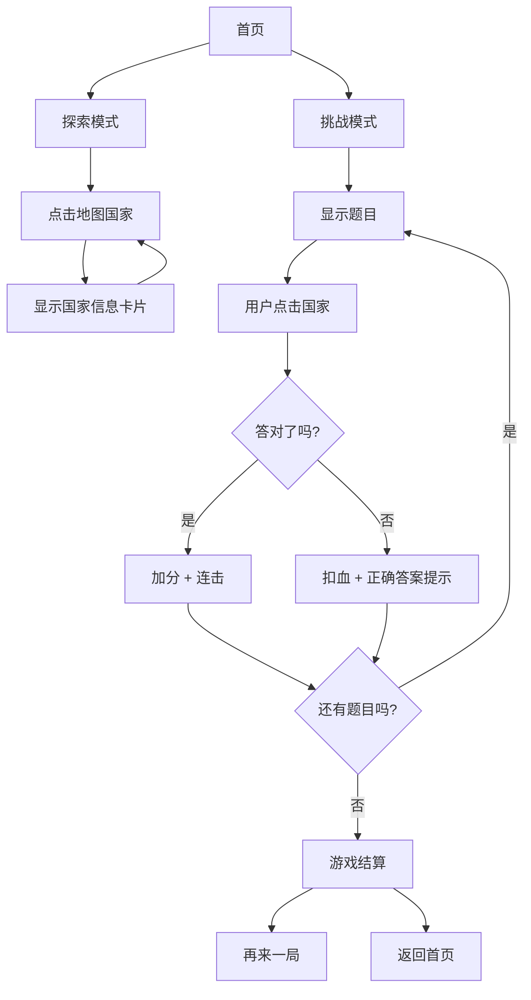

## 1. 产品概述

"地理大冒险"是一款面向儿童的互动地理认知小游戏，通过点击世界地图、识别国家、记忆首都的方式，让小朋友在游戏中快乐学习地理知识。

- **核心玩法**：戳地图、认国家、记首都
- **目标用户**：6-12岁儿童及其家长
- **产品价值**：寓教于乐，培养地理兴趣，建立世界地理认知基础

## 2. 核心功能

### 2.1 功能模块

1. **首页**：游戏入口、模式选择、装饰性世界地图
2. **探索模式**：自由点击地图，学习国家名称和首都
3. **挑战模式**：问答游戏，根据提示点击正确的国家
4. **成绩展示**：得分统计、正确率、学习进度

### 2.2 页面详情

| 页面名称 | 模块名称 | 功能描述 |
|-----------|-------------|---------------------|
| 首页 | 游戏标题区 | 大标题展示、副标题说明、开始按钮 |
| 首页 | 模式选择区 | 探索模式和挑战模式两个卡片入口 |
| 首页 | 装饰地图 | 静态世界地图背景，增加氛围感 |
| 探索模式 | 交互地图 | 可点击的世界地图，高亮显示选中国家 |
| 探索模式 | 信息卡片 | 显示国家名称、首都、国旗、所属大洲 |
| 探索模式 | 导航栏 | 返回首页、切换模式按钮 |
| 挑战模式 | 题目区 | 显示问题（国家名/首都名）、倒计时 |
| 挑战模式 | 交互地图 | 根据题目点击正确国家，答对答错有反馈 |
| 挑战模式 | 得分面板 | 当前得分、连击数、生命值 |
| 挑战模式 | 结算弹窗 | 最终得分、正确率、再来一局按钮 |

## 3. 核心流程

### 3.1 探索模式流程
用户进入首页 → 点击"探索模式" → 进入地图页面 → 点击任意国家 → 显示国家信息卡片 → 继续点击学习 → 可随时返回首页

### 3.2 挑战模式流程
用户进入首页 → 点击"挑战模式" → 开始游戏 → 显示题目 → 用户点击地图上的国家 → 判断对错 → 得分/扣血 → 下一题 → 游戏结束 → 显示结算 → 再来一局/返回首页

## 4. 用户界面设计

### 4.1 设计风格

- **整体风格**：卡通童趣、圆润可爱、色彩明亮
- **主色调**：天空蓝 (#4A90D9) - 代表地球和探索
- **辅助色**：阳光橙 (#FF8C42) - 代表活力和热情；草地绿 (#52C41A) - 代表生机和成长
- **背景色**：米黄色 (#FFF8E7) - 温暖舒适，减少视觉疲劳
- **按钮风格**：圆润大按钮，带有轻微3D效果和阴影，点击有弹性动画
- **字体**：圆润可爱的中文字体，大号字体，易于儿童阅读
- **图标风格**：emoji 风格，色彩鲜艳，形象生动
- **卡片风格**：圆角矩形，柔和阴影，渐变背景

### 4.2 页面设计概览

| 页面名称 | 模块名称 | UI 元素 |
|-----------|-------------|-------------|
| 首页 | 游戏标题区 | 大标题动画入场、地球图标装饰、渐变背景 |
| 首页 | 模式选择区 | 两张大卡片，分别有探索/挑战图标、标题、描述 |
| 首页 | 装饰地图 | 淡色世界地图作为背景装饰 |
| 探索模式 | 交互地图 | SVG 世界地图，悬停高亮，点击放大效果 |
| 探索模式 | 信息卡片 | 从右侧滑入，包含国旗、国名、首都、大洲信息 |
| 探索模式 | 导航栏 | 顶部圆角导航条，返回按钮和模式切换按钮 |
| 挑战模式 | 题目区 | 顶部题目卡片，大号文字，倒计时进度条 |
| 挑战模式 | 交互地图 | 点击反馈动画，答对绿色闪烁，答错红色抖动 |
| 挑战模式 | 得分面板 | 左上角分数、连击数，右上角生命值心形图标 |
| 挑战模式 | 结算弹窗 | 居中弹出，奖杯图标，最终得分，星级评价 |

### 4.3 响应式

- 以桌面端为主要设计目标，兼顾平板体验
- 地图区域自适应容器大小
- 触摸设备优化点击区域，确保国家易于点选
- 最小支持 1024px 宽度

### 4.4 动效设计

- 页面入场：元素从下往上渐入，带轻微弹跳
- 按钮交互：悬停放大，点击缩小，有弹性
- 地图交互：悬停国家高亮放大，点击有波纹效果
- 答对反馈：绿色光晕 + 星星飞溅动画
- 答错反馈：红色闪烁 + 轻微抖动
- 卡片切换：平滑的淡入淡出和滑入滑出
