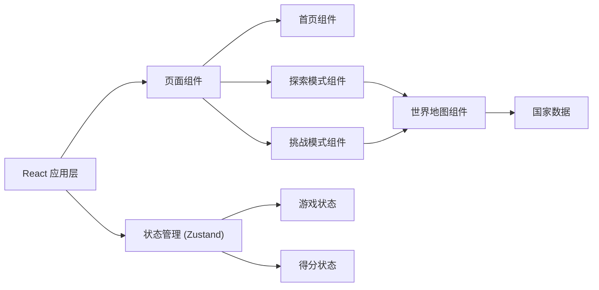

## 1. 架构设计



## 2. 技术描述

- **前端框架**：React@18 + TypeScript
- **构建工具**：Vite@5
- **样式方案**：TailwindCSS@3
- **状态管理**：Zustand
- **路由方案**：React Router DOM
- **地图实现**：SVG 内联世界地图
- **图标库**：lucide-react
- **后端**：无（纯前端应用）
- **数据库**：无（数据内置在前端）

## 3. 路由定义

| 路由 | 页面 | 用途 |
|-------|------|------|
| / | 首页 | 游戏入口、模式选择 |
| /explore | 探索模式 | 自由点击地图学习国家知识 |
| /challenge | 挑战模式 | 问答游戏，挑战得分 |

## 4. 数据模型

### 4.1 国家数据结构

```typescript
interface Country {
  id: string;
  name: string;
  capital: string;
  continent: string;
  flag: string;
  path: string;
}
```

### 4.2 游戏状态

```typescript
interface GameState {
  currentMode: 'home' | 'explore' | 'challenge';
  score: number;
  combo: number;
  lives: number;
  currentQuestion: Country | null;
  answeredCount: number;
  correctCount: number;
  selectedCountry: Country | null;
  isGameOver: boolean;
}
```

## 5. 项目结构

```
src/
├── components/
│   ├── WorldMap/          # 世界地图组件
│   ├── CountryCard/       # 国家信息卡片
│   ├── QuestionCard/      # 题目卡片
│   ├── ScorePanel/        # 得分面板
│   ├── GameResult/        # 游戏结算弹窗
│   └── NavBar/            # 导航栏
├── pages/
│   ├── Home.tsx           # 首页
│   ├── Explore.tsx        # 探索模式页
│   └── Challenge.tsx      # 挑战模式页
├── data/
│   └── countries.ts       # 国家数据
├── store/
│   └── gameStore.ts       # 游戏状态管理
├── utils/
│   └── gameUtils.ts       # 游戏工具函数
├── App.tsx
├── main.tsx
└── index.css
```

## 6. 技术要点

### 6.1 地图实现
- 使用 SVG 格式的世界地图
- 每个国家是一个独立的 path 元素
- 通过 CSS hover 和 active 状态实现交互效果
- 地图自适应容器大小，使用 viewBox 实现缩放

### 6.2 状态管理
- 使用 Zustand 管理全局游戏状态
- 探索模式和挑战模式共享国家数据
- 游戏状态与 UI 组件分离

### 6.3 动画效果
- 使用 CSS transitions 和 keyframes 实现动画
- 地图国家悬停、点击反馈动画
- 页面切换过渡动画
- 答对答错的反馈动画

### 6.4 性能优化
- 国家数据静态化，无需网络请求
- SVG 地图使用事件委托优化点击事件
- 组件按需渲染，避免不必要的重绘
