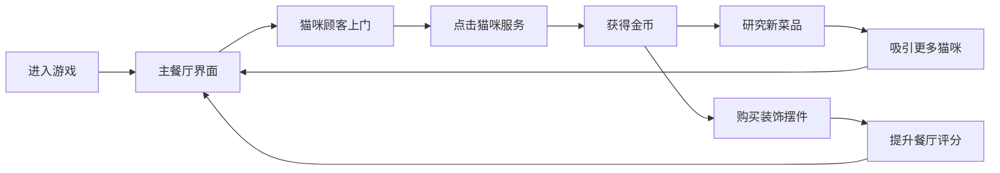
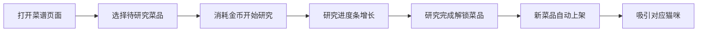

## 1. 产品概述

喵喵餐厅是一款画风可爱、治愈系的猫咪经营小游戏。玩家经营一家专门接待猫咪顾客的温馨餐厅，通过点击收集金币、研究新菜品、装饰餐厅，吸引各种可爱的猫咪上门光顾。游戏主打轻松休闲，无需复杂操作，适合碎片化时间放松。

- 核心玩法：点击放置 + 经营收集 + 治愈养成
- 目标用户：喜欢可爱画风、休闲游戏的玩家
- 产品价值：提供轻松愉快的治愈体验，满足收集和经营的成就感

## 2. 核心功能

### 2.1 功能模块

1. **主餐厅界面**：餐厅场景展示、猫咪顾客互动、金币收集
2. **菜品研究**：解锁新菜品、升级菜品、查看菜品图鉴
3. **猫咪图鉴**：记录来访猫咪、查看猫咪信息、收集成就
4. **装饰系统**：购买摆件、布置餐厅、提升餐厅评分
5. **资源系统**：金币管理、餐厅等级、声望值

### 2.2 页面详情

| 页面名称 | 模块名称 | 功能描述 |
|---------|---------|----------|
| 主餐厅 | 餐厅场景 | 展示餐厅内景，猫咪顾客走动，可点击收集金币 |
| 主餐厅 | 顶部状态栏 | 显示金币、等级、声望值 |
| 主餐厅 | 底部导航 | 切换餐厅、菜谱、猫咪、装饰四个功能页 |
| 菜谱页面 | 菜品列表 | 展示所有菜品，可研究解锁和升级 |
| 菜谱页面 | 菜品详情 | 显示菜品信息、售价、研究进度 |
| 猫咪图鉴 | 猫咪列表 | 展示已解锁和未解锁的猫咪顾客 |
| 猫咪图鉴 | 猫咪详情 | 显示猫咪信息、喜好、来访记录 |
| 装饰商店 | 摆件列表 | 展示可购买的餐厅装饰摆件 |
| 装饰商店 | 我的装饰 | 已拥有的摆件，可放置到餐厅 |

## 3. 核心流程

### 3.1 主要游戏流程

玩家进入游戏后，在主餐厅界面等待猫咪顾客上门。猫咪会随机点单，玩家点击猫咪完成服务获得金币。用金币研究新菜品可以吸引更多种类的猫咪，购买装饰摆件可以提升餐厅美观度和收益。

### 3.2 菜品研究流程

## 4. 用户界面设计

### 4.1 设计风格

**整体风格**：可爱治愈系、奶油色调、圆润柔和

**配色方案**：
- 主色调：奶油粉 `#FFE4E6`、奶茶色 `#FDF6E3`
- 辅助色：薄荷绿 `#B5EAD7`、天空蓝 `#BEE3F8`
- 强调色：蜜桃橙 `#FFCBA4`、薰衣草紫 `#E0BBE4`
- 文字色：深棕 `#5C4033`、浅棕 `#8B7355`

**字体**：
- 标题字体：圆润可爱的卡通风格字体
- 正文字体：清晰易读的圆角无衬线字体

**视觉元素**：
- 所有卡片和按钮采用大圆角设计
- 使用柔和的阴影营造层次感
- 大量使用猫咪表情和爪印元素
- 背景采用浅渐变和细腻纹理

### 4.2 页面设计概览

| 页面名称 | 模块名称 | UI元素 |
|---------|---------|-------|
| 主餐厅 | 餐厅场景 | 暖色调背景、餐桌椅、猫咪角色、飘浮金币、柔和动画 |
| 主餐厅 | 顶部状态栏 | 半透明胶囊样式、图标+数字、平滑过渡 |
| 主餐厅 | 底部导航 | 图标+文字、选中态高亮、圆润tab切换 |
| 菜谱页面 | 菜品卡片 | 食物插画、菜品名称、价格标签、解锁状态 |
| 猫咪图鉴 | 猫咪卡片 | 猫咪头像、名字、稀有度标签、解锁进度 |
| 装饰商店 | 商品卡片 | 摆件预览图、名称、价格、拥有标记 |

### 4.3 响应式

- 桌面端优先设计，同时适配平板和手机
- 使用弹性布局保证不同屏幕下的良好展示
- 移动端优化触摸区域，确保点击友好

### 4.4 动效设计

- 猫咪走动动画：平滑的位移动画，带有轻微上下浮动
- 金币收集动画：金币弹跳+放大缩小后消失
- 按钮反馈：点击时轻微缩放+颜色变化
- 页面切换：淡入淡出+滑动过渡
- 新菜品解锁：闪光效果+弹出动画
