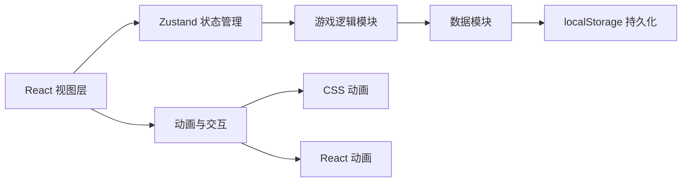

## 1. 架构设计

本项目为纯前端单页应用，采用 React 组件化架构，使用 Zustand 进行状态管理，游戏数据完全在前端处理并持久化到 localStorage。

## 2. 技术描述

- **前端框架**：React 18 + TypeScript
- **构建工具**：Vite 5
- **样式方案**：Tailwind CSS 3
- **状态管理**：Zustand
- **路由方案**：React Router DOM 6（使用底部导航切换视图）
- **图标库**：Lucide React
- **数据持久化**：localStorage
- **动画实现**：CSS Animations + Transitions

## 3. 模块划分

| 模块 | 路径 | 职责 |
|------|------|------|
| 状态管理 | `src/store/` | 游戏全局状态（金币、等级、解锁状态等） |
| 游戏数据 | `src/data/` | 菜品、猫咪、摆件的初始配置数据 |
| 类型定义 | `src/types/` | TypeScript 类型接口定义 |
| 工具函数 | `src/utils/` | 游戏逻辑工具函数、格式化等 |
| 页面组件 | `src/pages/` | 餐厅、菜谱、猫咪、装饰四个主页面 |
| 通用组件 | `src/components/` | 导航栏、状态栏、卡片等可复用组件 |
| 自定义Hooks | `src/hooks/` | 游戏循环、动画等可复用逻辑 |

## 4. 核心数据模型

### 4.1 游戏状态 (GameState)

| 字段 | 类型 | 说明 |
|------|------|------|
| coins | number | 金币数量 |
| level | number | 餐厅等级 |
| reputation | number | 声望值 |
| unlockedDishes | string[] | 已解锁菜品ID列表 |
| dishLevels | Record<string, number> | 各菜品等级 |
| unlockedCats | string[] | 已解锁猫咪ID列表 |
| catVisitCounts | Record<string, number> | 猫咪来访次数 |
| ownedDecorations | string[] | 已拥有摆件ID列表 |
| placedDecorations | PlacedDecoration[] | 餐厅中放置的摆件 |
| lastSaveTime | number | 上次保存时间戳 |

### 4.2 菜品 (Dish)

| 字段 | 类型 | 说明 |
|------|------|------|
| id | string | 菜品唯一ID |
| name | string | 菜品名称 |
| description | string | 菜品描述 |
| emoji | string | 菜品图标（emoji） |
| basePrice | number | 基础售价 |
| unlockCost | number | 研究解锁花费 |
| unlockTime | number | 研究所需时间（秒） |
| attractsCats | string[] | 吸引的猫咪ID列表 |
| rarity | 'common' | 'rare' | 'epic' | 稀有度 |

### 4.3 猫咪 (Cat)

| 字段 | 类型 | 说明 |
|------|------|------|
| id | string | 猫咪唯一ID |
| name | string | 猫咪名字 |
| description | string | 猫咪介绍 |
| emoji | string | 猫咪图标（emoji） |
| rarity | 'common' | 'rare' | 'epic' | 'legendary' | 稀有度 |
| favoriteDishes | string[] | 喜欢的菜品ID |
| coinReward | number | 每次来访给的金币 |
| personality | string | 性格描述 |

### 4.4 摆件 (Decoration)

| 字段 | 类型 | 说明 |
|------|------|------|
| id | string | 摆件唯一ID |
| name | string | 摆件名称 |
| description | string | 摆件描述 |
| emoji | string | 摆件图标（emoji） |
| price | number | 购买价格 |
| reputationBonus | number | 增加的声望值 |
| category | 'furniture' | 'plant' | 'toy' | 'wall' | 分类 |

### 4.5 当前猫咪顾客 (ActiveCat)

| 字段 | 类型 | 说明 |
|------|------|------|
| id | string | 唯一实例ID |
| catId | string | 对应猫咪ID |
| orderedDish | string | 点的菜品ID |
| positionX | number | X坐标位置（百分比） |
| state | 'walking' | 'eating' | 'leaving' | 状态 |
| coinReady | boolean | 是否有金币可收取 |

## 5. 核心游戏循环

1. **猫咪生成**：定时随机生成猫咪顾客进入餐厅
2. **点单系统**：猫咪坐下后随机点一份已解锁的菜品
3. **金币收取**：猫咪吃完后产生金币，玩家点击收取
4. **猫咪离开**：收取金币后猫咪离开餐厅
5. **自动保存**：定期将游戏状态保存到 localStorage

## 6. 页面路由

| 路由路径 | 页面组件 | 说明 |
|---------|---------|------|
| / | RestaurantPage | 主餐厅页面（默认） |
| /menu | MenuPage | 菜谱研究页面 |
| /cats | CatsPage | 猫咪图鉴页面 |
| /decor | DecorPage | 装饰商店页面 |

## 7. 状态管理设计

使用 Zustand 创建单一 store，包含：
- 游戏资源状态（金币、等级、声望）
- 解锁进度状态（菜品、猫咪、装饰）
- 当前场景状态（活跃猫咪、放置的装饰）
- 游戏操作方法（收取金币、研究菜品、购买装饰等）
