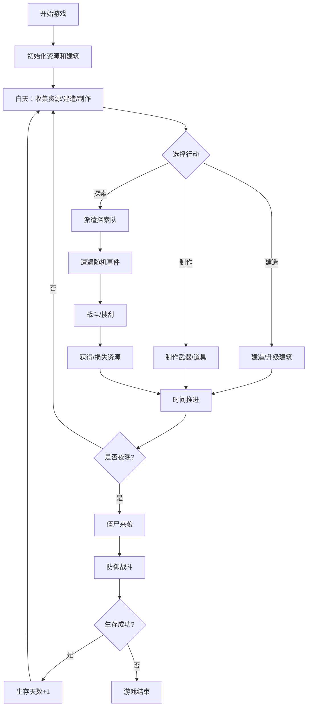

## 1. 产品概述

僵尸末日生存冒险游戏，玩家在末日废墟中建造庇护所、收集资源、制作武器，抵御僵尸进攻并努力生存下去。

- 核心目标：在僵尸末日中尽可能长时间生存，建造坚固的庇护所
- 目标用户：喜欢生存建造类游戏的休闲玩家
- 产品价值：轻量级页游，无需下载，打开即玩，策略与养成结合

## 2. 核心功能

### 2.1 功能模块

1. **主控制台**：资源状态栏、生存天数、角色状态（生命值、饥饿度）
2. **建造系统**：建造/升级各类建筑（庇护所、仓库、工作台、农田、围墙等）
3. **资源系统**：木材、石头、金属、食物、水、药品等资源的收集与管理
4. **武器工坊**：制作各类近战和远程武器，提升战斗力
5. **探索系统**：派遣探索队外出搜刮资源，遭遇随机事件和僵尸战斗
6. **僵尸防御**：每晚僵尸来袭，需要足够的防御设施和武器

### 2.2 页面详情

| 页面名称 | 模块名称 | 功能描述 |
|---------|---------|---------|
| 游戏主界面 | 顶部状态栏 | 显示生存天数、当前时间、角色生命值、饥饿度、口渴度 |
| 游戏主界面 | 资源面板 | 显示各类资源数量（木材、石头、金属、食物、水、药品） |
| 游戏主界面 | 主操作区 | 庇护所场景可视化展示，建筑布局 |
| 游戏主界面 | 底部功能栏 | 建造、制作、探索、背包四大功能入口 |
| 建造面板 | 建筑列表 | 可建造的建筑分类展示，带有图标和描述 |
| 建造面板 | 建筑详情 | 建筑效果、升级消耗、当前等级 |
| 武器工坊 | 武器列表 | 可制作的武器分类（近战/远程） |
| 武器工坊 | 制作界面 | 武器属性、所需材料、制作进度 |
| 探索界面 | 探索地点 | 多个探索区域，风险与收益不同 |
| 探索界面 | 探索进度 | 探索时间、遭遇事件、战斗结算 |
| 战斗界面 | 僵尸来袭 | 夜间僵尸进攻，防御战斗动画 |

## 3. 核心流程

## 4. 用户界面设计

### 4.1 设计风格

**末日废土工业风**
- 主色调：深炭灰背景 (#1a1a1a)，铁锈红点缀 (#b45309)，军绿色功能色 (#4d7c0f)
- 辅助色：警示黄 (#eab308)，危险红 (#dc2626)，安全绿 (#16a34a)
- 质感：磨损金属纹理、做旧效果、暗部阴影
- 字体：硬朗无衬线字体，标题粗壮有力，正文清晰易读
- 按钮风格：方形微圆角，金属质感边框，hover有发光效果
- 图标风格：线性图标搭配emoji，简约末世风格

### 4.2 页面设计概述

| 页面名称 | 模块名称 | UI 元素 |
|---------|---------|--------|
| 游戏主界面 | 顶部状态栏 | 深色渐变条，图标+数字，状态条动画 |
| 游戏主界面 | 资源面板 | 卡片式布局，图标+数量，悬停显示详情 |
| 游戏主界面 | 庇护所场景 | 2D俯视/侧视图，建筑格子布局，动画过渡 |
| 游戏主界面 | 底部功能栏 | 四大功能按钮，图标+文字，选中高亮 |
| 建造面板 | 建筑卡片 | 图标、名称、等级、效果简介、建造按钮 |
| 武器工坊 | 武器列表 | 分类标签，武器卡片，属性条，制作按钮 |
| 探索界面 | 地点卡片 | 风险等级标识，预计收益，探索按钮 |
| 战斗界面 | 战斗场景 | 僵尸波次，血量条，伤害数字飘字 |

### 4.3 响应式

- Desktop-first 设计，主区域最小宽度 1024px
- 平板端自适应布局，功能栏可折叠
- 移动端单列布局，底部导航改为底部Tab

### 4.4 动效设计

- 建筑建造：进度条填充 + 落成动画
- 资源获取：数字跳动 + 飘字效果
- 僵尸来袭：屏幕震动 + 红光闪烁
- 按钮交互：按下缩放 + 边框发光
- 页面切换：淡入淡出 + 滑动过渡
