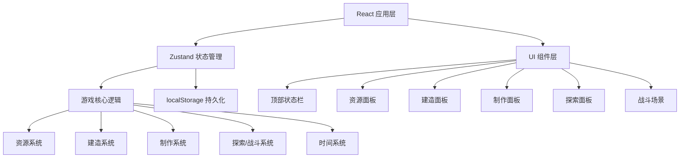

## 1. 架构设计

纯前端单页应用，游戏状态全部在前端管理，使用 localStorage 存档。



## 2. 技术选型

- **前端框架**: React@18 + TypeScript
- **构建工具**: Vite@5
- **样式方案**: TailwindCSS@3
- **状态管理**: Zustand@4
- **图标库**: lucide-react
- **数据持久化**: localStorage
- **无后端**：纯前端游戏

## 3. 目录结构

```
src/
├── components/          # 可复用组件
│   ├── StatusBar.tsx    # 顶部状态栏
│   ├── ResourcePanel.tsx # 资源面板
│   ├── BuildPanel.tsx   # 建造面板
│   ├── CraftPanel.tsx   # 制作面板
│   ├── ExplorePanel.tsx # 探索面板
│   ├── BattleScene.tsx  # 战斗场景
│   ├── ShelterView.tsx  # 庇护所视图
│   └── BottomNav.tsx    # 底部导航
├── store/               # 状态管理
│   └── useGameStore.ts  # 游戏主状态
├── types/               # 类型定义
│   └── game.ts          # 游戏相关类型
├── data/                # 游戏配置数据
│   ├── buildings.ts     # 建筑配置
│   ├── weapons.ts       # 武器配置
│   ├── resources.ts     # 资源配置
│   └── locations.ts     # 探索地点配置
├── utils/               # 工具函数
│   ├── gameLogic.ts     # 游戏核心逻辑
│   └── storage.ts       # 本地存储
├── pages/               # 页面
│   └── Game.tsx         # 游戏主页面
├── App.tsx
├── main.tsx
└── index.css
```

## 4. 数据模型

### 4.1 资源类型

```typescript
interface Resources {
  wood: number;      // 木材
  stone: number;     // 石头
  metal: number;     // 金属
  food: number;      // 食物
  water: number;     // 水
  medicine: number;  // 药品
  scrap: number;     // 废料
}
```

### 4.2 玩家状态

```typescript
interface PlayerStatus {
  health: number;     // 生命值 0-100
  hunger: number;     // 饥饿度 0-100
  thirst: number;     // 口渴度 0-100
  attack: number;     // 攻击力
  defense: number;    // 防御力
}
```

### 4.3 建筑

```typescript
interface Building {
  id: string;
  name: string;
  icon: string;
  level: number;
  maxLevel: number;
  description: string;
  effect: string;
  cost: Resources;     // 建造/升级消耗
  upgradeCostMultiplier: number;
}
```

### 4.4 武器

```typescript
interface Weapon {
  id: string;
  name: string;
  icon: string;
  type: 'melee' | 'ranged';
  attack: number;
  durability: number;
  maxDurability: number;
  description: string;
  cost: Resources;
  craftTime: number;   // 制作时间（秒）
}
```

### 4.5 探索地点

```typescript
interface Location {
  id: string;
  name: string;
  icon: string;
  dangerLevel: number;  // 1-5
  duration: number;     // 探索时长（秒）
  rewards: Partial<Resources>;
  zombieChance: number; // 遭遇僵尸概率 0-1
  description: string;
}
```

### 4.6 游戏状态

```typescript
interface GameState {
  day: number;              // 生存天数
  timeOfDay: 'day' | 'night'; // 白天/夜晚
  timeProgress: number;     // 当前时间段进度 0-100
  resources: Resources;
  player: PlayerStatus;
  buildings: Building[];
  weapons: Weapon[];        // 已拥有的武器
  equippedWeapon: string | null;
  isExploring: boolean;
  exploreProgress: number;
  currentLocation: string | null;
  isUnderAttack: boolean;
  gameOver: boolean;
  gameStarted: boolean;
}
```

## 5. 游戏核心机制

### 5.1 时间系统
- 每个白天 60 秒，夜晚 30 秒
- 白天可以建造、制作、探索
- 夜晚会有僵尸来袭，需要防御
- 时间推进时消耗饥饿度和口渴度

### 5.2 建造系统
- 建筑有多个等级，升级提升效果
- 建造/升级需要消耗资源
- 关键建筑：庇护所、仓库、工作台、农田、水井、围墙、陷阱

### 5.3 制作系统
- 在工作台制作武器和道具
- 制作需要消耗资源和时间
- 武器分为近战和远程
- 武器有耐久度，使用会消耗

### 5.4 探索系统
- 选择地点派遣探索
- 探索需要时间
- 有概率遭遇僵尸战斗
- 探索成功获得资源奖励

### 5.5 战斗系统
- 自动战斗模式
- 攻击力 vs 防御力计算伤害
- 武器提供攻击加成
- 围墙和陷阱提供防御加成
- 战斗失败损失生命值和资源
