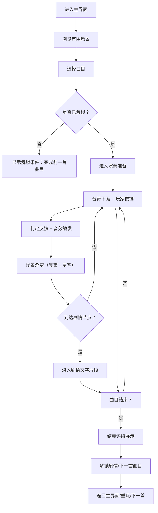

# 产品需求文档（PRD）：旋律叙事音游

## 1. 产品概述

一款以"旋律叙事"为核心的轻量级治愈系音游，复刻《Deemo》温暖治愈的沉浸体验。玩家通过在适当时机触碰钢琴键，奏响完整乐章，解锁唯美剧情。产品定位于零门槛、重情感的音乐绘本式游戏，让每个玩家都能感受音乐与故事交织的美好。

- 核心目标：打造"会发声的绘本"，以极简操作承载深度情感体验
- 目标用户：音乐爱好者、治愈游戏玩家、追求放松体验的大众用户
- 市场价值：填补轻叙事音游空白，以情感共鸣替代竞技压力

## 2. 核心功能

### 2.1 用户角色
| 角色 | 注册方式 | 核心权限 |
|------|---------|----------|
| 普通玩家 | 无需注册，本地存档 | 浏览曲目、演奏音乐、解锁剧情、查看进度 |

### 2.2 功能模块
1. **主界面**：曲目标题展示、场景预览、曲目列表、游戏入口
2. **曲目选择页**：曲目封面、难度标识、剧情预览、解锁状态
3. **游戏演奏页**：钢琴键区、音符下落、判定反馈、场景渐变、剧情片段
4. **结算页面**：演奏评级、得分统计、剧情解锁提示、返回/重玩

### 2.3 页面详情
| 页面名称 | 模块名称 | 功能描述 |
|---------|---------|----------|
| 主界面 | 场景氛围层 | 动态渐变背景（晨雾→星空）、漂浮粒子、氛围光效 |
| 主界面 | 曲目入口 | 展示当前可选曲目、"开始演奏"按钮、剧情提示 |
| 主界面 | 导航区 | 曲目列表切换、设置入口、进度总览 |
| 曲目选择页 | 曲目卡片 | 封面图、曲名、作曲者、难度星标、解锁锁图标 |
| 曲目选择页 | 剧情摘要 | 简短故事片段、当前进度百分比、章节标题 |
| 游戏演奏页 | 钢琴键盘 | 4-6键位布局、按下高亮、琴键音反馈 |
| 游戏演奏页 | 音符系统 | 发光音符下落、轨迹线、判定线、Perfect/Great/Good判定 |
| 游戏演奏页 | 场景层 | 随曲目进度从晨雾→午后→黄昏→星空渐变 |
| 游戏演奏页 | HUD | 分数显示、连击计数、进度条、暂停按钮 |
| 游戏演奏页 | 剧情插入 | 特定进度触发淡入式文字剧情片段 |
| 结算页面 | 评级展示 | S/A/B/C等级、Perfect/Great/Good/Miss统计、总分 |
| 结算页面 | 剧情解锁 | 解锁新章节动画、下一首曲目预览 |

## 3. 核心流程

玩家进入主界面后，沉浸于动态氛围场景中，选择感兴趣的曲目进入演奏。演奏过程中，音符从屏幕上方落向钢琴键，玩家在判定线附近按键触发音效与视觉反馈。随着曲目推进，场景从晨雾渐变为星空，关键节点插入剧情文字。演奏结束后展示评级，解锁后续曲目与剧情，形成"音乐-场景-剧情"三位一体的完整体验闭环。

## 4. 用户界面设计

### 4.1 设计风格
- **主色调**：暖金色 (#F5E6C8) + 淡蓝紫 (#8B9DC3) + 墨绿深灰 (#2C3E50)，辅以柔和渐变
- **辅助色**：音符发光色采用温暖橙黄 (#FFB347)，判定反馈用粉紫 (#E8B4D4)
- **按钮风格**：圆角矩形（radius 16px），柔和阴影，悬浮时微微放大并发光
- **字体**：标题使用 "Noto Serif SC" 衬线体（宋体风格），正文用 "Noto Sans SC"，营造绘本般的文艺感
- **布局风格**：全屏沉浸，大量留白，元素采用柔和居中对称布局
- **视觉元素**：粒子光点、漂浮叶片、星尘、柔和光晕、渐变蒙版

### 4.2 页面设计概览
| 页面名称 | 模块名称 | UI 元素 |
|---------|---------|---------|
| 主界面 | 氛围场景 | 全屏渐变背景（晨雾暖黄）、漂浮粒子、柔焦光晕、中央标题文字（淡入动画） |
| 主界面 | 曲目入口 | 底部大圆角卡片、曲目封面缩略、"开始演奏"主按钮（悬浮发光）、进度条 |
| 曲目选择页 | 曲目列表 | 横向滑动卡片组、每张卡片有封面图+难度星标+锁图标、选中时放大高亮 |
| 曲目选择页 | 剧情摘要 | 半透明磨砂玻璃面板、衬线体故事文字、章节标题、进度百分比圆环 |
| 游戏演奏页 | 场景层 | 全屏动态背景、随进度4段渐变（晨雾→午后→黄昏→星空）、飘落花瓣/星尘粒子 |
| 游戏演奏页 | 钢琴键区 | 底部固定4-6键位、象牙白键+黑色间缝、按下时下沉并发光、键位上方有判定线（柔和横线） |
| 游戏演奏页 | 音符 | 发光椭圆形（橙黄渐变）、带拖尾光晕、下落轨迹柔和、命中时爆裂为粒子 |
| 游戏演奏页 | HUD | 左上角分数（衬线体+金色）、右上角连击数（淡入淡出）、顶部进度条（细线+光点）、中央判定文字（Perfect/Great 浮动消失） |
| 游戏演奏页 | 剧情插入 | 全屏半透明遮罩淡入、中央衬线体文字逐字浮现、2-3秒后淡出 |
| 结算页面 | 评级卡片 | 中央大圆角卡片、巨大等级字母（S金色/A银色/B铜色/C灰色）、带发光效果 |
| 结算页面 | 统计面板 | 各判定数量横向条形图、总分展示、解锁提示文字（淡入动画） |

### 4.3 响应式设计
- **设计优先**：桌面端 16:9 为主（1920×1080），同时适配平板横屏
- **移动端适配**：保持核心玩法区比例，钢琴键自动拉伸适配屏宽，字体缩放，触控区域增大至 48px+
- **触摸优化**：钢琴键支持多点触控，音符命中区域略大于视觉区域，防误触判定

### 4.4 视觉氛围指引
- **环境氛围**：
  - 晨雾阶段：暖淡黄色渐变，柔和的丁达尔光效，半透明雾层缓慢流动
  - 午后阶段：明亮的金橙色，柔光从右上角洒落，地面有斑驳光影
  - 黄昏阶段：紫粉橙三色渐变天空，远处山峦剪影，暖橘色光晕
  - 星空阶段：深蓝紫夜空，闪烁星点（呼吸动画），流星偶尔划过
- **光影设置**：全局采用软光，主光源方向随场景变化，琴键按下时发出向上的柔和光柱
- **动画节奏**：所有过渡采用 0.8-1.5s 的缓动曲线 (ease-in-out)，避免急促变化
- **后期效果**：全局 5% 模糊柔化 + 轻微胶片颗粒感，营造绘本质感
- **粒子系统**：各阶段专属粒子（晨雾的光斑/黄昏的花瓣/星空的星尘），数量 50-100，缓慢漂浮

