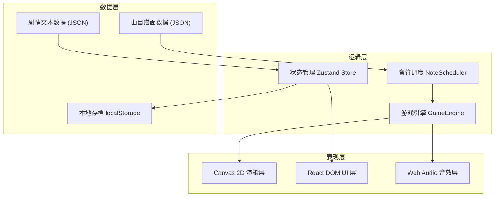
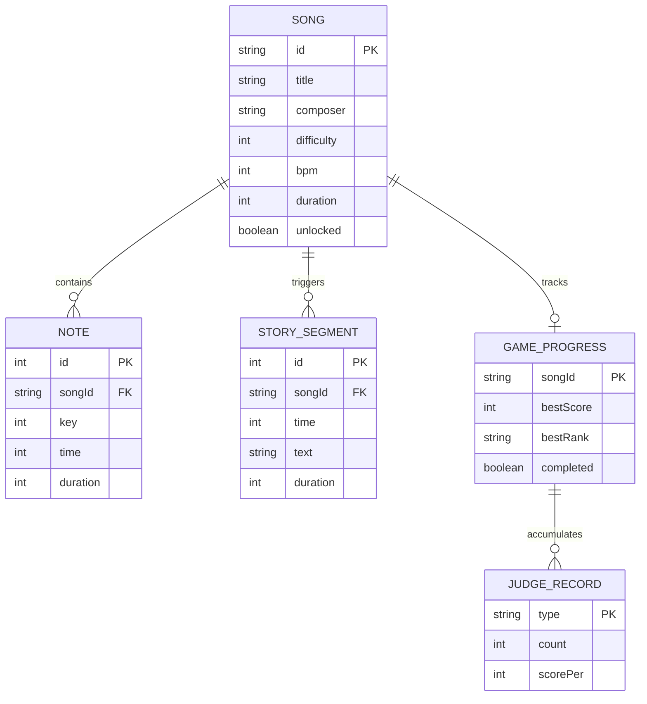

# 技术架构文档：旋律叙事音游

## 1. 架构设计

采用纯前端单页应用架构，使用 Canvas 2D 负责游戏核心渲染（音符、粒子、钢琴键），DOM/CSS 负责 UI 层（菜单、HUD、剧情文字），Web Audio API 负责实时音效合成。游戏状态通过 React 管理，与渲染层通过自定义事件解耦。



## 2. 技术选型说明

- **前端框架**：React@18 + TypeScript — 类型安全，组件化 UI，生态成熟
- **构建工具**：Vite@5 — 极速开发体验，HMR 快速，生产构建优化
- **样式方案**：Tailwind CSS@3 — 快速构建 UI，响应式适配
- **状态管理**：Zustand — 轻量级，无样板代码，适合游戏状态
- **核心渲染**：Canvas 2D API — 高性能绘制音符、粒子、钢琴键动画
- **音频系统**：Web Audio API — 实时合成钢琴音，无需音频文件资源
- **动画引擎**：requestAnimationFrame + 自定义缓动函数 — 60fps 流畅动画
- **存档系统**：localStorage — 曲目进度、解锁状态、最高分本地存储

## 3. 路由定义

| 路由路径 | 页面组件 | 功能用途 |
|---------|---------|---------|
| `/` | HomePage | 主界面：氛围场景 + 曲目入口 + 导航 |
| `/select` | SelectPage | 曲目选择：曲目卡片列表 + 剧情摘要预览 |
| `/play/:songId` | PlayPage | 游戏演奏：Canvas 游戏区 + HUD + 剧情插入 |
| `/result/:songId` | ResultPage | 结算页面：评级展示 + 统计 + 解锁提示 |

## 4. 核心模块类型定义

```typescript
// 谱面音符定义
interface Note {
  id: number;
  key: number;          // 0-5 对应 6 个琴键
  time: number;         // 命中时间（毫秒）
  duration?: number;    // 长按音符持续时间（可选）
}

// 曲目数据
interface Song {
  id: string;
  title: string;
  composer: string;
  difficulty: 1 | 2 | 3;  // 难度星级
  bpm: number;
  duration: number;       // 总时长（毫秒）
  notes: Note[];
  storySegments: StorySegment[];  // 剧情片段
  unlocked: boolean;
  bestScore?: number;
  bestRank?: 'S' | 'A' | 'B' | 'C';
}

// 剧情片段
interface StorySegment {
  time: number;     // 触发时间点
  text: string;     // 剧情文字
  duration: number; // 展示时长
}

// 判定结果
type JudgeType = 'perfect' | 'great' | 'good' | 'miss';

interface JudgeResult {
  type: JudgeType;
  score: number;
  combo: number;
}

// 游戏状态
interface GameState {
  status: 'idle' | 'playing' | 'paused' | 'ended';
  currentTime: number;
  score: number;
  combo: number;
  maxCombo: number;
  judges: Record<JudgeType, number>;
  activeNotes: ActiveNote[];
  pressedKeys: Set<number>;
}

// 实时渲染用音符
interface ActiveNote extends Note {
  y: number;           // 当前 Y 坐标
  hit: boolean;        // 是否已命中
  missed: boolean;     // 是否已错过
  particlePhase: number; // 命中粒子动画相位
}

// 场景阶段
type ScenePhase = 'dawn' | 'noon' | 'dusk' | 'night';
```

## 5. 核心数据模型

### 5.1 实体关系图



### 5.2 存档数据结构

```typescript
// localStorage key: 'melody-game-save'
interface SaveData {
  version: string;
  songs: Record<string, {
    unlocked: boolean;
    bestScore: number;
    bestRank: 'S' | 'A' | 'B' | 'C' | null;
    completed: boolean;
    playCount: number;
  }>;
  settings: {
    volume: number;
    noteSpeed: number;    // 1.0 正常速度
    keyLayout: '4k' | '6k';
  };
  totalPlayTime: number;
}
```

## 6. 游戏引擎核心流程

### 6.1 渲染循环 (60fps)

```
requestAnimationFrame →
  1. 计算 deltaTime（与上一帧时间差）
  2. 更新当前时间 currentTime += deltaTime
  3. 调度音符：筛选 time - fallDuration <= currentTime <= time + missWindow 的音符加入 activeNotes
  4. 更新每个 activeNote 的 Y 坐标（线性下落）
  5. 检测过期音符（currentTime > time + missWindow 且未命中 → 标记 miss）
  6. 场景阶段更新：根据 currentTime / duration 切换 dawn→noon→dusk→night
  7. 剧情触发检测：到达 storySegment 触发点时展示
  8. 粒子更新：移动漂浮粒子、命中粒子动画
  9. Canvas 重绘：场景背景 → 粒子 → 音符 → 判定线 → 琴键 → HUD
```

### 6.2 按键判定逻辑

```
keydown 事件 →
  1. 在 activeNotes 中查找：key 匹配 && !hit && !missed 的音符
  2. 按 |time - currentTime| 差值从小到大排序
  3. 取差值最小的音符进行判定：
     - |Δ| < 50ms  → Perfect (+100分，combo+1)
     - |Δ| < 100ms → Great   (+70分，combo+1)
     - |Δ| < 150ms → Good    (+40分，combo+1)
     - |Δ| >= 150ms → 不计入（等待更晚的 miss 判定）
  4. 触发对应 Web Audio 钢琴音
  5. 生成命中粒子特效
  6. 更新分数与 combo
```

## 7. 性能与优化策略

- **对象池**：音符与粒子对象复用，避免频繁 GC
- **离屏渲染**：钢琴键纹理使用 OffscreenCanvas 预渲染缓存
- **视口裁剪**：Canvas 只绘制 activeNotes，跳过已出屏的音符
- **音频预调度**：Web Audio 提前 100ms 调度音符，避免延迟
- **节流更新**：DOM 层 HUD 每 100ms 更新一次，而非每帧
- **降级策略**：检测到低帧率时自动降低粒子数量（100 → 50 → 20）

