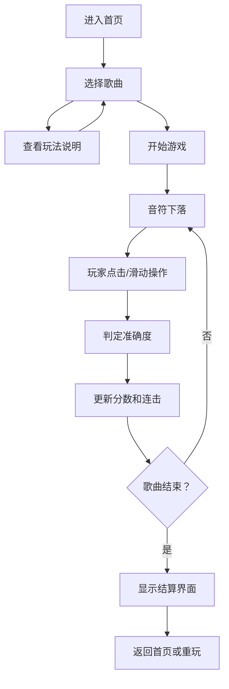

## 1. 产品概述

「喵节奏」是一款类似《喵赛克》的网页端节奏音乐游戏，玩家通过点击或滑动箭头符号跟随音乐节拍进行游戏。游戏主打简洁清晰的界面设计、舒适柔和的配色方案，以及直观易懂的玩法规则。

- 核心目标：让玩家在轻松愉悦的氛围中体验音乐节奏游戏的乐趣
- 目标用户：喜欢音乐游戏、追求简洁游戏体验的休闲玩家

## 2. 核心功能

### 2.1 功能模块

1. **首页/主菜单**：游戏标题、开始按钮、玩法说明、歌曲选择
2. **游戏界面**：音轨轨道、判定线、音符下落、分数/连击显示
3. **结算界面**：分数统计、评级展示、重玩/返回按钮

### 2.2 页面详情

| 页面名称 | 模块名称 | 功能描述 |
|---------|---------|---------|
| 首页 | 标题区 | 大标题展示，带动画效果的游戏Logo |
| 首页 | 菜单按钮 | 开始游戏、选择歌曲、玩法说明三个核心按钮 |
| 首页 | 歌曲列表 | 展示可选歌曲卡片，包含歌曲名、难度等级、时长 |
| 首页 | 玩法说明 | 简洁的操作说明（图示+文字），不超过5条规则 |
| 游戏界面 | 轨道区 | 4条下落轨道，显示判定线和下落音符 |
| 游戏界面 | 状态栏 | 实时分数、连击数、生命值、歌曲进度条 |
| 游戏界面 | 判定反馈 | Perfect/Great/Good/Miss 判定文字和视觉特效 |
| 结算界面 | 成绩展示 | 总分、最高连击、各判定数量统计 |
| 结算界面 | 评级系统 | S/A/B/C/D 等级展示，带动画效果 |
| 结算界面 | 操作按钮 | 再来一次、返回主菜单 |

## 3. 核心流程

## 4. 用户界面设计

### 4.1 设计风格

- **主色调**：柔和的粉紫色渐变（#FFB6C1 → #DDA0DD），搭配淡蓝色（#B0E0E6）作为辅助色
- **背景**：半透明的玻璃拟态效果（Glassmorphism），背景使用柔和的渐变光晕
- **按钮样式**：圆润的胶囊形按钮，带有轻微的毛玻璃效果和柔和阴影
- **字体**：使用圆润可爱的字体风格，标题用装饰性字体，正文用清晰易读的无衬线字体
- **图标**：使用柔和的emoji风格图标，避免尖锐的几何图形
- **动画**：所有过渡和反馈使用缓动曲线（ease-out），节奏感强但不刺眼

### 4.2 页面设计概览

| 页面名称 | 模块名称 | UI元素 |
|---------|---------|--------|
| 首页 | 标题区 | 渐变文字、跳动的音符装饰、柔和光晕背景 |
| 首页 | 菜单按钮 | 胶囊形按钮、悬停放大效果、点击波纹动画 |
| 首页 | 歌曲卡片 | 圆角矩形、半透明背景、难度星标、悬停上浮效果 |
| 首页 | 玩法说明 | 卡片式弹窗、图标配文字、步骤条展示 |
| 游戏界面 | 轨道区 | 4条垂直轨道、柔和发光判定线、彩色箭头音符 |
| 游戏界面 | 判定反馈 | 居中弹出的判定文字（Perfect/Great等）、粒子特效 |
| 游戏界面 | 状态栏 | 顶部半透明条、分数/连击数字放大显示、进度条渐变 |
| 结算界面 | 评级展示 | 大号评级字母、环形进度动画、闪光效果 |
| 结算界面 | 成绩详情 | 数据卡片列表、图标配数值、柔和分割线 |

### 4.3 响应式设计

- 桌面端：固定宽度游戏区域（约600px宽），居中显示
- 移动端：全屏自适应，触摸操作优化，确保按钮和轨道足够大
- 触控优化：支持滑动手势和点击两种操作方式

### 4.4 视觉氛围

- 整体感觉：温馨、治愈、柔和，像猫咪一样可爱
- 背景：使用猫咪主题的柔和装饰元素（猫爪印、猫耳等）作为点缀
- 特效：音符击中时产生柔和的光波扩散效果，而非爆炸效果
