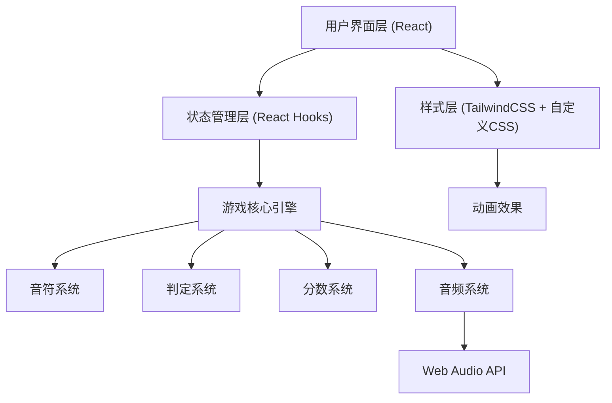

## 1. 架构设计



## 2. 技术说明

- **前端框架**: React@18 + TypeScript
- **构建工具**: Vite
- **样式方案**: TailwindCSS@3 + 自定义CSS动画
- **音频处理**: Web Audio API
- **状态管理**: React Hooks (useState, useEffect, useRef, useCallback)
- **动画方案**: CSS Animations + requestAnimationFrame

## 3. 路由定义

| 路由 | 页面 | 用途 |
|-----|------|-----|
| / | HomePage | 首页/主菜单，包含歌曲选择和玩法说明 |
| /game/:songId | GamePage | 游戏主界面 |
| /result | ResultPage | 结算界面 |

## 4. 核心数据结构

### 4.1 音符数据 (Note)
```typescript
interface Note {
  id: number;
  track: number;      // 轨道编号 0-3
  time: number;       // 出现时间（毫秒）
  type: 'tap' | 'slide-left' | 'slide-right' | 'slide-up' | 'slide-down';
  direction: 'up' | 'down' | 'left' | 'right';
}
```

### 4.2 歌曲数据 (Song)
```typescript
interface Song {
  id: string;
  title: string;
  artist: string;
  difficulty: 1 | 2 | 3;  // 难度星级
  duration: number;       // 毫秒
  bpm: number;
  notes: Note[];
  audioUrl: string;
}
```

### 4.3 游戏状态 (GameState)
```typescript
interface GameState {
  score: number;
  combo: number;
  maxCombo: number;
  perfect: number;
  great: number;
  good: number;
  miss: number;
  health: number;    // 0-100
  isPlaying: boolean;
  currentTime: number;
}
```

### 4.4 判定结果
```typescript
type JudgmentType = 'perfect' | 'great' | 'good' | 'miss';

interface JudgmentResult {
  type: JudgmentType;
  score: number;
  time: number;
  track: number;
}
```

## 5. 核心模块设计

### 5.1 游戏引擎模块 (GameEngine)
- 音符调度：根据时间轴控制音符生成和下落
- 帧更新：使用 requestAnimationFrame 实现60fps流畅渲染
- 状态同步：保持音频播放和视觉效果的时间同步

### 5.2 判定系统 (JudgmentSystem)
- 判定窗口：
  - Perfect: ±50ms
  - Great: ±100ms
  - Good: ±150ms
  - Miss: >150ms 或未操作
- 分数计算：
  - Perfect: 100分 × (1 + combo加成)
  - Great: 70分 × (1 + combo加成)
  - Good: 30分
  - Miss: 0分，连击中断

### 5.3 输入系统 (InputSystem)
- 键盘映射：D F J K 对应4条轨道
- 触摸支持：点击轨道区域
- 滑动手势：检测触摸轨迹方向

### 5.4 音频系统 (AudioSystem)
- 背景音乐播放
- 判定音效（可选）
- 使用 Web Audio API 保证低延迟

## 6. 性能优化

- 音符对象池：复用已消失的音符DOM节点，避免频繁创建销毁
- GPU加速：使用 transform: translate3d 进行硬件加速渲染
- 节流处理：对触摸滑动事件进行节流，保证60fps
- 离屏渲染：未出现在视野内的音符不进行渲染

## 7. 预设歌曲数据

使用内置的3首演示歌曲，包含不同难度：
- 简单：「小星星」- 适合新手
- 普通：「欢乐颂」- 中等节奏
- 困难：「练习曲」- 快速密集音符

每首歌曲使用程序生成的音符序列，并使用Web Audio API合成简单旋律。
