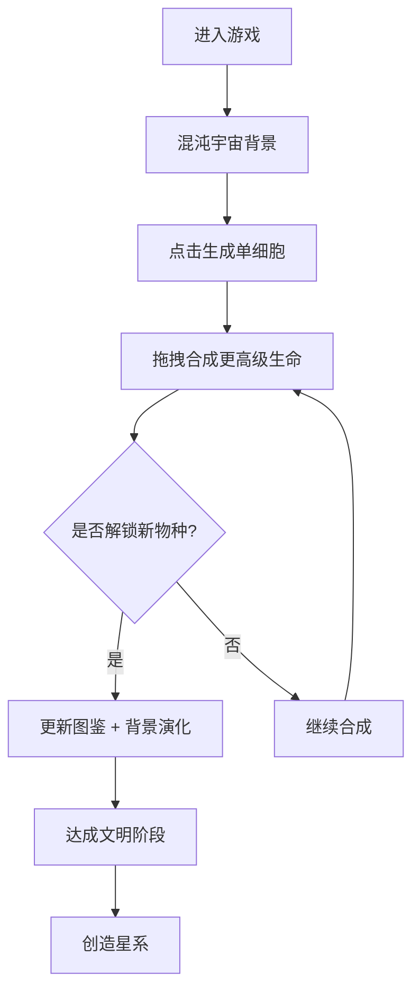

## 1. 产品概述

《造物主》是一款佛系合成放置类游戏，玩家通过点击生成生命、拖拽合成进化，从单细胞生物开始，逐步孕育出整个文明乃至星系。游戏主打禅意体验，无竞争无压力，享受创造与进化的宁静乐趣。

- 核心玩法：点击生成、拖拽合成、进化收集
- 目标用户：喜欢休闲放置、治愈系游戏的玩家
- 产品价值：提供碎片化时间的禅意放松体验，见证生命进化的奇迹

## 2. 核心功能

### 2.1 用户角色

| 角色 | 注册方式 | 核心权限 |
|------|----------|----------|
| 玩家 | 无需注册 | 进行游戏、收集进化图鉴 |

### 2.2 功能模块

1. **主游戏区**：生命生成、拖拽合成、进化展示
2. **图鉴系统**：已解锁物种展示、进化树查看
3. **信息面板**：当前等级、生成速度、合成统计
4. **背景演化**：随进化阶段变化的动态背景
5. **存档系统**：本地存储游戏进度

### 2.3 页面详情

| 页面名称 | 模块名称 | 功能描述 |
|----------|----------|----------|
| 主游戏页 | 生命合成区 | 点击空白处生成基础生命，拖拽两个相同生命合成更高级形态 |
| 主游戏页 | 进化图鉴 | 右侧抽屉式面板，展示所有已解锁物种及进化路径 |
| 主游戏页 | 信息栏 | 顶部展示当前最高文明等级、已解锁物种数、总合成次数 |
| 主游戏页 | 背景层 | 随进化阶段动态变化的宇宙/地球/文明背景 |
| 主游戏页 | 操作提示 | 新手引导与操作提示 |

## 3. 核心流程

玩家进入游戏后，看到一片混沌的宇宙背景。点击屏幕生成第一个单细胞，拖拽两个相同的细胞合成更高级的生命形态。随着合成的进行，背景逐渐从宇宙尘埃演化为海洋、陆地、文明。每解锁新物种，图鉴自动更新。

## 4. 用户界面设计

### 4.1 设计风格

- **主色调**：深邃宇宙蓝 (#0a0e27) 为底，配以星云紫 (#4a1a6b)、生命绿 (#10b981)、神圣金 (#fbbf24)
- **辅色调**：海洋蓝 (#0ea5e9)、大地棕 (#92400e)、文明橙 (#f97316)
- **按钮风格**：半透明玻璃态、圆角胶囊、柔和光晕
- **字体**：标题使用 "ZCOOL XiaoWei" 书法字体，正文使用 "Noto Sans SC"
- **布局风格**：中央大区域为合成区，右侧抽屉图鉴，顶部状态栏
- **图标风格**：使用 emoji 作为生命形态图标，配以粒子光晕效果

### 4.2 页面设计概述

| 页面名称 | 模块名称 | UI 元素 |
|----------|----------|----------|
| 主游戏页 | 合成区 | 深蓝色背景，漂浮的生命元素，拖拽时产生粒子轨迹 |
| 主游戏页 | 图鉴抽屉 | 半透明毛玻璃面板，网格布局展示物种卡片 |
| 主游戏页 | 状态栏 | 半透明顶栏，金色文字，图标+数值 |
| 主游戏页 | 背景层 | 多层渐变叠加，缓慢流动的星云/海洋/城市光效 |
| 主游戏页 | 进化提示 | 解锁新物种时的金色光芒动画 + 名称浮现 |

### 4.3 响应式

- **桌面优先**：PC 端最佳体验，合成区域充足
- **移动端适配**：自适应屏幕尺寸，图鉴改为底部抽屉，优化触控区域
- **触控优化**：元素最小 48x48px 触控区，拖拽延迟优化

### 4.4 动效设计

- **生命生成**：从点击处绽放粒子，生命元素淡入
- **合成动画**：两个元素靠近融合，产生金色光芒爆发，新元素弹出
- **背景演化**：阶段变化时平滑过渡，新元素缓慢浮现
- **漂浮动画**：所有生命元素都有轻微的上下漂浮效果
- **图鉴展开**：抽屉平滑滑入，卡片依次淡入

## 5. 进化树设计

### 5.1 进化阶段

| 阶段 | 代表物种 | 背景主题 |
|------|----------|----------|
| 1. 宇宙尘埃 | 夸克、原子、分子 | 深空星云 |
| 2. 生命起源 | 氨基酸、DNA、单细胞 | 深海热泉 |
| 3. 微观世界 | 细菌、藻类、变形虫 | 微观海洋 |
| 4. 多细胞 | 海绵、水母、珊瑚 | 浅海世界 |
| 5. 海洋生物 | 鱼类、贝壳、章鱼 | 蔚蓝海洋 |
| 6. 登陆时代 | 两栖、昆虫、蕨类 | 沼泽陆地 |
| 7. 恐龙时代 | 恐龙、裸子植物、翼龙 | 远古大陆 |
| 8. 哺乳动物 | 猛犸、剑齿虎、古猿 | 冰河世纪 |
| 9. 人类文明 | 部落、城邦、帝国 | 古代文明 |
| 10. 现代社会 | 城市、科技、太空 | 现代都市 |
| 11. 星际时代 | 飞船、殖民地、戴森球 | 宇宙文明 |
| 12. 神级文明 | 星系、宇宙、新维度 | 创世之境 |

### 5.2 合成规则

- 两个相同等级的元素合成一个更高等级的元素
- 高等级元素不能逆向分解
- 合成时有几率触发"奇迹"，直接跨越多个等级
- 点击生成速度随文明等级提升而加快
