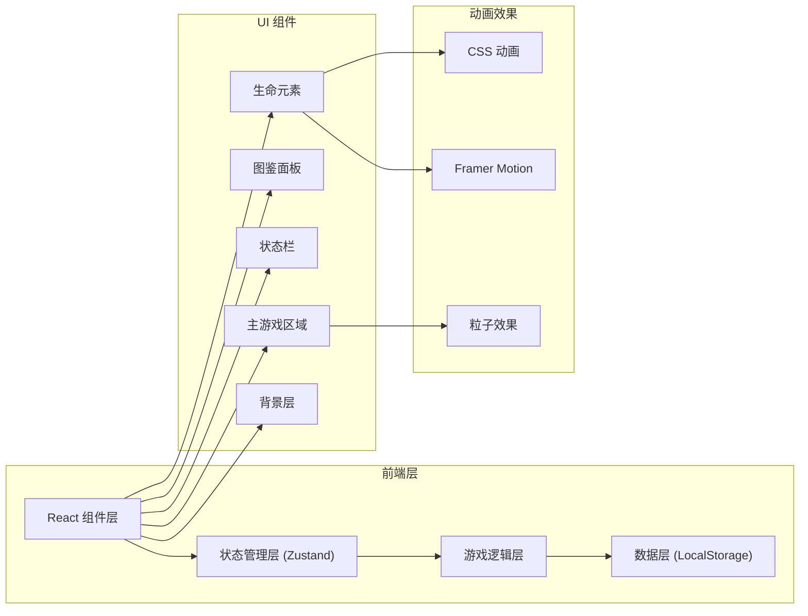

## 1. 架构设计



## 2. 技术描述

- **前端框架**: React@18 + TypeScript
- **构建工具**: Vite
- **样式方案**: TailwindCSS@3 + CSS 变量
- **状态管理**: Zustand (轻量级，适合小游戏)
- **动画库**: Framer Motion (流畅的拖拽与合成动画)
- **图标**: 原生 Emoji + 自定义 SVG 光晕
- **数据持久化**: LocalStorage
- **无后端**: 纯前端游戏，所有数据本地存储

## 3. 目录结构

```
src/
├── components/
│   ├── GameArea.tsx          # 主游戏区域
│   ├── LifeElement.tsx       # 生命元素组件
│   ├── StatusBar.tsx         # 顶部状态栏
│   ├── CodexPanel.tsx        # 图鉴面板
│   ├── BackgroundLayer.tsx   # 动态背景层
│   ├── ParticleEffect.tsx    # 粒子效果
│   └── EvolutionToast.tsx    # 进化提示
├── store/
│   └── useGameStore.ts       # 游戏状态管理
├── types/
│   └── index.ts              # 类型定义
├── data/
│   └── evolutionTree.ts      # 进化树数据
├── hooks/
│   ├── useDragDrop.ts        # 拖拽逻辑
│   ├── useGameLoop.ts        # 游戏循环
│   └── useLocalStorage.ts    # 本地存储
├── utils/
│   ├── mergeLogic.ts         # 合成逻辑
│   └── animations.ts         # 动画配置
├── App.tsx
├── main.tsx
└── index.css
```

## 4. 核心数据模型

### 4.1 类型定义

```typescript
// 生命元素类型
interface LifeEntity {
  id: string;
  level: number;
  name: string;
  emoji: string;
  x: number;
  y: number;
  isDragging: boolean;
  createdAt: number;
}

// 进化阶段类型
interface EvolutionStage {
  id: number;
  name: string;
  description: string;
  bgGradient: string;
  unlockLevel: number;
}

// 物种定义
interface Species {
  level: number;
  name: string;
  emoji: string;
  description: string;
  stage: number;
  rarity: 'common' | 'rare' | 'legendary';
}

// 游戏状态
interface GameState {
  entities: LifeEntity[];
  unlockedSpecies: number[];
  currentStage: number;
  totalMerges: number;
  clickPower: number;
  highestLevel: number;
  lastSaveTime: number;
}
```

### 4.2 进化树数据

进化树包含12个阶段，每个阶段3个物种，共36种可收集形态：
- Level 1-3: 宇宙尘埃阶段
- Level 4-6: 生命起源阶段
- Level 7-9: 微观世界阶段
- Level 10-12: 多细胞阶段
- Level 13-15: 海洋生物阶段
- Level 16-18: 登陆时代阶段
- Level 19-21: 恐龙时代阶段
- Level 22-24: 哺乳动物阶段
- Level 25-27: 人类文明阶段
- Level 28-30: 现代社会阶段
- Level 31-33: 星际时代阶段
- Level 34-36: 神级文明阶段

## 5. 核心逻辑

### 5.1 合成规则

```
合成公式: Entity(level N) + Entity(level N) = Entity(level N+1)
特殊: 5% 概率触发奇迹 = Entity(level N+2)
限制: 最多同时存在 50 个实体，超过时自动清理最低等级实体
```

### 5.2 状态更新流程

1. 点击生成 → 添加 level-1 实体到 entities 数组
2. 拖拽实体 → 更新实体 x/y 坐标
3. 碰撞检测 → 检测重叠且同等级的实体
4. 合成操作 → 移除两个旧实体，添加新实体
5. 检查解锁 → 如果是新物种，加入 unlockedSpecies
6. 阶段检查 → 根据最高等级更新 currentStage
7. 自动存档 → 每 30 秒自动保存到 localStorage

## 6. 动画配置

| 动画类型 | 持续时间 | 缓动函数 | 触发时机 |
|----------|----------|----------|----------|
| 实体生成 | 0.4s | easeOutBack | 点击生成时 |
| 合成爆发 | 0.6s | easeOutExpo | 两个实体合并时 |
| 解锁提示 | 2s | easeOut | 解锁新物种时 |
| 背景切换 | 1.5s | easeInOut | 阶段进化时 |
| 漂浮动画 | 3s (循环) | easeInOut | 所有实体常驻 |
| 图鉴展开 | 0.3s | easeOut | 打开/关闭图鉴 |
