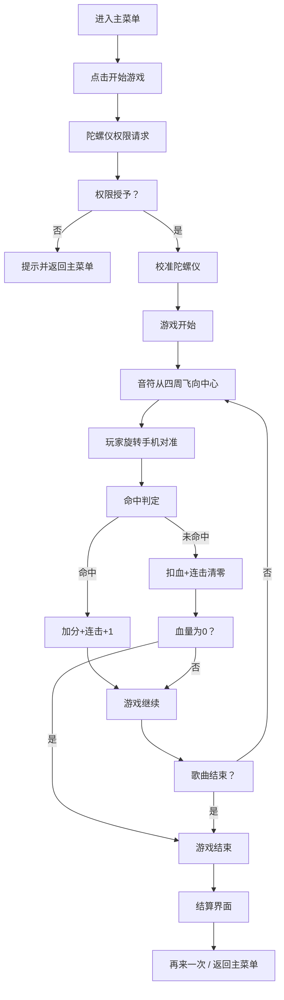

## 1. 产品概述

《旋音》是一款利用手机陀螺仪控制的节奏游戏，玩家通过旋转手机来操控屏幕中央的指针，接住从四周飞来的音符，配合音乐节奏获得高分。

- **核心玩法**：转动手机对准飞来的音符，在判定圈内命中得分
- **目标用户**：喜欢节奏游戏、追求新颖操作体验的移动玩家
- **产品价值**：将体感控制与节奏游戏结合，带来沉浸式的音乐互动体验

## 2. 核心功能

### 2.1 功能模块
1. **主菜单界面**：游戏标题、开始按钮、设置入口
2. **游戏界面**：游戏画布、得分显示、连击显示、生命值
3. **结算界面**：最终得分、最高连击、评价等级、重玩/返回按钮
4. **设置界面**：陀螺仪校准、灵敏度调节、音量控制

### 2.2 页面详情

| 页面名称 | 模块名称 | 功能描述 |
|----------|----------|----------|
| 主菜单 | 标题区域 | 游戏 Logo、副标题动效展示 |
| 主菜单 | 操作指引 | 简单图示说明旋转操作方式 |
| 主菜单 | 按钮组 | 开始游戏、设置、最高分 |
| 游戏界面 | 游戏画布 | 中央判定圈、旋转指针、飞行音符 |
| 游戏界面 | 状态 HUD | 得分、连击、生命值、进度条 |
| 游戏界面 | 暂停按钮 | 暂停/继续游戏 |
| 结算界面 | 成绩展示 | 总分、最大连击、准确率、评价等级 |
| 结算界面 | 操作按钮 | 再来一次、返回主菜单 |
| 设置界面 | 陀螺仪校准 | 校准中心点、调节灵敏度 |
| 设置界面 | 音频设置 | 音乐音量、音效音量 |

## 3. 核心流程

## 4. 用户界面设计

### 4.1 设计风格
- **整体风格**：清新科技感（参照《兰空》风格）
- **主色调**：天蓝色渐变 (#4FC3F7 → #29B6F6) 搭配薄荷绿 (#81C784)
- **点缀色**：淡紫色 (#CE93D8)、珊瑚粉 (#F48FB1) 用于不同类型音符
- **背景**：深色渐变星空 + 微光粒子效果
- **字体**：现代无衬线字体，标题使用细体营造科技感
- **视觉元素**：发光边框、半透明玻璃质感、柔和光晕

### 4.2 游戏元素设计
- **判定圈**：多层同心圆，最内层为 Perfect 判定区，外层依次为 Great、Good
- **指针**：细长发光指针，带拖尾效果，随手机旋转
- **音符**：圆形发光球体，带有节奏脉动动画，不同颜色代表不同分值
- **命中特效**：扩散光环 + 粒子爆炸

### 4.3 页面设计概览

| 页面名称 | 模块名称 | UI 元素 |
|----------|----------|---------|
| 主菜单 | 标题区 | 发光游戏名、渐变背景、浮动装饰 |
| 主菜单 | 按钮区 | 玻璃拟态按钮、悬停发光效果 |
| 游戏界面 | 画布区 | 中心判定圈、旋转指针、飞行音符、粒子背景 |
| 游戏界面 | HUD | 顶部得分、连击数、底部生命值条 |
| 结算界面 | 成绩卡 | 玻璃质感卡片、评价徽章、数据展示 |
| 设置界面 | 设置项 | 滑动条、切换开关、校准按钮 |

### 4.4 响应式设计
- 以移动端竖屏为主要设计目标
- 支持不同屏幕尺寸自适应
- 触摸操作区域充足，确保手指可及
- 桌面端可用鼠标拖拽模拟陀螺仪操作

### 4.5 动效设计
- 页面切换：淡入淡出 + 轻微缩放
- 按钮交互：悬停时发光增强、按下时微缩
- 音符生成：从远处缩放飞入
- 命中反馈：光环扩散 + 文字弹出（Perfect/Great/Good）
- 指针拖尾：平滑跟随，带渐变透明效果
