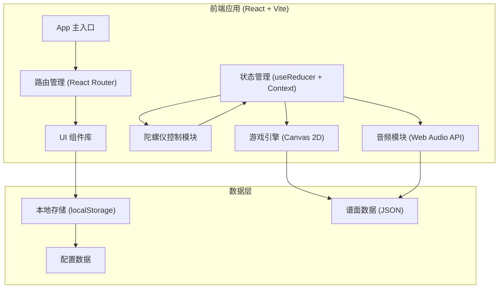

## 1. 架构设计



## 2. 技术描述

- **前端框架**：React 18 + TypeScript
- **构建工具**：Vite 5
- **样式方案**：Tailwind CSS 3 + CSS Modules
- **游戏渲染**：HTML5 Canvas 2D
- **状态管理**：React Context + useReducer
- **音频处理**：Web Audio API
- **传感器**：DeviceOrientation API（陀螺仪）
- **数据存储**：localStorage（最高分、设置）

## 3. 目录结构

```
src/
├── components/          # UI 组件
│   ├── Menu/           # 主菜单组件
│   ├── Game/           # 游戏界面组件
│   ├── Result/         # 结算界面组件
│   ├── Settings/       # 设置界面组件
│   └── common/         # 通用组件（按钮、卡片等）
├── game/               # 游戏核心逻辑
│   ├── engine.ts       # 游戏引擎主循环
│   ├── notes.ts        # 音符管理
│   ├── judgement.ts    # 判定系统
│   ├── renderer.ts     # Canvas 渲染器
│   └── types.ts        # 游戏类型定义
├── hooks/              # 自定义 Hooks
│   ├── useGyroscope.ts # 陀螺仪 Hook
│   ├── useAudio.ts     # 音频 Hook
│   └── useGameLoop.ts  # 游戏循环 Hook
├── store/              # 状态管理
│   ├── GameContext.tsx # 游戏状态上下文
│   └── gameReducer.ts  # 状态 reducer
├── data/               # 数据文件
│   ├── songs/          # 谱面数据
│   └── config.ts       # 游戏配置
├── utils/              # 工具函数
│   ├── math.ts         # 数学计算
│   └── storage.ts      # 本地存储
├── App.tsx
├── main.tsx
└── index.css
```

## 4. 游戏核心数据结构

### 4.1 音符类型

```typescript
interface Note {
  id: string;
  angle: number;      // 出现角度 (0-360)
  speed: number;      // 飞行速度
  spawnTime: number;  // 生成时间
  type: 'normal' | 'bonus' | 'danger';
  hit?: boolean;      // 是否已命中
  judgement?: 'perfect' | 'great' | 'good' | 'miss';
}
```

### 4.2 游戏状态

```typescript
interface GameState {
  status: 'menu' | 'playing' | 'paused' | 'ended';
  score: number;
  combo: number;
  maxCombo: number;
  health: number;
  pointerAngle: number;   // 当前指针角度
  notes: Note[];
  perfectCount: number;
  greatCount: number;
  goodCount: number;
  missCount: number;
  startTime: number;
  currentTime: number;
}
```

### 4.3 判定配置

```typescript
const JUDGEMENT_CONFIG = {
  perfect: { radius: 20, score: 100, color: '#4FC3F7' },
  great: { radius: 40, score: 70, color: '#81C784' },
  good: { radius: 60, score: 40, color: '#FFD54F' },
  miss: { score: 0, healthCost: 10 }
};
```

## 5. 核心模块说明

### 5.1 陀螺仪控制模块
- 使用 `DeviceOrientationEvent` 获取设备方向
- 支持校准功能，设置初始角度为中心点
- 灵敏度调节，将陀螺仪角度映射到指针旋转角度
- 平滑处理，防止指针抖动
- 桌面端降级为鼠标/触摸拖拽控制

### 5.2 游戏引擎
- 基于 `requestAnimationFrame` 的主循环
- 音符生成：根据谱面数据在指定时间生成音符
- 音符运动：从屏幕边缘向中心判定圈飞行
- 碰撞检测：音符到达判定圈时检测指针角度是否匹配
- 粒子系统：命中时的视觉特效

### 5.3 音频模块
- 使用 Web Audio API 播放背景音乐
- 节拍同步：根据 BPM 生成音符节奏
- 音效：命中音效、连击音效、Miss 音效

### 5.4 渲染模块
- Canvas 2D 绘制游戏画面
- 分层渲染：背景层 → 判定圈 → 音符 → 指针 → 特效 → UI
- 发光效果：使用 `shadowBlur` 和渐变实现科技感
- 响应式：自适应屏幕尺寸，保持圆形比例

## 6. 谱面数据格式

```json
{
  "id": "song001",
  "name": "示例曲目",
  "artist": "艺术家",
  "bpm": 120,
  "duration": 120,
  "difficulty": "normal",
  "notes": [
    { "time": 1.0, "angle": 0, "type": "normal" },
    { "time": 1.5, "angle": 90, "type": "normal" },
    { "time": 2.0, "angle": 180, "type": "bonus" },
    { "time": 2.5, "angle": 270, "type": "normal" }
  ]
}
```
