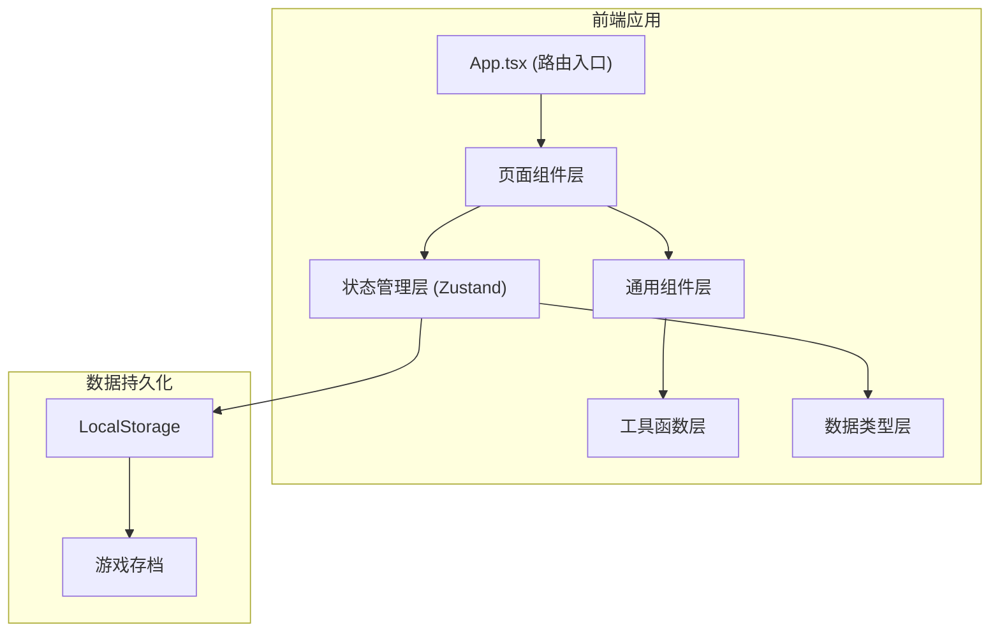
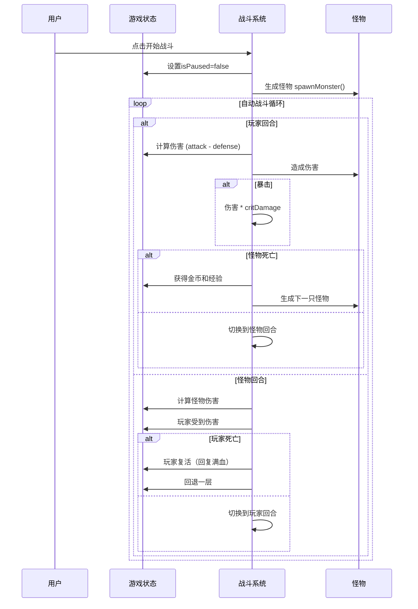

## 1. 架构设计



## 2. 技术描述

- **前端框架**：React 18 + TypeScript
- **构建工具**：Vite 5
- **状态管理**：Zustand（轻量级，适合游戏状态管理）
- **样式方案**：Tailwind CSS 3（原子化CSS，快速构建UI）
- **路由管理**：React Router DOM 6
- **图标库**：Lucide React
- **数据持久化**：LocalStorage（自动保存游戏进度）
- **动画方案**：CSS Animation + Framer Motion（流畅的过渡动画）

## 3. 目录结构

```
project55/
├── src/
│   ├── components/          # 通用组件
│   │   ├── layout/         # 布局组件（Header, BottomNav）
│   │   ├── ui/             # 基础UI组件（Button, Card, ProgressBar）
│   │   └── game/           # 游戏相关组件（HealthBar, DamageNumber）
│   ├── pages/              # 页面组件
│   │   ├── Home.tsx        # 主界面
│   │   ├── Battle.tsx      # 战斗页面
│   │   ├── Equipment.tsx   # 装备页面
│   │   ├── Shop.tsx        # 商店页面
│   │   └── Settings.tsx    # 设置页面
│   ├── store/              # 状态管理
│   │   └── useGameStore.ts # 游戏核心状态
│   ├── hooks/              # 自定义Hooks
│   │   ├── useBattle.ts    # 战斗逻辑Hook
│   │   └── useOffline.ts   # 离线收益Hook
│   ├── utils/              # 工具函数
│   │   ├── formatter.ts    # 数字格式化
│   │   └── storage.ts      # 本地存储
│   ├── types/              # 类型定义
│   │   └── game.ts         # 游戏相关类型
│   ├── data/               # 静态数据
│   │   ├── monsters.ts     # 怪物配置
│   │   ├── equipment.ts    # 装备配置
│   │   └── items.ts        # 道具配置
│   ├── App.tsx             # 应用入口
│   ├── main.tsx            # 渲染入口
│   └── index.css           # 全局样式
├── api/                    # 后端（本项目不需要）
├── public/                 # 静态资源
├── package.json
├── tsconfig.json
├── vite.config.ts
└── tailwind.config.js
```

## 4. 路由定义

| 路由路径 | 页面名称 | 说明 |
|---------|---------|------|
| `/` | 主界面 | 角色状态、资源显示、导航入口 |
| `/battle` | 战斗页面 | 地牢自动战斗场景 |
| `/equipment` | 装备页面 | 装备查看与升级 |
| `/shop` | 商店页面 | 购买道具和增益 |
| `/settings` | 设置页面 | 游戏设置、音效开关、数据管理 |

## 5. 数据模型

### 5.1 核心类型定义

```typescript
// 角色属性
interface Player {
  level: number;
  exp: number;
  maxExp: number;
  hp: number;
  maxHp: number;
  attack: number;
  defense: number;
  critRate: number;
  critDamage: number;
}

// 装备
interface Equipment {
  id: string;
  name: string;
  type: 'weapon' | 'armor' | 'accessory';
  icon: string;
  level: number;
  maxLevel: number;
  baseStats: {
    attack?: number;
    defense?: number;
    hp?: number;
    critRate?: number;
    critDamage?: number;
  };
  upgradeCost: number;
  upgradeCostMultiplier: number;
}

// 怪物
interface Monster {
  id: string;
  name: string;
  icon: string;
  level: number;
  hp: number;
  maxHp: number;
  attack: number;
  defense: number;
  goldDrop: number;
  expDrop: number;
}

// 道具
interface Item {
  id: string;
  name: string;
  icon: string;
  description: string;
  price: number;
  type: 'buff' | 'consumable' | 'upgrade';
  effect: {
    stat?: keyof Player;
    value?: number;
    duration?: number;
  };
}

// 游戏状态
interface GameState {
  player: Player;
  gold: number;
  gems: number;
  equipment: Equipment[];
  currentStage: number;
  currentMonster: Monster | null;
  isAutoBattle: boolean;
  isPaused: boolean;
  battleSpeed: number;
  inventory: { itemId: string; quantity: number }[];
  lastOnlineTime: number;
  totalPlayTime: number;
  monstersKilled: number;
  highestStage: number;
}
```

### 5.2 状态管理设计

使用 Zustand 管理全局游戏状态，核心方法包括：

```typescript
interface GameActions {
  // 战斗相关
  startBattle: () => void;
  pauseBattle: () => void;
  toggleAutoBattle: () => void;
  setBattleSpeed: (speed: number) => void;
  attack: () => void;
  takeDamage: (damage: number) => void;
  defeatMonster: () => void;
  spawnMonster: () => void;
  
  // 装备相关
  upgradeEquipment: (equipmentId: string) => boolean;
  
  // 商店相关
  buyItem: (itemId: string) => boolean;
  useItem: (itemId: string) => void;
  
  // 资源相关
  addGold: (amount: number) => void;
  addExp: (amount: number) => void;
  levelUp: () => void;
  
  // 存档相关
  saveGame: () => void;
  loadGame: () => boolean;
  resetGame: () => void;
  
  // 离线收益
  calculateOfflineRewards: () => { gold: number; exp: number; time: number };
  claimOfflineRewards: () => void;
}
```

## 6. 核心战斗逻辑

### 6.1 战斗流程



### 6.2 战斗公式

- **伤害计算**：`最终伤害 = max(1, 攻击力 - 防御力 * 0.5) * 随机浮动(0.9~1.1)`
- **暴击判定**：`随机数 < 暴击率 → 触发暴击，伤害 * 暴击伤害`
- **经验需求**：`升级所需经验 = 基础经验 * (当前等级 ^ 1.5)`
- **装备升级**：`升级费用 = 基础费用 * (升级倍率 ^ 当前等级)`
- **怪物属性**：`怪物属性 = 基础属性 * (1 + 层数 * 0.1)`
- **金币掉落**：`金币 = 基础掉落 * (1 + 层数 * 0.05) * 随机浮动(0.8~1.2)`
- **离线收益**：`每秒收益 = 击杀怪物平均收益 * 0.5`

## 7. 性能优化

1. **状态切片**：使用 Zustand 的 selectors 避免不必要的重渲染
2. **requestAnimationFrame**：战斗动画使用 RAF 确保流畅
3. **防抖节流**：数字变化动画使用节流避免频繁更新
4. **虚拟列表**：商店和日志列表使用虚拟滚动
5. **Web Workers**：（可选）离线收益计算移至 Worker 线程
6. **LocalStorage 防抖**：自动保存使用防抖，避免频繁写入

## 8. 数据持久化

- 自动保存：每次状态变化后3秒防抖保存到 LocalStorage
- 手动保存：设置页面提供手动保存按钮
- 存档导入/导出：支持JSON格式的存档备份
- 离线时间记录：记录最后在线时间，计算离线收益
