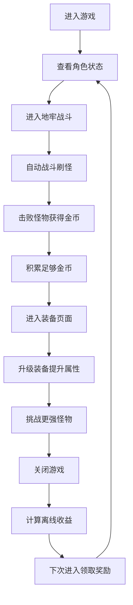

## 1. 产品概述

《星落小镇》是一款治愈系放置类RPG小游戏，玩家扮演一位勇敢的冒险者，在神秘的地牢中自动战斗、收集金币、升级装备，享受轻松愉快的成长乐趣。游戏主打轻松休闲的放置玩法，配合精美的视觉设计和简洁明了的功能分区，让玩家一上手就能沉浸其中。

- 核心玩法：自动战斗 → 收集金币 → 升级装备 → 挑战更强敌人 → 挂机收益
- 目标用户：喜欢放置类游戏、追求轻松休闲体验的玩家
- 产品价值：提供碎片化时间的娱乐体验，让玩家在忙碌之余享受角色成长的成就感

## 2. 核心功能

### 2.1 功能模块

1. **主界面**：角色状态展示、资源显示、导航入口
2. **地牢战斗**：自动战斗系统、怪物生成、战斗动画、伤害数字、战利品掉落
3. **装备系统**：武器、护甲、饰品三个部位，查看属性、升级强化
4. **商店系统**：购买临时增益道具、解锁新装备
5. **挂机系统**：离线收益计算、挂机奖励领取

### 2.2 页面详情

| 页面名称 | 模块名称 | 功能描述 |
|---------|---------|---------|
| 主界面 | 角色状态区 | 显示角色等级、生命值、攻击力、防御力 |
| 主界面 | 资源区 | 显示当前金币、钻石、离线收益按钮 |
| 主界面 | 导航区 | 四个功能入口：战斗、装备、商店、设置 |
| 战斗页面 | 战斗场景 | 动态背景、角色和怪物立绘、血条显示 |
| 战斗页面 | 战斗日志 | 实时显示战斗信息、伤害数字飘字 |
| 战斗页面 | 战斗控制 | 开始/暂停战斗、加速战斗、切换自动战斗 |
| 装备页面 | 装备栏 | 三个装备槽位，显示当前装备和属性 |
| 装备页面 | 升级面板 | 升级按钮、消耗金币、升级后属性预览 |
| 商店页面 | 商品列表 | 各种增益道具、价格显示、购买按钮 |
| 挂机页面 | 收益计算 | 离线时长、预计收益、领取奖励 |

## 3. 核心流程

## 4. 用户界面设计

### 4.1 设计风格

**整体风格**：治愈系、清新、卡通、柔和

**配色方案**：
- 主色调：柔和的薄荷绿 `#7FC8A9`（代表生命力和自然）
- 辅助色：温暖的珊瑚橙 `#FFB4A2`（代表活力和热情）
- 背景色：奶油米白 `#F8F4E3`（温暖舒适）
- 点缀色：薰衣草紫 `#B8B8D1`（神秘魔法感）
- 文字色：深咖啡棕 `#4A4A4A`（柔和不刺眼）

**按钮风格**：
- 圆润大圆角（圆角16px）
- 柔和渐变背景
- 轻微阴影营造悬浮感
- 点击时有缩放和颜色变化反馈

**字体**：
- 标题：圆润可爱的中文字体，字号24px，粗体
- 正文：清晰易读的无衬线字体，字号14px
- 数字：等宽字体，突出金币、伤害等数值

**布局风格**：
- 卡片式布局，每个功能区独立卡片
- 大量留白，避免视觉拥挤
- 圆角边框，柔和阴影
- 顶部状态栏 + 底部导航栏的经典移动布局

**图标风格**：
- 使用emoji图标，可爱治愈
- 怪物使用🐺🐉👻🤖等emoji
- 装备使用⚔️🛡️💍等emoji
- 功能按钮使用🏰⚒️🛒⏰等emoji

### 4.2 页面设计概览

| 页面名称 | 模块名称 | UI元素 |
|---------|---------|--------|
| 主界面 | 角色卡片 | 圆形头像、等级徽章、属性条（HP/ATK/DEF）、渐变背景 |
| 主界面 | 资源栏 | 金币💰图标、数字动画、悬停效果 |
| 战斗页面 | 战斗场景 | 分层背景（远山/近景/地面）、角色在左怪物在右、血条浮动、伤害数字飘字动画 |
| 战斗页面 | 控制栏 | 大圆形开始按钮、加速按钮、自动开关、呼吸灯效果 |
| 装备页面 | 装备槽 | 六边形槽位、装备图标、等级角标、属性浮动提示 |
| 装备页面 | 升级按钮 | 渐变填充、金币消耗显示、不可用时置灰 |
| 商店页面 | 商品卡片 | 图标、名称、描述、价格、购买按钮、hover放大效果 |

### 4.3 动画效果

- **页面切换**：左右滑动过渡，300ms缓动
- **战斗攻击**：角色向前冲刺动画，武器挥砍特效
- **伤害数字**：从怪物头顶向上飘出，渐隐，颜色区分暴击（红色）和普通（白色）
- **金币获取**：+数字从小变大，飞入顶部金币栏
- **按钮点击**：缩放0.95 → 1.0，100ms
- **升级特效**：装备发光，金色粒子扩散，属性数字滚动
- **血条变化**：平滑过渡动画，300ms
- **飘字特效**：获得物品/金币时的提示气泡

### 4.4 响应式设计

- 桌面端优先，最大宽度480px居中显示（模拟移动端体验）
- 移动端自适应，触摸区域不小于48x48px
- 横竖屏切换时自动调整布局
- 支持滚轮和触摸滑动操作

### 4.5 音效与震动（可选）

- 点击按钮：清脆的"嗒"声
- 攻击命中："咻"的挥砍声 + "砰"的打击声
- 获得金币："叮铃"的金币声
- 升级：上扬的音阶特效
- 可在设置中开关音效和震动
