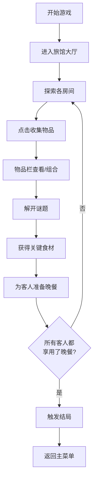

## 1. 产品概述

《暗夜旅馆》是一款锈湖风格的点击式推理解谜游戏。玩家扮演神秘旅馆的侍者，在阴森诡谲的氛围中探索各个房间，收集线索和解开谜题，最终为五位"客人"端上致命的"特制晚餐"。

- 核心玩法：点击探索 + 物品收集 + 谜题解密 + 剧情推进
- 目标用户：喜欢悬疑解谜、暗黑美学的休闲玩家
- 产品价值：提供沉浸式的悬疑推理体验，短小精悍的单局游戏时长

## 2. 核心功能

### 2.1 功能模块

1. **开始界面**：游戏标题、开始按钮、关于说明
2. **主游戏场景**：旅馆大厅、五个客房、厨房、地窖
3. **物品栏系统**：收集、查看、使用、组合物品
4. **对话/叙事系统**：与客人互动，推进剧情
5. **谜题系统**：密码锁、机关、物品组合谜题
6. **结局系统**：完成所有晚餐后触发结局

### 2.2 页面详情

| 页面名称 | 模块名称 | 功能描述 |
|---------|---------|---------|
| 开始界面 | 标题区域 | 游戏Logo、氛围动画、开始按钮 |
| 开始界面 | 关于弹窗 | 游戏简介、操作说明 |
| 游戏主界面 | 场景展示 | 当前房间的全景视图，可点击互动 |
| 游戏主界面 | 物品栏 | 底部物品栏，展示收集的物品，可选中使用 |
| 游戏主界面 | 导航按钮 | 左右箭头切换房间/场景 |
| 游戏主界面 | 对话气泡 | 与NPC互动时显示对话内容 |
| 游戏主界面 | 提示按钮 | 可选的提示功能（有限次数） |
| 结局界面 | 结局展示 | 游戏通关后的结局画面和文字 |

## 3. 核心流程

玩家从旅馆大厅开始，可以在多个房间之间自由切换。通过点击场景中的物体收集物品，使用物品解开谜题获得更多线索和食材。当收集到足够的食材后，可以在厨房为对应的客人准备"特制晚餐"。当五位客人都享用了晚餐后，游戏进入结局。

## 4. 用户界面设计

### 4.1 设计风格

- **整体调性**：阴森诡谲、暗黑复古、维多利亚式哥特风
- **主色调**：深棕 (#2D1B0E)、墨绿 (#1A2F1A)、暗红 (#5C1A1A)、米黄 (#D4C4A8)
- **点缀色**：烛火橙 (#FF8C00)、惨白 (#F0EAD6)
- **视觉质感**：做旧纸张纹理、暗角效果、颗粒噪点、微弱的烛光影动
- **字体**：装饰性衬线字体（标题）+ 复古手写体（对话/笔记）
- **按钮风格**：复古浮雕式按钮，悬停时有微弱的发光效果
- **动效**：缓慢的淡入淡出、物品闪烁提示、烛火摇曳、雾气飘动

### 4.2 页面设计概览

| 页面名称 | 模块名称 | UI元素 |
|---------|---------|-------|
| 开始界面 | 标题区域 | 哥特式字体Logo、滴血效果、背景为旅馆剪影、烛火动画 |
| 开始界面 | 开始按钮 | 复古浮雕按钮、悬停发光、点击音效 |
| 游戏主界面 | 场景展示 | 全屏场景图、暗角遮罩、可点击热点提示 |
| 游戏主界面 | 物品栏 | 底部木质纹理栏、物品图标槽位、选中高亮 |
| 游戏主界面 | 导航按钮 | 左右箭头、复古金属质感 |
| 游戏主界面 | 对话气泡 | 羊皮纸风格气泡、手写字体、打字机效果 |
| 结局界面 | 结局画面 | 黑场渐显、结局文字、回响音效 |

### 4.3 响应式

- 桌面端优先设计，适配 1280x720 以上分辨率
- 移动端等比缩放，保持画面比例
- 触屏优化：点击区域不小于 48x48px

### 4.4 氛围营造

- **环境音效**：低沉的背景音、偶尔的风声/门轴声、远处的钟声
- **光影效果**：烛火摇曳的动态光影、手电筒/提灯的光照范围
- **画面特效**：老照片颗粒感、轻微色差、画面抖动
- **转场效果**：黑场淡入淡出、模拟开门的推拉效果
