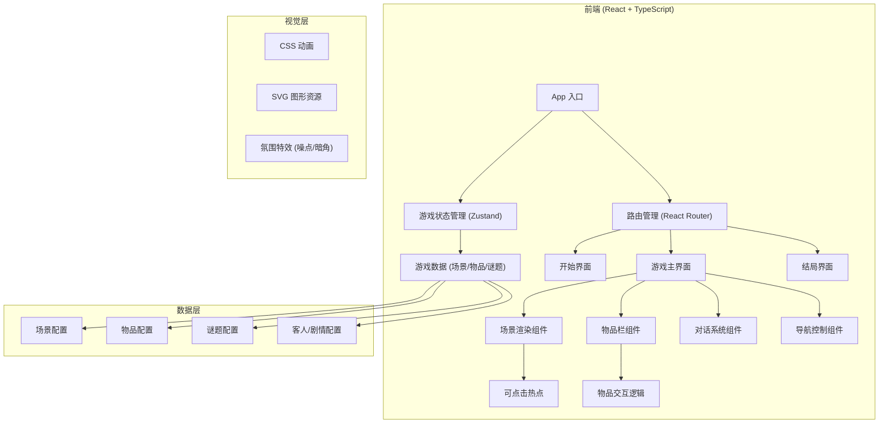

## 1. 架构设计



## 2. 技术选型

- **前端框架**：React 18 + TypeScript
- **构建工具**：Vite
- **状态管理**：Zustand（轻量级，适合游戏状态管理）
- **路由**：React Router DOM
- **样式方案**：Tailwind CSS 3 + 自定义 CSS 变量 + CSS 动画
- **图形资源**：纯 CSS + SVG 绘制（避免外部图片依赖，保持复古像素/手绘质感）
- **音效**：Web Audio API（可选，使用程序生成的简单音效）

**为什么选择纯前端**：
- 点击解谜游戏是纯客户端体验，无需后端
- 所有游戏逻辑和数据都在前端运行，加载快
- 便于部署和分享

## 3. 目录结构

```
src/
├── components/           # 组件
│   ├── game/            # 游戏相关组件
│   │   ├── Scene.tsx    # 场景渲染
│   │   ├── Inventory.tsx # 物品栏
│   │   ├── DialogBox.tsx # 对话框
│   │   ├── NavButtons.tsx # 导航按钮
│   │   └── Hotspot.tsx  # 可点击热点
│   ├── StartScreen.tsx  # 开始界面
│   ├── GameScreen.tsx   # 游戏主界面
│   └── EndingScreen.tsx # 结局界面
├── store/               # 状态管理
│   └── useGameStore.ts  # 游戏状态 store
├── data/                # 游戏数据配置
│   ├── scenes.ts        # 场景定义
│   ├── items.ts         # 物品定义
│   ├── puzzles.ts       # 谜题定义
│   └── guests.ts        # 客人/剧情定义
├── types/               # TypeScript 类型定义
│   └── game.ts          # 游戏相关类型
├── utils/               # 工具函数
│   └── gameUtils.ts     # 游戏逻辑工具
├── App.tsx              # 应用入口
├── main.tsx             # React 入口
└── index.css            # 全局样式 + Tailwind
```

## 4. 数据模型

### 4.1 核心类型定义

```typescript
// 场景
interface Scene {
  id: string;
  name: string;
  description: string;
  background: string; // CSS 背景样式
  hotspots: Hotspot[];
  exits: Exit[]; // 可前往的其他场景
}

// 可点击热点
interface Hotspot {
  id: string;
  x: number; // 百分比位置
  y: number;
  width: number;
  height: number;
  type: 'item' | 'puzzle' | 'npc' | 'inspect';
  targetId: string; // 关联的物品/谜题/NPC ID
  condition?: string; // 显示条件
}

// 物品
interface Item {
  id: string;
  name: string;
  description: string;
  icon: string; // SVG 或 emoji
  combinable?: { with: string; result: string }[]; // 可组合的物品
}

// 谜题
interface Puzzle {
  id: string;
  type: 'password' | 'combination' | 'item_use' | 'sequence';
  description: string;
  solution: string | string[];
  reward: string; // 解谜后获得的物品/触发的事件
  hint?: string;
}

// 客人
interface Guest {
  id: string;
  name: string;
  roomId: string;
  description: string;
  dialogue: string[];
  requiredDish: string; // 需要的晚餐
  served: boolean;
}
```

### 4.2 游戏状态

```typescript
interface GameState {
  currentScene: string;
  inventory: string[]; // 物品 ID 列表
  selectedItem: string | null;
  solvedPuzzles: string[];
  servedGuests: string[];
  dialogueQueue: string[];
  showingDialogue: boolean;
  gamePhase: 'start' | 'playing' | 'ending';
  hintsRemaining: number;
  
  // Actions
  changeScene: (sceneId: string) => void;
  collectItem: (itemId: string) => void;
  selectItem: (itemId: string | null) => void;
  useItem: (itemId: string, targetId: string) => boolean;
  combineItems: (item1: string, item2: string) => boolean;
  solvePuzzle: (puzzleId: string) => void;
  serveDish: (guestId: string) => void;
  showDialogue: (text: string) => void;
  startGame: () => void;
  resetGame: () => void;
}
```

## 5. 核心游戏流程实现

1. **场景切换**：通过 `changeScene` 改变当前场景 ID，Scene 组件根据 ID 渲染对应场景
2. **物品收集**：点击热点 → 判断类型为 item → 调用 `collectItem` → 添加到 inventory
3. **物品使用**：选中物品 → 点击目标热点 → 检查是否为正确组合 → 触发对应效果
4. **谜题解谜**：点击谜题热点 → 弹出谜题界面 → 输入答案 → 正确则奖励物品
5. **晚餐制作**：在厨房场景收集食材 → 组合成对应菜品 → 送到客人房间
6. **结局触发**：检查 `servedGuests` 数量 → 全部完成后切换到结局界面

## 6. 视觉实现方案

### 6.1 场景绘制
- 使用多层 CSS 渐变和背景图模拟场景深度
- 使用 SVG 绘制关键物品和装饰
- 使用 CSS box-shadow 和 filter 营造光影效果

### 6.2 氛围特效
- 噪点纹理：使用 SVG noise filter
- 暗角效果：radial-gradient 遮罩
- 烛火摇曳：CSS animation + opacity 变化
- 老电影效果：轻微抖动 + 色差

### 6.3 动画系统
- 场景切换：淡入淡出 (fade-in/out)
- 物品获得：弹跳 + 闪光效果
- 对话出现：打字机效果
- 热点提示：呼吸式闪烁

## 7. 性能与体验

- **首屏加载**：控制在 200KB 以内，纯 CSS/SVG 无图片
- **动画性能**：优先使用 transform 和 opacity 动画，保证 60fps
- **状态持久化**：可选 localStorage 保存游戏进度
- **可访问性**：键盘导航支持，语义化 HTML
